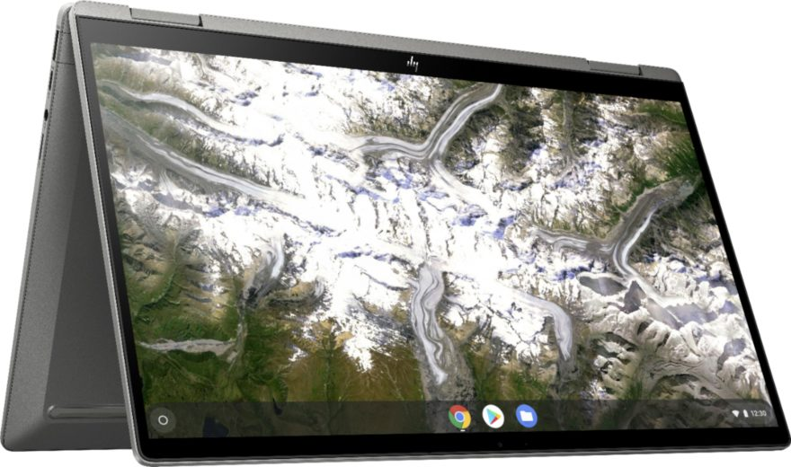
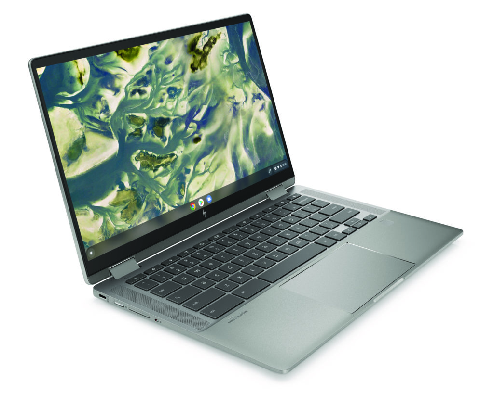

Look out mid-range Chromebooks, there's a new-ish kid on the block. On Friday, a new HP Chromebook x360 14c configuration was announced with up to an 11th-gen Intel Core i5 processor. This refreshed model will start with a Core i3 and a 128 GB SSD for storage, priced at $649.99, up slightly from [last year's version](https://www.aboutchromebooks.com/news/premium-hp-chromebook-x360-14c-launching-this-month-models-priced-from-499-to-629/).

That configuration will be made available later this month at both HP's online store [as well as at Best Buy](https://www.bestbuy.com/site/hp-14-2-in-1-touchscreen-chromebook-intel-core-i3-8gb-memory-128gb-ssd-mineral-silver/6458047.p?loc=HP_6458047_PR&ref=186&skuId=6458047 "https://www.bestbuy.com/site/hp-14-2-in-1-touchscreen-chromebook-intel-core-i3-8gb-memory-128gb-ssd-mineral-silver/6458047.p?loc=HP_6458047_PR&ref=186&skuId=6458047"). I would expect the top-tier configuration with Core i5 to be found on [HP's own site](https://www8.hp.com/us/en/chrome/chrome-family.html).

Here's a rundown of the specs for the $649.99 version:

<table><tbody><tr><td>CPU</td><td>Dual-core Intel Core i3-1115G4 with 4.1 GHz boost</td></tr><tr><td>GPU</td><td>Intel UHD Graphics</td></tr><tr><td>Memory</td><td>8 GB DDR4, 3200 MHz</td></tr><tr><td>Storage</td><td>128 GB PCIe, NVMe M.2 SSD, microSD card expansion</td></tr><tr><td>Display</td><td>14-inch, 1920 x 1080 IPS touchscreen, 45% NTSC color gamut, 250 nits brightness</td></tr><tr><td>Connectivity</td><td>Intel Wi-Fi 6, 802.11ax (2x2) and Bluetooth 5.0 Combo</td></tr><tr><td>Ports</td><td>2 SuperSpeed USB Type-C with 10Gbps signaling rate (USB PD, DP 1.4), 1 SuperSpeed USB Type-A with 5Gbps signaling rate, headphone/microphone combo</td></tr><tr><td>Input</td><td>Backlit keyboard, multi-touch trackpad</td></tr><tr><td>Audio</td><td>B&amp;O stereo speakers</td></tr><tr><td>Battery</td><td>58 WHr, up to 10.75 hours claimed run time with mixed usage</td></tr><tr><td>Software support</td><td>Automatic Chrome OS updates TBD, expected through June 2028</td></tr></tbody></table>

[HP introduced the existing Chromebook x360 14c models back in June of 2020](https://www.aboutchromebooks.com/news/premium-hp-chromebook-x360-14c-launching-this-month-models-priced-from-499-to-629/) with 10th-generation Intel processors for $629.99. There was a Core i3 model with 8 GB of slower memory and 64 GB of (also slower) eMMC storage. So aside from any performance improvements from the next-generation CPU, this update brings benefits to those areas for $20 more.

Most everything else about the new 3.67 pound Chromebook is the same, which isn't a bad thing.

The 14-inch 1080p display is solid as is the backlit keyboard and battery life. HP is being more conservative on that aspect with their run time quote being "mixed usage"; something I find to be more accurate for everyday use. And you still get the security and simple sign-in through the integrated fingerprint scanner.

[I'm still partial to the Acer Chromebook Spin 713 when it comes to the bang for the](https://www.aboutchromebooks.com/news/acer-chromebook-spin-713-review/ "Acer Chromebook Spin 713 review: You can’t get a better Chromebook than this for $629") buck. At $629 (or less on sale), you get a similar package but with a 10th-gen Intel Core i5.

But there's no fingerprint sensor and the slightly higher resolution display is in a 3:2 aspect ratio. Some don't like that, in which case, this new HP Chromebook x360 14c might hit the sweet spot.
