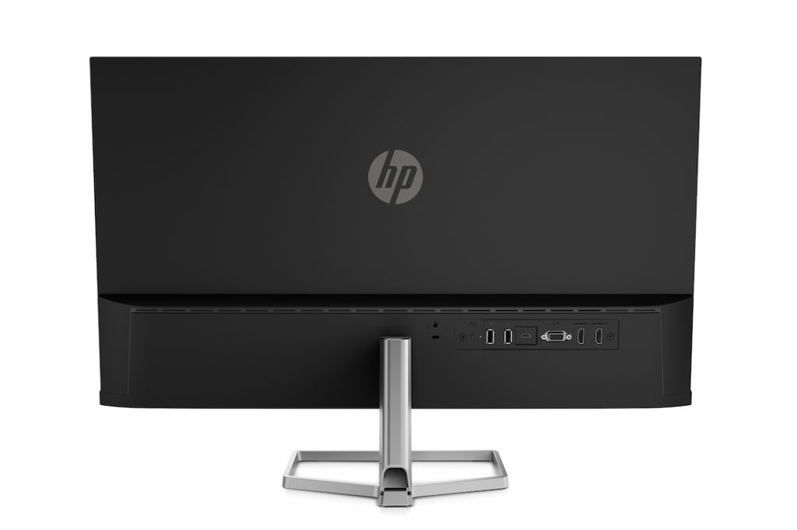
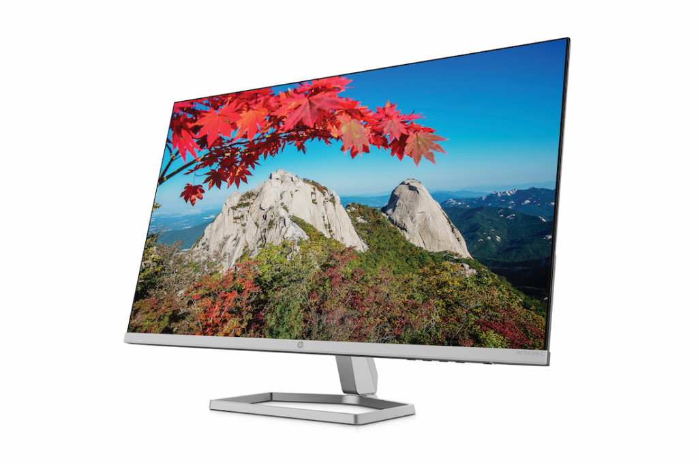

We're starting to see an uptick in products earning the [new Works with Chromebook certification](https://www.aboutchromebooks.com/news/hyper-has-3-works-with-chromebook-usb-c-hubs/), which is a good thing. Last month, several USB hubs debuted as part of the program. This month, at least so far, it's a new 27-inch monitor. Say hello to the new [HP Works with Chromebook monitor, available today for $299.99](https://www.hp.com/us-en/shop/pdp/hp-m27fd-fhd-monitor).

This is a 27-inch, 16:9 IPS display with 300 nits of brightness. On the back are multiple input ports: 2 HDMI, 2 USB Type-A, and a USB Type-C. Oh, there's even an old-school VGA jack.

It's that USB-C port that steals the show here which supplies up to 65W of juice thanks to USB-C Power Delivery. You can charge your USB devices with that port while working on your Chromebook. And this port supports DisplayPort 1.2 for video output as well. A single USB-C cable from your Chromebook will output content on the video display.

This monitor has a 75Hz refresh rate, which adds a smidge more smoothness than a traditional 60Hz display. You also get a 1,000:1 contrast ratio and 99% sRGB color gamut along with wide 178-degree viewing angles.

Since this is a Works with Chromebook monitor, it's been tested and certified by Google to... you know... work with a Chromebook. That means the display meets all Chromebook connectivity, input, and power requirements.

Essentially, if you buy the HP Works with Chromebook display, you can rest assured that it will just work as an external monitor with your Chrome OS device. I can't say I've seen a monitor that doesn't work as an external Chromebook display but you never know based on driver support.

HP says the new Works with Chromebook monitor is [available today through HP.com for $299.99](https://www.hp.com/us-en/shop/pdp/hp-m27fd-fhd-monitor). I've spent more on non-certified monitors that offer lesser video features, so the price seems reasonable to me.
