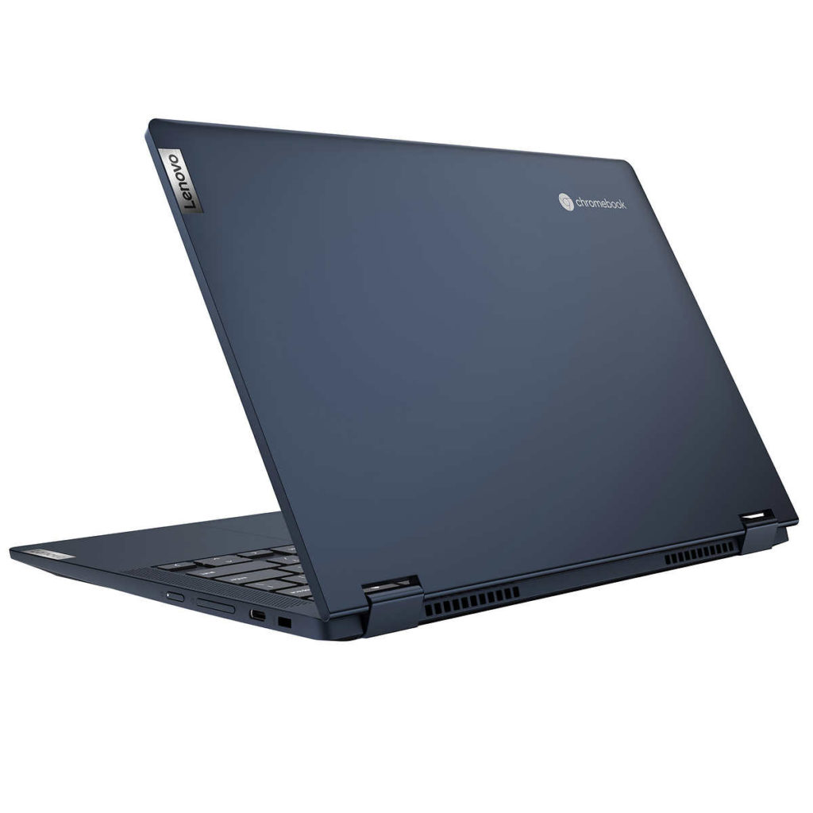

The [Lenovo Flex 5i Chromebook was recently announced](https://www.aboutchromebooks.com/news/mwc-2021-lenovo-chromebook-5i-and-flex-5i-debut-look-great-on-paper/) but the company hasn't abandoned last year's Flex 5 model [Costco is selling a new Lenovo Flex 5 Chromebook for $549.99](https://www.costco.com/lenovo-flex-5-13.3%22-2-in-1-touchscreen-chromebook---11th-gen-intel-i3-1115g4---1080p.product.100744753.html). This revised configuration includes a newer 11th-gen Core i3 processor and 8 GB of faster memory.

At just under $550, the 2021 Lenovo Flex 5 Chromebook is more expensive than last year's model. That one [started at $409.99](https://www.aboutchromebooks.com/news/lenovo-flex-5-chromebook-hands-on-and-first-impressions/) with a 10th-generation Core i3, 4 GB of memory, and 64 GB of eMMC storage.

I suggested that folks consider [upgrading to the $499.99 model](https://www.aboutchromebooks.com/news/theres-finally-an-8-gb-memory-version-of-the-lenovo-flex-5-chromebook-available-in-the-u-s/) with the same processor but double the RAM and the storage. That configuration switched to a faster SSD for file transfers as well.

So I'd equate this Costco option with the $499 model from 2021 because it's basically the same device but with a more recent processor.

Here's a spec rundown with the [official details on Lenovo's site](https://psref.lenovo.com/Detail/IdeaPad/IdeaPad_Flex_5_CB_13ITL6?M=82M70001UX):

<table><tbody><tr><td>CPU</td><td>Dual-core <a href="https://ark.intel.com/content/www/us/en/ark/products/208652/intel-core-i3-1115g4-processor-6m-cache-up-to-4-10-ghz.html" target="_blank" rel="noreferrer noopener">Intel Core i3-1115G4</a> processor</td></tr><tr><td>GPU</td><td>Intel Integrated UHD Graphics</td></tr><tr><td>Display</td><td>13.3-inch IPS 1920 x 1080 touchscreen, 16:9 aspect ratio, 250 nits brightness</td></tr><tr><td>Memory</td><td>8 GB DDR4x-3733MHz memory</td></tr><tr><td>Storage</td><td>128 GB NVMe SSD microSD card slot for expansion</td></tr><tr><td>Connectivity</td><td>WiFi6 (802.11ax, 2x2 MIMO), Bluetooth 5.0</td></tr><tr><td>Input</td><td>Spill-resistant backlit keyboard, USI stylus (optional) support, 720p webcam with physical privacy shutter</td></tr><tr><td>Ports</td><td>1 USB Type-A (3.2), 2 USB Type-C (3.2), headphone/microphone combo jack</td></tr><tr><td>Battery</td><td>51 WHr, expected run-time up to 10 hours</td></tr><tr><td>Weight</td><td>2.97 pounds</td></tr><tr><td>Software</td><td>Chrome OS automatic updates through June 2029</td></tr></tbody></table>

So the premium over last year's higher-end model is really for that 11th-gen Core i3 CPU and the higher frequency memory. Nearly everything else is the same, including the weight, which further emphasizes this as an evolutionary upgrade.

Even so, many folks were happy with last year's model. The only real complaint I ever heard was about one of the display hinges breaking. I didn't experience that with mine and I have no idea if Lenovo has modified the hinge on the 2021 edition.

Aside from that, if this updated Flex 5 is anything like last year's model, it should offer a great mid-range experience.

Enough to justify the price premium? That's hard to say without any hands-on testing and without knowing your budget.

If you're in the market and considering the 2020 edition, I'd say it's likely worth it though.

I should note that earlier in the week Lenovo began [directly selling a 14-inch Lenovo Flex 5i Chromebook](https://chromeunboxed.com/lenovos-light-bar-toting-14-chromebook-5i-is-available-and-100-off/) with a new Pentium Gold processor.

The MSRP is $439 but, typical for Lenovo, it [immediately saw a $100 discount, which is still active](https://www.lenovo.com/us/en/laptops/lenovo/student-chromebooks/5i-Chromebook-Gen-6-14-Intel/p/WMD00000481?clickid=UXkTyRXFkxyLW2B2-gRlnV5UUkBytOz-Nz7WRw0&irgwc=1&PID=10078&acid=ww%3Aaffiliate%3Abv0as6). You still get the fast 128 GB of storage but only 4 GB of memory with that model.

Oh, and it has the lightbar that acts as a battery indicator too!
