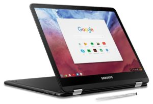

Nothing else has changed from the original model, but if you passed on the original Samsung Chromebook Pro because it lacked a backlit keyboard, the [newest edition for $599 includes it](https://www.samsung.com/us/computing/chromebooks/12-14/samsung-chromebook-pro-xe510c25-k01us/?CID=AFL-hq-mul-0813-11000758), as reported by [Chrome Unboxed](https://chromeunboxed.com/news/samsung-chromebook-pro-backlit-keyboard). Or you can [skip the back-lighting and save $100](https://aboutchromebooks.com/news/samsung-chromebook-pro-discounted-to-499-at-best-buy/).
