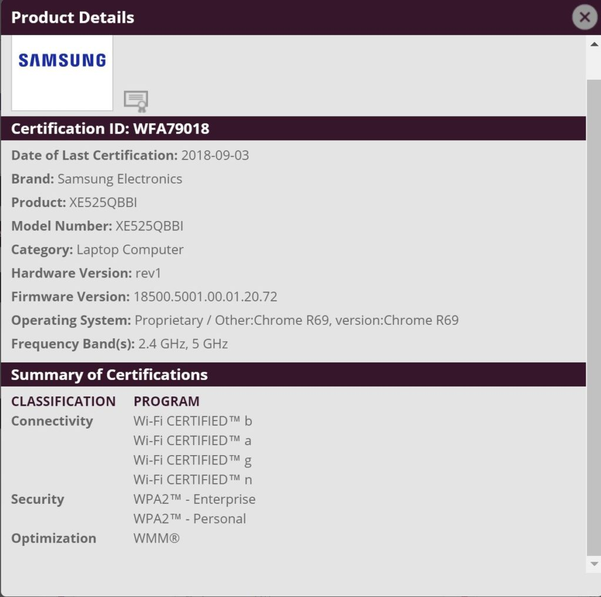

There's not much to go on here but [the Wi-Fi Alliance certified a new Samsung Chromebook earlier this week](https://www.wi-fi.org/product-finder-results?sort_by=certified&sort_order=desc&categories=1&keywords=xe525&companies=362). The model number is XE525QBBI, which doesn't correspond to any currently available Samsung devices.

Note that these are the most recent model numbers for Samsung Chromebooks:

- 2018 Samsung Chromebook Plus: XE521QAB
- 2018 Samsung Chromebook Pro with backlit keyboard: XE510C25

Since Samsung [recently introduced the new Chromebook Plus v2](https://www.aboutchromebooks.com/news/samsung-chromebook-plus-v2-release-date-price/) with considerable changes -- switching from an ARM to X86 chip, modifying the screen resolution and adding a 13-megapixel camera -- I'm leaning towards this being a refresh of the Samsung Chromebook Pro.

There's evidence of a [new Pro model with LTE](https://www.aboutchromebooks.com/news/samsung-chromebook-pro-v2-lte-core-m3/), so it's possible this is the model. Unfortunately, the Wi-Fi Alliance doesn't test or certify any LTE device capabilities. And so far, I haven't found any references to this device in the FCC database, which is where one would find LTE test results.

The other alternative, of course, is a completely new Samsung Chromebook, perhaps something more along the lines of higher-end competition to the recently announced [Dell Inspiron 14](https://www.aboutchromebooks.com/news/dell-insipiron-14-chromebook-price-release-date-availability/), [Lenovo Yoga Chromebook C630](https://www.aboutchromebooks.com/news/4k-lenovo-yoga-chromebook-c630-specs-price-release-date-599/), or the previously introduced [Acer Chromebook 13 and Chromebook Spin 13](https://www.aboutchromebooks.com/news/acer-chromebook-13-spin-13-price-release-date-september-650-and-750/), which are expected soon in stores. I'll keep digging.
