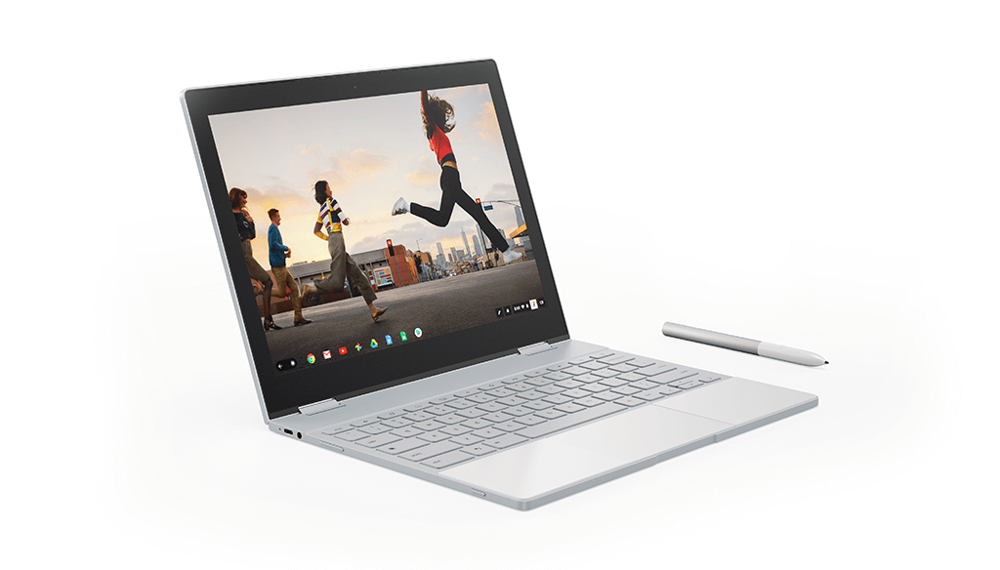

I was scanning the Best Buy site for any Chromebook deals as 2019 begins and among the usual suspects is a deal for the [base Pixelbook at $599.99](https://www.bestbuy.com/site/google-geek-squad-certified-refurbished-pixelbook-12-3-touch-screen-chromebook-intel-core-i5-8gb-memory-128gb-ssd-silver/6290345.p?skuId=6290345). This is a certified refurbished model so it's not brand new but if that's not a concern, you can save $399.01 from the standard $999 non-sale price on what's arguably one of the best Chromebooks from 2017.

 

<iframe style="width:120px;height:240px;" marginwidth="0" marginheight="0" scrolling="no" frameborder="0" align="right" src="//ws-na.amazon-adsystem.com/widgets/q?ServiceVersion=20070822&amp;OneJS=1&amp;Operation=GetAdHtml&amp;MarketPlace=US&amp;source=ac&amp;ref=tf_til&amp;ad_type=product_link&amp;tracking_id=aboutchromebo-20&amp;marketplace=amazon&amp;region=US&amp;placement=B075JSK7TR&amp;asins=B075JSK7TR&amp;linkId=3462b77e89460fe8e00f1bff0b3301ad&amp;show_border=true&amp;link_opens_in_new_window=true&amp;price_color=333333&amp;title_color=0066c0&amp;bg_color=ffffff"></iframe>

This is the base model, so it uses a 7th-generation Intel Core i5 processor, 8GB of memory and 128GB of local storage. The real highlights for me, aside from the great performance and all-day battery life, are the fantastic keyboard and trackpad, plus that crisp 2400 x 1600 resolution touchscreen.

The Pixelbook is a 2-in-1 device, so you can fold the screen all the way around for tablet mode, although when I did use mine in that way, I wasn't too keen on feeling the keyboard on the "back" of the device.

I suspect that Best Buy has a limited number of these and, depending on your location, it may not have any in stock near you. There weren't any within 250 miles of my home, for example.

Shipping is free though, so as long as you can find one and don't mind waiting for delivery, this is a pretty solid deal if none of the [more current](https://www.aboutchromebooks.com/news/lenovo-yoga-chromebook-c630-price-availability-4k/), [comparably priced Chromebooks](https://www.aboutchromebooks.com/news/dell-insipiron-14-chromebook-price-release-date-availability/) are appealing to you.
