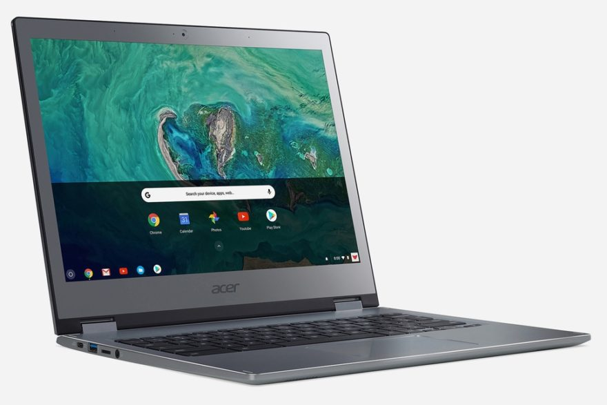
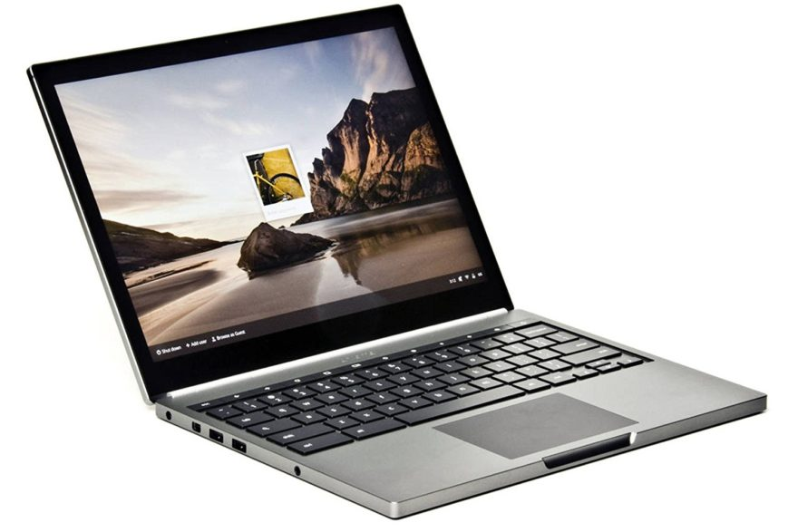
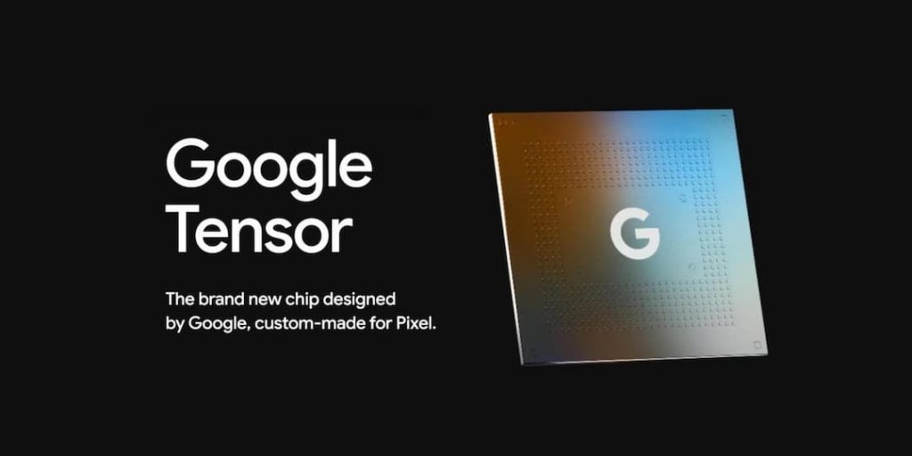
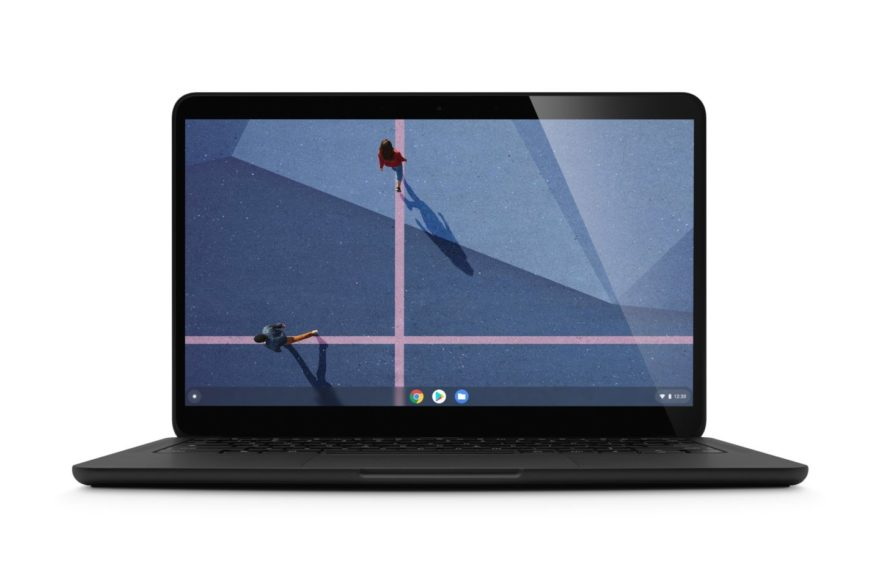

Last week, we learned there would be [no Pixelbook](https://www.aboutchromebooks.com/news/why-pixelbook-go-isnt-the-pixelbook-2-according-to-google/) in 2022. The information came directly from Chrys Tsolaki, Retail Partner Manager for Chromebooks at Google, [as reported from a Qualcomm event attended by Trusted Reviews](https://www.trustedreviews.com/news/google-confirms-it-wont-launch-a-new-pixelbook-in-2022-4178747): “Next year \[2022\] there won’t be anything coming. In the future, I don’t know.”

I spent a few days reading both articles about this news, as well as reader comments on those articles. You'd think Google was pulling out of the total Chromebook market based on some of them. Let's be real: the lack of a Pixelbook in 2022 isn't all doom and gloom.

## A recap of Google's own Pixelbooks

First, some perspective. Chromebooks have been available for around 10.5 years, with _hundreds_ of models offered during that time. Out of all of them, only five have been made by Google:

- 2013: Chromebook Pixel
- 2015: Chromebook Pixel (updated edition)
- 2017: Pixelbook
- 2018: Pixel Slate
- 2019: Pixelbook Go

That's it. Five out of hundreds of very capable Chromebooks are Google-branded.

The product line started out much as a beta, with [Google calling it a "proof of concept"](https://www.omgchrome.com/chromebook-pixel-2-teamwork-confirmed/). Eventually, with newer models, the line became a little more mainstream with broader retail availability.

Clearly, the Pixelbook products have a passionate fan following. I include myself in that group, having purchased every single one of the five models. But the times have changed since the earlier versions of these Chromebooks, and even now.

## The purpose of a Pixelbook and more choices

That gets me to a slightly deeper dive into the above timeline. Though the two Chromebook Pixels and the original Pixelbook, Chromebook users really didn't have much choice when it came to high-end laptops running Chrome OS. You pretty much had to choose a Google-branded Chromebook Pixel or Pixelbook to get the best display, the latest processor, and a choice of the most memory.

But then we started to see a shift in Google's hardware partners as they expanded from entry-level and classroom Chromebooks to the mid and high-end range of devices.

Acer Chromebook Spin 13

I saw this in 2018, one year after the original Pixelbook debuted, and bought an [Acer Chromebook Spin 13 with a newer Core i5 processor](https://www.aboutchromebooks.com/reviews/acer-chromebook-spin-13-review-vs-pixelbook/), a very comparable display to the Pixelbook, and 16 GB of memory. Oh, and that model cost $100 less than a similarly configured Pixelbook.

At that time, I said:

> Overall, the Acer Chromebook Spin 13 is the first Chromebook I’ve used that rivals or exceeds the Google Pixelbook. And it does so at a lower cost. That’s impressive.

Is the Acer as thin as or as nicely designed as the Pixelbook? That's subjective and I'd personally say no. But I still have and use that device, having gotten over some of the design differences. It's been a powerhouse that's gotten me [through undergraduate coding classes](https://www.aboutchromebooks.com/news/can-you-learn-to-code-in-a-college-computer-science-program-with-a-chromebook/). And it's now [doing the same in a Masters program](https://www.aboutchromebooks.com/news/linux-on-chromebooks-just-might-get-me-through-a-masters-in-computer-science/).

Let's move forward in time after the Acer Chromebook Spin 13 debuted though.

Now instead of one or maybe two high-end Chromebook choices, just about every Google hardware partner has an option available:

- [Acer Chromebook Spin 713](https://www.acer.com/ac/en/US/content/model/NX.AHAAA.001)
- [ASUS Chromebook CX9](https://www.asus.com/us/Laptops/For-Work/Chromebook/ASUS-Chromebook-CX9-CX9400-11th-Gen-Intel/)
- [Dell Latitude 7410 Chromebook Enterprise](https://www.dell.com/en-us/work/shop/2-in-1-laptops-tablets/latitude-7410-chromebook-enterprise-laptop-or-2in1/spd/latitude-14-7410-2-in-1-chrome-laptop/cto2lc741014us?redirectTo=SOC)
- [HP Pro C640 Chromebook](https://www.hp.com/us-en/shop/pdp/hp-pro-c640-chromebook-customizable-9wl20av-mb)
- [HP Chromebook x360 14c](https://www.hp.com/us-en/shop/pdp/hp-chromebook-x360-14c-cc0047nr)

Not all of these can be configured with the latest Core i7 or more than 8 GB of memory, but some can. And from a price perspective, they're still likely less expensive than a comparable Google-branded Chromebook. If there was one, that is.

## Let's talk about pricing and markets

The Google Pixelbook lineup has almost always been priced higher than any competing devices when we finally started getting some of those. Heck, when Google was the only one making such Chromebooks, prices started at $1,299 and went up from there. I paid nearly $1,500 for the second Chromebook Pixel, for example. I never regretted that purchase but the point is that it's challenging for Google Chromebooks to compete on price.

The company simply doesn't sell enough laptops compared to its hardware partners to get the type of volume discounts on CPUs and other components.

Yes, some people are willing to pay more. I was! But are there enough people like me out there for Google to make a profit on its own Chromebooks? I doubt it based on sales whisper numbers and analyst reports of the Chromebook market.

The situation may have changed but when I was at Google, there was a renewed effort on profitability outside of the company's search and ads revenue. Those make up around 90% of Google's income, so it makes sense for the company wanting sales diversification.

That's partially why the Google Pixel phone line still exists. No, these handsets don't sell in enough quantity to compete with Apple, Samsung, and others. But the phone market is a much larger market. Put another way: We have a few billion phone users on the planet so there's a large incentive for Google to stay competitive there. Especially when you have the most used operating system when it comes to phones.

The computing market is different, though. Google's Chrome OS isn't the major platform player that Android is. It's competing against the massive Microsoft Windows juggernaut, a growing macOS userbase, and Linux to a lesser degree. This is a market that's [estimated to have shipped 275.15 million PCs in 2020](https://www.statista.com/statistics/273495/global-shipments-of-personal-computers-since-2006/#:~:text=In%202020%2C%20approximately%20275.15%20million,home%20during%20the%20coronavirus%20pandemic.). Conversely, [an estimated 1.38 billion phones shipped worldwide in the same time period](https://www.statista.com/statistics/263437/global-smartphone-sales-to-end-users-since-2007/#:~:text=In%202020%2C%20smartphone%20vendors%20sold,end%20users%20were%20Apple%20smartphones.).

If you're not price competitive in the smaller PC market, you might as well focus on getting a bigger piece of the larger pie. Why offer a Pixelbook in 2022 when you pay more for the components, face a global chip shortage, and have more opportunities for profit in the phone market?

## Architecture changes from x86 to ARM

None of the above highlights another relevant point. Google finally has a custom-designed ARM processor with the Tensor chip in the Pixel 6. Now that it does, the time to transition Chrome OS from an x86-first to a best-in-class ARM experience just makes sense.

I'm not suggesting that Google's going to use the Tensor chip inside the Pixel 6 for a new Chromebook. Instead, I suspect Google builds upon the Tensor design to further customize a chipset for Chromebooks.

That. Takes. Time.

Any primary Tensor chip efforts up to the Pixel 6 launch had to be focused squarely on the Pixel 6. That was goal one. Use of a modified Tensor shop for a Pixelbook? That's goal two in mind. And given the time it takes to design a chip for a custom software platform isn't done in days or weeks. Maybe not even months, depending on the situation. You have to realize that Google started working on the Tensor chip a few years ago.

So to expect a Pixelbook in 2022, at least with Google's own custom silicon, isn't realistic. And while the company could use Intel processors inside a Pixelbook next year, these would still face (and likely lose) a price competition against other Chromebook makers.

## Think long term

Look, I get it. Diehard Pixelbook fans are disappointed. From a personal standpoint, so am I to a degree. [Although it got better over time](https://www.aboutchromebooks.com/news/with-chrome-os-improvements-and-a-200-discount-the-pixel-slate-is-worth-a-second-look/), the Pixel Slate was a general flop for Google. The [Pixelbook Go is a great device](https://www.aboutchromebooks.com/news/pixelbook-go-review-2020/)... for my wife. She has one and loves it. For me, it simply doesn't offer the performance I need for the way I use a Chromebook.

So I'm with you on the disappointment that we won't see a Pixelbook in 2022.

But Google is thinking long-term here and we should too. We may personally prefer a Google-branded Chromebook for the design or a few special features, but most people buying Chromebooks don't. Or if they do, they see similar Chromebooks at lower prices.

Let's give Google a breather here and see what's in store for the Pixelbook line after 2022. We may still pay more for the Pixelbook experience but with a custom ARM processor specifically designed to work with Chrome OS, we could see premium features that are worth that extra price to us and to others. 18 hours of battery life, for example. Or integrated LTE by default. Who knows?

I'm willing to wait instead of writing off Google's Pixelbook efforts as doom and gloom. Are you?
