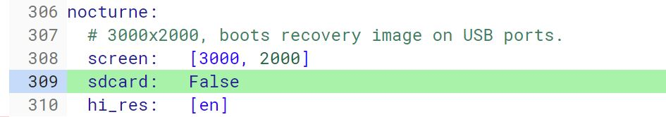
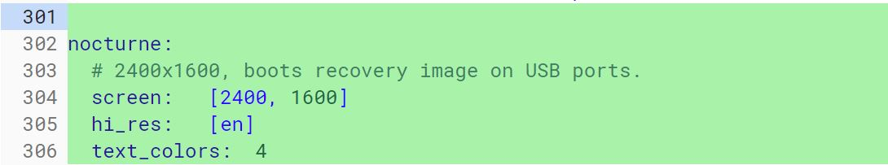

As we get closer to October 9, the day [Google will announce a slew of new hardware](https://www.aboutchromebooks.com/news/pixelbook-2-atlas-nocturne-madebygoogle-event-october-9/), more details are becoming clear about Nocturne, the Chrome OS tablet expected to be soon launched. After seeing what appears to be the [first look at Nocturne](https://www.aboutchromebooks.com/news/first-look-chrome-os-pixelbook-tablet-nocturne-madebygoogle/), there's now some updated information about the all-screen tablet: It will have a 3000x2000 resolution, which is higher than the 2400x1400 screen on the current Pixelbook.

I found this information in a [recently updated Chrome OS code commit](https://chromium-review.googlesource.com/c/chromiumos/platform/bmpblk/+/1234279/1/images/boards.yaml) and it differs from the [_original_ Nocturne code I discovered in April](https://www.aboutchromebooks.com/news/nocturne-to-be-a-chrome-os-detachable-with-high-res-display-and-fingerprint-reader/). Back then, Nocturne was planned to support a 2400x1600 display but the code now shows a 3000x2000 screen.

The code change was actually to set the sdcard property to "False", meaning that Nocturne won't have an SD Card slot, which we already knew. But here is where I noticed the screen resolution change, which must have happened very quietly.

Here's the same information on Nocturne from April, for reference:

Based on the first likely images of Nocturne, this makes sense to a degree: The thin tablet shown is clearly a 3:2 aspect ratio. That alone doesn't prove the screen resolution as the 2400x1600 resolution of the current Pixelbook is also a 3:2 ratio. However, if the Chrome OS code showed something like 1920x1080, as an example, that wouldn't jive because that's a widescreen, or 16:9, ratio.

I suspect that Google originally used 2400x1600 as Nocturne's screen resolution for two reasons: To support a 3:2 ratio like the Pixelbook, and to hide the fact -- at least until we get closer to a product launch -- that Nocturne would actually have a higher resolution than the Pixelbook. It's also a higher resolution than the current Microsoft Surface Pro: I use one for school and the screen with its 2736x1824 resolution is outstanding.

There **_is_** one other possibility, although I think it's unlikely: Nocturne could come in two sizes. A smaller one, say roughly a 10-inch option with 2400x1600 display, and a 12- to 13-inch model with the higher resolution. I don't think that's the case, but I'm not ruling it out just yet.
