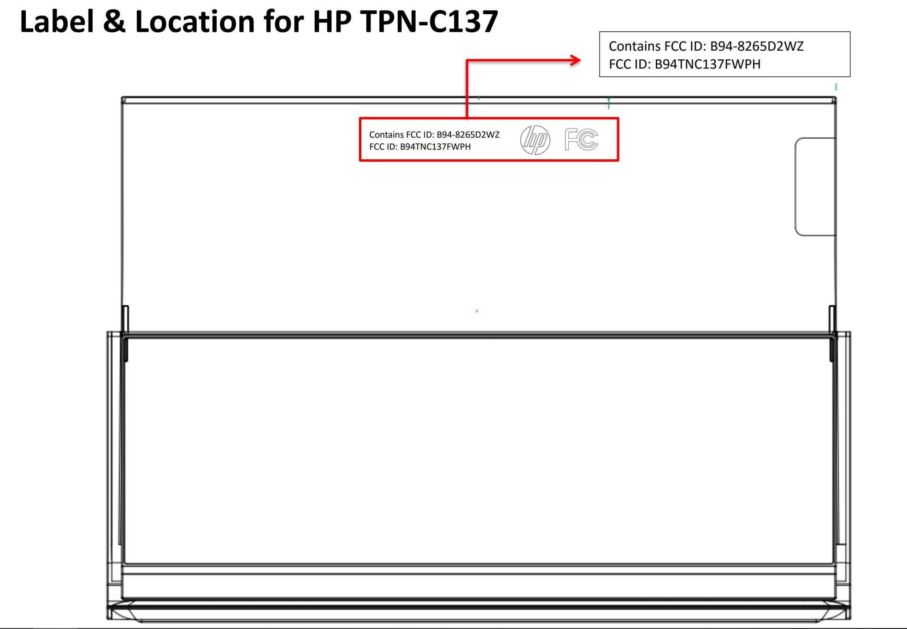
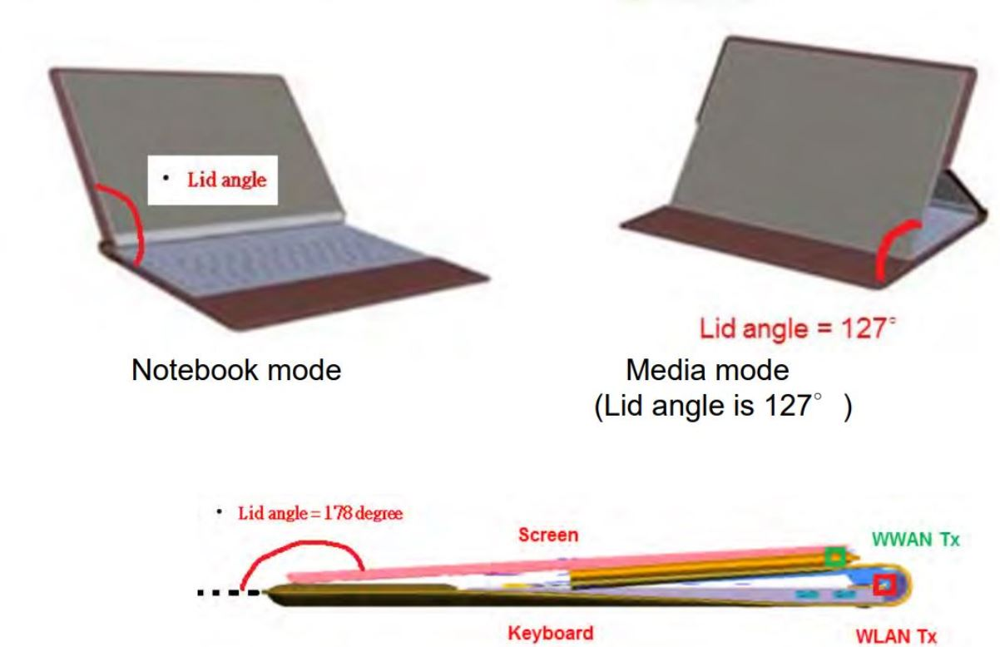
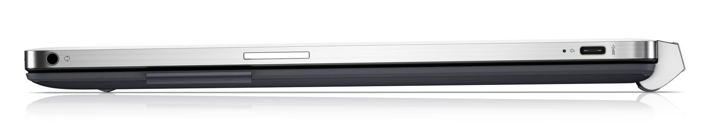

Some interesting FCC filings over the past few days have me intrigued. Although up to now I've been expecting [Google to release both a Pixelbook 2 and some other detachable Chromebook](https://www.aboutchromebooks.com/news/pixelbook-2-atlas-nocturne-madebygoogle-event-october-9/) at its hardware event on October 9, based on the filings it's possible that other hardware partners may have new devices as well. The codenames Atlas and Nocturne are contenders for new Chromebooks, although there's been more code work on Nocturne than the 4K Atlas device.

Based on the FCC filings, there's a reasonable chance that Nocturne is the next convertible Chromebook and it could be made by HP. Let me explain.

Above you'll see a schematic of an upcoming HP convertible that was recently tested by the FCC for Bluetooth, Wi-Fi and LTE bands. When I first saw it, I thought it had a Microsoft Surface-like hinge on the left and right that allowed a stand to fold outward. I was close, but not quite right.

These drawings of the FCC testing -- it tests radio waves in both tablet and laptop configurations for convertible devices, tell a different story. It appears that the HP device under test has an attachable keyboard cover, although these are likely renderings.

This device appears similar to the HP Chromebook X2 because the tablet mode image shows a hinge on the right side of the picture and the display is detached. Here's a side view of the HP Chromebook X2 for comparison, where you case the same, or a similar, hinge mechanism:

In fact, I'm wondering if Nocture is essentially a slightly revised Chromebook X2 **_with_** an optional thin keyboard cover using pogo pins for the attachment. That would provide a lighter device when leaving the base behind but still offer the productivity of a full, light keyboard.

This is all even more interesting when combined with another few tidbits in filings and in the Chromium OS code commit logs.

The FCC test result documents make mention that that HP device uses three hall sensors to detect which mode the device is in. Wi-Fi transmission power is reduced when the HP is in tablet mode, shown by the bottom image where the screen is completely covering the keyboard. Hall sensors are likely used in many devices, but [this Chrome OS commit from August 18 is specifically for Nocturne](https://chromium-review.googlesource.com/c/chromiumos/platform/ec/+/1180493):

> nocturne: Turn on UHALL\_PWR\_EN by default. UHALL\_PWR\_EN needs to be enabled when the EC comes out of reset so that the top hall sensor is active when the EC boots.

That's not a smoking gun, of course, but I find it a bit serendipitous when connecting the dots and based on the timing of the commit, the FCC testing, and the upcoming hardware event. Don't forget that additionally, [Nocturne will support a fingerprint reader](https://www.aboutchromebooks.com/news/nocturne-to-be-a-chrome-os-detachable-with-high-res-display-and-fingerprint-reader/) as well as a [detchable keyboard with pogo pins](https://www.aboutchromebooks.com/news/nocturne-chromebook-to-power-its-detachable-keyboard-like-apples-smart-keyboard-for-ipad/), and [AEC or acoustic echo cancellation](https://www.aboutchromebooks.com/news/atlas-and-nocturne-chromebooks-may-natively-support-acoustic-echo-cancellation/).

By the way, the HP device uses a Fibocom LTE module per the FCC test documents. We already know [Google has recently filed for use of this module](https://www.aboutchromebooks.com/news/google-pixelbook-2-lte-connectivity/), but that could be coincidental. As far as [supported frequencies that were tested for the HP convertible](https://apps.fcc.gov/eas/GetApplicationAttachment.html?id=4001297), there's something for everyone: LTE Bands 2, 4, 5, 12, 13, 14, 17, 25, 26, 30, 38, 41, 66 as well as WCDMA Bands II, IV, and V.

Note that it's entirely possible that this is simply a new HP convertible running Windows 10. A Windows variant of the X2, for example.

But I don't think so.

I'm leaning -- say with 75 percent confidence -- towards Nocturne as an HP device made in partnership with Google to showcase an LTE capable detachable / convertible Chromebook. Indeed, such a device would coincide nicely with the new [auto-switching between tablet and desktop mode in Chrome OS 70](https://www.aboutchromebooks.com/news/chrome-os-70-to-transform-tablets-with-an-smart-auto-switch-to-desktop-mode/). And it may explain why [we haven't yet seen other configurations of the HP Chromebook X2](https://www.aboutchromebooks.com/news/hp-chromebook-x2-8-gb-core-m5-configuration-availability/).
