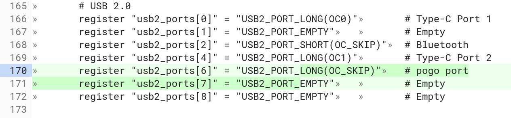
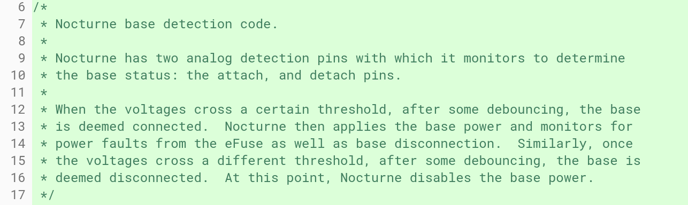
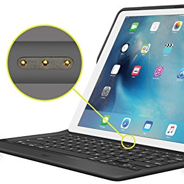

When I first came across the Chromebook-in-progress code-named [Nocturne, I found evidence that it might be a detachable Chrome OS tablet](https://www.aboutchromebooks.com/news/nocturne-to-be-a-chrome-os-detachable-with-high-res-display-and-fingerprint-reader/) like the HP Chromebook X2 (shown above). Now there's additional information that essentially confirms it and also suggests that the keyboard base may have its own battery.

A Chromium code commit from Friday caught my eye today with this bit of text: "[enable pogo pin USB port](https://chromium-review.googlesource.com/c/chromiumos/third_party/coreboot/+/1066019)". Digging into the actual file shows the addition of pogo pin support as well.

There was no specific mention of pogo pins in my initial Nocturne find earlier this month. Instead the [code snippet from that commit](https://chromium-review.googlesource.com/c/chromiumos/platform/ec/+/1032094/2) explained how the "two analog detection pins"  detect if the base is attached to the display, and if so, how to handle power.

Friday's commit explains that these connectors are magnetic pogo pins.

What this suggests to me is that the Nocturne keyboard base will work similarly to how Apple's Smart Keyboard for the iPad Pro works.

Using pogo pins when you attach Apple's tablet to the keyboard accessory, the keyboard gets power and transfers what you type to the display.

Based on the above code snippets, it appears that Nocturne will function similarly; at least for now, considering anything can change on an unreleased device until it's launched.

Assuming this is how Nocturne will arrive to market, it means that you won't have to fiddle with Bluetooth settings to pair the keyboard base in order to use it: You'll just drop the display part of the device into the keyboard and start typing. And you don't be using any of your battery for a constant Bluetooth connection; instead, just enough power will be supplied over the pins to accept and transfer data entry from the keyboard base.

What we don't know yet of course is if the keyboard base will be a traditional "meaty" one you'd find on a 2-in-1 laptop or it will be something akin to either Apple's Smart Keyboard or the slim keyboard Microsoft makes for its Surface Pro devices. Hmmm.....
