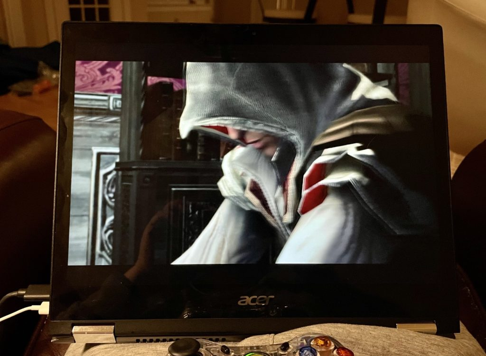

At its Game Developers Conference this week, [Nvidia announced its RTX graphics support for ARM processors](https://blogs.nvidia.com/blog/2021/07/19/geforce-rtx-arm-gdc/). The company showed off game demos using an ARM CPU paired with an RTX 3060 graphics card. This confirms the [company's announcement in April about RTX inside Chromebooks](https://www.aboutchromebooks.com/news/well-likely-see-nvidia-and-mediatek-chips-in-chromebooks/). While Nvidia RTX graphics Chromebooks sound like potentially great news for Chromebooks, and it is, there's quite a bit to keep in mind.

https://youtu.be/VBfci5hYN1c

First, Nvidia is showing this off as a developer preview. This means it's highly unlikely to arrive in any Chromebooks soon. And by soon, I mean within the next two or three years. I'm not saying that because developer previews mean that. I'm saying that because of my next point.

Second, you have to realize the preview was done with the next generation of MediaTek ARM processors. Yes, I'm talking about [the MT8192 and MT8195](https://www.aboutchromebooks.com/news/chromebooks-mediatek-mt8192-mt8195-vs-qualcomm-snapdragon-7c-8c/) that will supplant the [MT8183 that's inside current Chromebooks](https://www.aboutchromebooks.com/news/hp-chromebook-11a-vs-lenovo-duet-chromebook/). We're all looking forward to Chrome OS devices with these and I expect we see some within the next 6 to 12 months. I'd say sooner but the silicon shortage is also a likely delay factor.

But those MediaTek chips inside a Chromebook alone won't simply have Nvidia RTX graphics capabilities. Nvidia will have to provide that part of the equation. And frankly, most of those chips will be in gaming laptops running Windows. There's simply far more demand for the limited supply in that market.

Lastly, and possibly the key point here to understand: You'll be paying more for Nvidia RTX graphics Chromebooks. Like... a lot more. I could easily see the price premium be $400 to $600 more for a Chromebook with this hardware capability. Even at the low end, that's more than many Chromebooks cost today alone. You'll pay in battery life too. Oh, and you want a fanless Chromebook? Not with one of these graphics cards inside.

So we're talking about a limited market with limited supply and higher-priced devices as a result.

That doesn't even take into account the fact that until there's a localized way of running PC games in Chrome OS, this functionality is sort of pointless. Yes, we keep hearing that Steam is coming to Chrome OS and I'm sure that will happen. But it's not here yet.

Assassin's Creed II on a Chromebook, anyone?

For at least the next year, if not two, most PC gaming on Chromebooks will be done online [via Google Stadia](https://www.aboutchromebooks.com/news/google-stadia-gaming-chromebooks-november-release-pricing-chrome-os-preorder/) or [Nvidia's own GeForce Now](https://www.aboutchromebooks.com/news/steam-game-sync-on-geforce-now-for-chromebooks-may-make-it-a-better-option-than-stadia/), which is what I use. Heck, I was just playing Divinity: Original Sin on my Chromebook over the weekend with GeForce Now. And I'll still be playing it \*\* a year from now the same way.

Don't misunderstand me: Ultimately, this is great news for the Chromebook crowd. Or at least for the Chromebook crowd that wants to play PC games. But let's not get ahead of ourselves.

I'd expect we see an ARM-based handheld gaming console with this capability before we see it in Chromebooks. So don't sell that gaming PC or cancel that cloud gaming service just yet.

_**\*\* It's a long game and I'm a terrible gamer.**_
