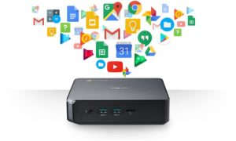
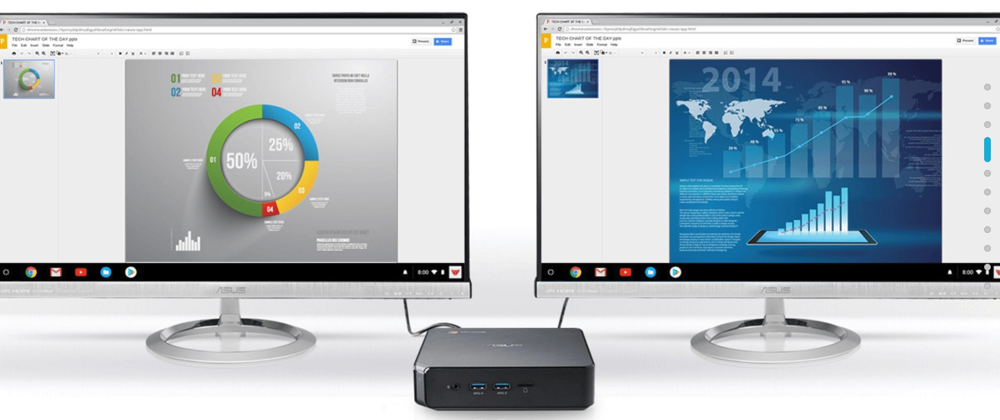

[Pre-orders for the Asus Chromebox 3](https://www.aboutchromebooks.com/news/asus-chromebox-3-available-for-pre-orders-starting-at-239-and-shipping-in-mid-may/) started last month from third-party retailers and now Asus has the [official Chromebox 3 landing page](https://www.asus.com/us/Chrome-Devices/ASUS-Chromebox-3/overview/) with full specs for its newest desktop Chrome OS device. Much of what's there was already known, however there are a few new tidbits that are interesting.

Initially, we heard there would be three processor choices with the possibility of a fourth. Acer's Chromebox 3 landing page now shows all four with the first two being newer 8-th generation Intel chips:

- [Intel Core i7-8550U Processor](https://ark.intel.com/products/122589/Intel-Core-i7-8550U-Processor-8M-Cache-up-to-4_00-GHz)
- [Intel Core i5-8250U Processor](https://ark.intel.com/products/124967/Intel-Core-i5-8250U-Processor-6M-Cache-up-to-3_40-GHz)
- [Intel Core i3-7100U Processor](https://ark.intel.com/products/95442/Intel-Core-i3-7100U-Processor-3M-Cache-2_40-GHz)
- [Intel Celeron 3865U Processor](https://ark.intel.com/products/96507/Intel-Celeron-Processor-3865U-2M-Cache-1_80-GHz)

In terms of pricing, I dug around today and found [B&H Photo taking Chromebox 3 pre-orders for the Core i7 model](https://www.bhphotovideo.com/c/product/1407450-REG/asus_chromebox_3_n020u_chromebox_3_i7_8550u_8gb.html) with 8 GB of RAM and 32 GB of storage for $699.

Stepping down to the Core i3 with the same memory and storage saves you some cash, since [the pre-order price is $479](https://www.bhphotovideo.com/c/product/1407449-REG/asus_chromebox_3_n019u_chromebox_3_i3_7100u_8gb.html).

The Core i5 seems elusive -- and is the processor we heard might be offered -- as I can't yet find anyone taking pre-orders for it.

Asus also shows that the Chromebox 3 supports up to 16 GB of memory and 256 GB of storage.

It's not clear if the company will sell configurations with those specs -- it seems doubtful -- or if you'll have to buy aftermarket parts and add them to your original Chromebox 3. There's also confirmation from Asus that Chromebox 3 will support Android apps, in case you had doubts.

For folks that want to drive multiple or high-resolution monitors, there's good news since all of the Core configurations use either the HD or UHD version of Intel's Integrated Graphics 620. Asus says Chromebox 3  supports dual 4K/UHD monitors through the USB 3.1 type-C port with support for DisplayPort and HDMI.

Lastly, Asus' mini desktop can charge mobile devices through either of two USB Power Delivery ports, which is super handy.

So how about it: Have any of you placed pre-orders for the Asus Chromebox 3 or do you think either the Acer or HP offerings are a better deal?
