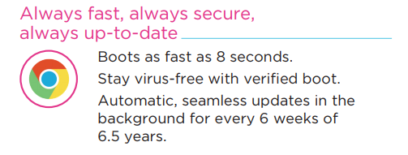

A PDF specification sheet of the [Lenovo IdeaPad Duet Chromebook that was announced last week at CES](https://www.aboutchromebooks.com/news/lenovo-ideapad-duet-chromebook-specifications-release-date-price-ces-2020/) fills in a little more information on the new 10.1-inch Chrome OS tablet. Based on the official document, we now know there will be two very similar configurations of the IdeaPad Duet, more about the included keyboard and the expected battery life on a charge.

As you can see above in the "Performance" section, there will be two configurations, both of which have 4 GB of memory. That's a bit different (in a good way) from the "up to 4 GB" of memory datapoint Lenovo provided in its launch documentation. Frankly, having less than 4 GB of RAM in a Chrome OS device these days would essentially be a non-starter.

Lenovo also only provided the battery capacity of 7180 mAh for the IdeaPad Duet Chromebook last week. Yet, the spec sheet shares more useful information: You can expect 8 hours of web browsing time or an additional 2 hours of runtime when solely watching videos. Mixed usage will change these figures, of course.

Also of note here is the mention of Bluetooth 4.2. I didn't doubt the Lenovo IdeaPad Duet Chromebook had Bluetooth support but the documentation provided at CES didn't mention this radio.

The "Design" section of the spec sheet provides more details about the product weight with either the Keyboard or the Stand Case options, as well as total weight for the entire package.

Of course, if you're going to use the included keyboard, you'll need to prop up the tablet with the Stand Cover so count on 2.03 pounds to tote around. The key travel on that keyboard is a scant 1.3 millimeters as well. Some might not find that to be enough but personally, I can fly on the Google Pixel Slate Keyboard which has just 1.2 millimeters of travel.

Oddly, the official spec sheet indicates 6.5 years of Chrome OS software updates.

That's in conflict with what Lenovo published and said at CES, saying this tablet would have 8 years of automatic software updates. I'm sure we'll find out which number is accurate on or before the May availability date, but either way, you'll get software updates for a long time with this tablet.

There hasn't been a price announcement for the model with 128 GB of storage, so all we know is that you get the base model with 4 GB of memory and 64 GB of storage, with the included keyboard and Stand Case for $279. Since neither model includes a microSD card slot for memory expansion you'll have to make a decision on if double the base model storage is worth what Lenovo decides to charge.
