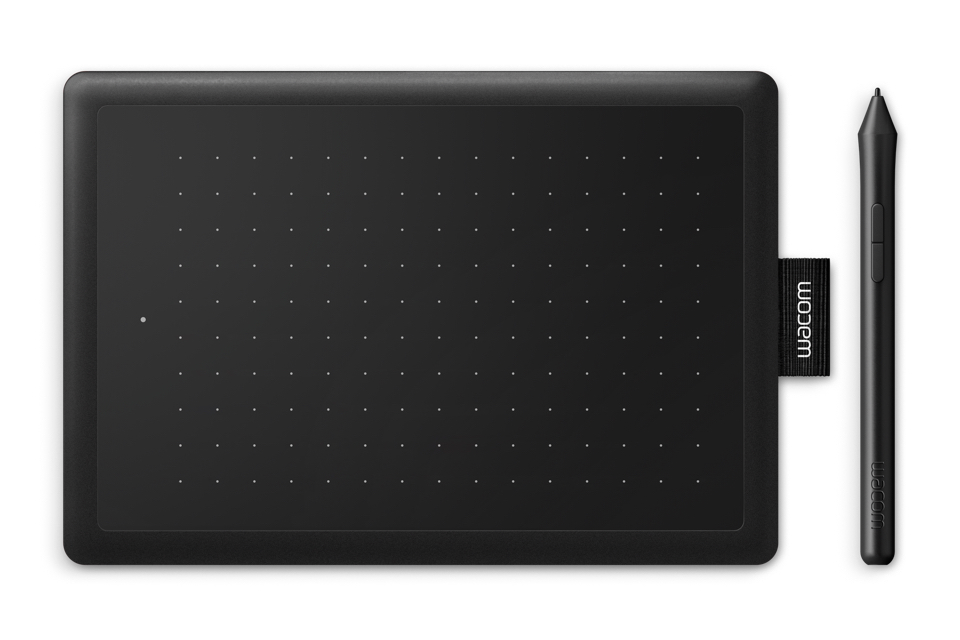
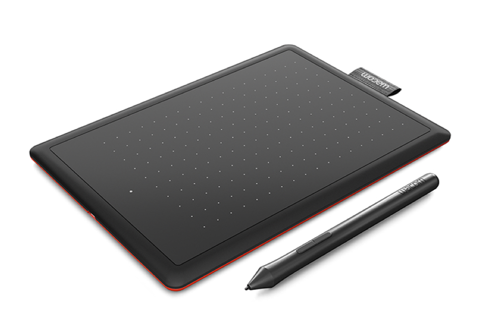

There's a new "Works with Chromebooks" device that might interest digital artists, inkers, and students. It's [the One by Wacom, a USB drawing pad and digital pen that costs $59.99](https://www.prnewswire.com/news-releases/learning-teaching-and-creating-digitally-made-easy-with-wacom-and-chromebook-301214927.html) and works natively with a Chromebook.

The 8.3-inch x 5.7-inch pad is around a third-of-an-inch thick and weighs 8.81 ounces, so carrying it around in a bag with your Chromebook won't add too much bulk or weight. And it comes with a featherweight battery-free pressure-sensitive pen with up to 2048 levels of sensitivity.

Also included is a USB Type-A cable to connect it to your Chromebook. If you only have Type-C ports available on your device, you'll either need a USB-C hub with extra Type-A ports, or a C to A converter dongle.

You'll also need -- and this is key -- a Chromebook running Linux kernel 4.4 or better. If not, this isn't the drawing pad and stylus for you.

Not sure what kernel version you have? Hit up [Google's Chromium developer information site and look for your Chromebook](https://www.chromium.org/chromium-os/developer-information-for-chrome-os-devices); it lists the kernel version for each device. I checked and I'd say roughly 40 Chrome OS devices are on 4.4 or better, even some older models.

If your Chromebook is supported, this is a simple plug-and-play solution. There aren't any drivers to download and install to your Chromebook.

https://youtu.be/Jrj99jX5cqQ

The One by Wacom is definitely positioned for the education market, even though any supported Chromebook can use it:

> The digital pen is a powerful tool in education. It allows teachers and students to incorporate natural handwriting for note-taking and annotation and lets them solve math problems, draw diagrams and explain themselves visually as intuitively online as they would in class on the blackboard. Especially STEAM subjects (science, technology, engineering, arts, mathematics) benefit a great deal from the use of a digital pen.
> 
> Wacom

The company is also promoting different software solutions, again mainly aimed at students and teachers.

Bundled with the One by Wacom are 3-month software licenses for Collaboard, Explain Everything, Kami, Limnu, and Pear Deck. I won't get into the details of each, but basically, you'll get digital whiteboards and presentation creation apps to try with your drawing pad and stylus.

A drawing pad with a stylus isn't quite a complete replacement for one that works on your Chromebook display, but this still sounds like a decent and inexpensive option. In fact, I think it would be great for device owners that have a clamshell Chromebook that want to do so some digital writing, PDF markup, or artistic creation.

