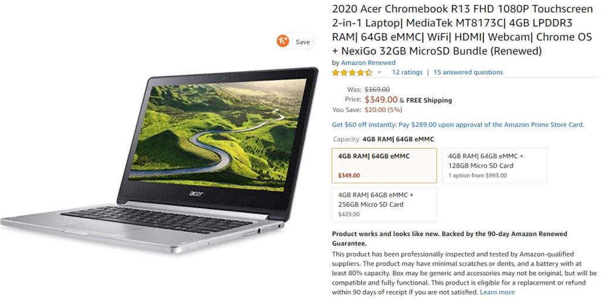
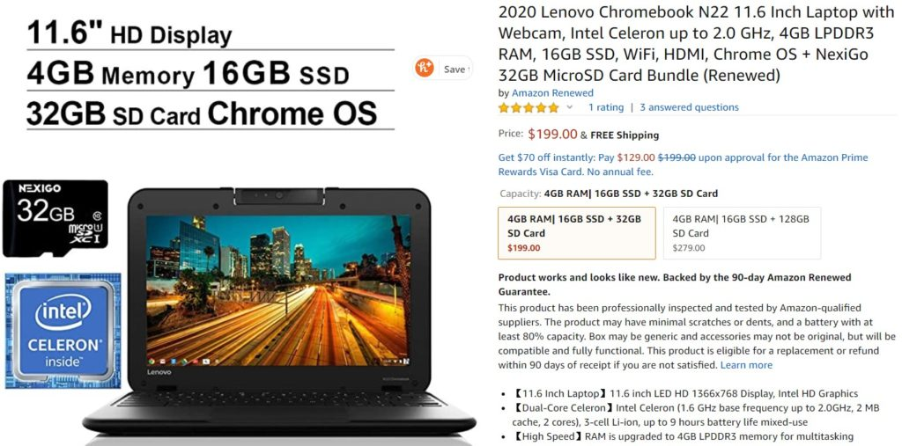
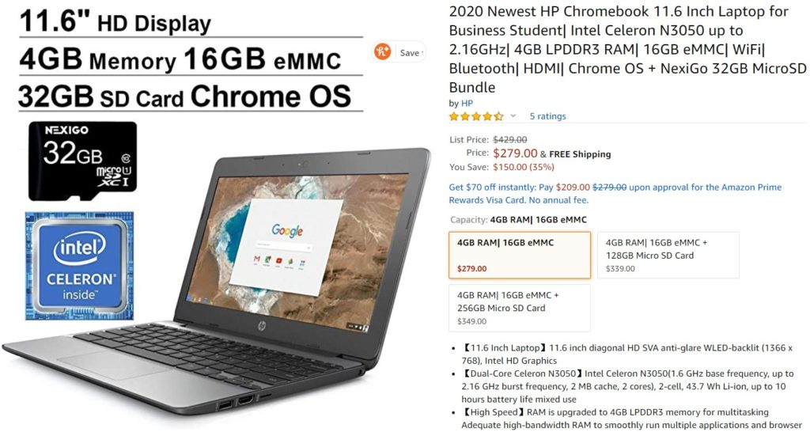
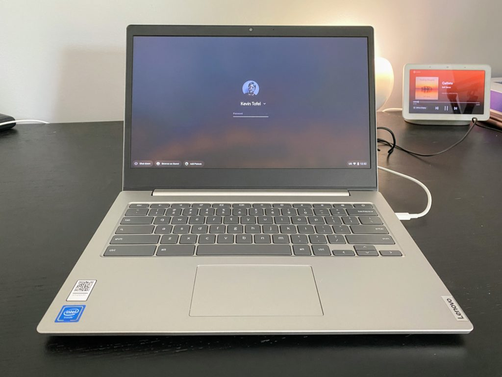

I've been stewing about something Chromebook-related for a while and today I hit my boiling point.

When I look at Chromebook listings on Amazon's site, I'm astounded by how many older Chromebooks are shown with misleading titles such as the "Newest" or "2020" model when in fact, the device is an older Chromebook.

Some are even from Amazon's own stock as they're renewed or refurbished models. That point is clearly stated, but even so: These are often not new or this year's models. And even worse for all Chromebook listings, but especially for the less current devices, there's no mention of [when Google will cease providing software updates for them](https://support.google.com/chrome/a/answer/6220366?hl=en).

Need some examples that might sway potential buyers who think they're getting a current model Chromebook when in fact, they're not? These are screen shots from Amazon today; I won't link to the products because I don't want to see anyone actually purchase an old Chromebook that's advertised as "new" or from 2020.

Here's the MediaTek-powered 2020 Acer Chromebook R13, which launched in 2016 and stops getting software updates in June of 2024:

The "date first available" in the listing is May 1, 2020. For folks not in the know, it's reasonable to assume this Chromebook debuted last month. In reality, it's almost four years old and the listed date is when Amazon made this particular renewed item available.

How about another example, like this renewed 2020 Lenovo Chromebook N22? Amazon's date first available is May 9, 2020, so it _**must**_ be a recent model, right?

Nope, this device launched in early 2016. You can tell by the old [Intel Celeron N3050](https://ark.intel.com/content/www/us/en/ark/products/87257/intel-celeron-processor-n3050-2m-cache-up-to-2-16-ghz.html) processor, a now-discontinued chipset that debuted in the first quarter of 2015! Well, you can tell if you know what you're looking at it, that is. And the N22 stops getting automatic software updates in June 2022, so you're looking at no more than two years of security updates.

The same chipset and software update expiration date apply to the HP Chromebook 11 that Amazon has listed as a 2020 model. And this one isn't even a refurbished or renewed unit! This is just left-over inventory from 2016!

There are many other examples, but you get the point. And these are typically among the first devices shown when you generically search Amazon for a Chromebook. I'm sure many of these devices are sold because of that and the perception of a good deal.

Let's be honest: In 2020, none of these are a good deal.

These will all have relatively poor performance as compared to comparable or lower-priced actual 2020 Chromebook models.

Put another way: Do. Not. Buy. These.

Instead, look at the newer devices that in the same price bracket of up to $350.

You would be much happier and have a device that will get Chrome OS software updates for a good six to eight years from now with any of this small sampling of devices:

- The 11.6-inch Lenovo Chromebook C340 with a $320 list price [now on sale for $286](https://amzn.to/3ibCPA4).
- The similar [Samsung Chromebook 4 at $199](https://amzn.to/38bHKwa) or the larger [15-inch Samsung Chromebook 4+ for $299](https://amzn.to/2VosCGP).
- Or even the 14-inch Lenovo IdeaPad 3, which costs $250, which has [impressed me so far for the price](https://www.aboutchromebooks.com/news/250-lenovo-ideapad-3-chromebook-14-hands-on-first-impressions-specifications/).

Lenovo IdeaPad 3 Chromebook 14

Frankly, it feels like Amazon is taking advantage of new Chromebook buyers naiveté when it comes to these ads.

The Chromebook market as compared to that of Windows as macOS laptops is still relatively small as the bulk of people really don't have a good understanding of what Chrome OS is just yet. So when they see a low-cost Chromebook, especially when it's listed at "newest" or "2020", they'll likely never know that the device is based on hardware that's several years old.

It's simply wrong.

And I hope Amazon puts a stop to it because while it may be good for it as an online retailer, a terrible end-user Chromebook experience does nothing to help advance the Chrome OS market and fleeces customers who think they're getting something that they're not.
