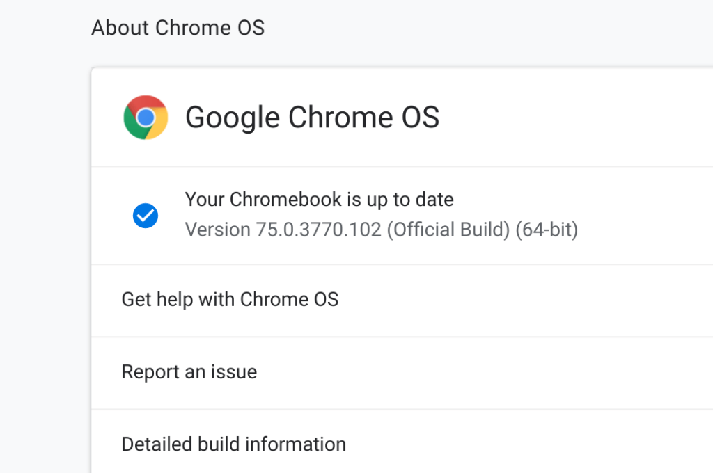
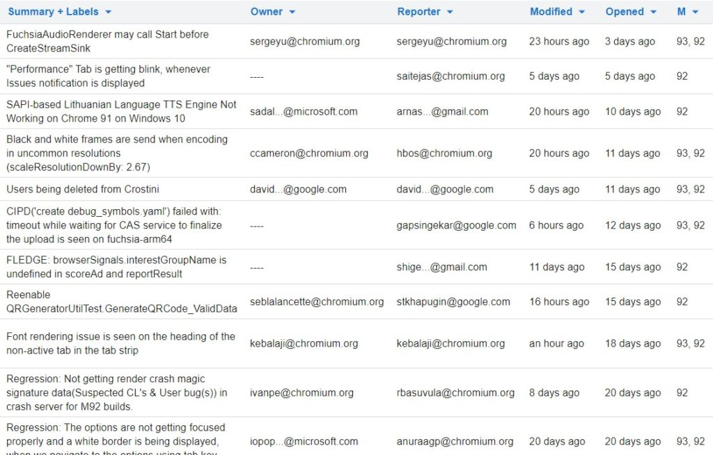

By now you've probably heard the news that [Chrome OS is moving from a six- to four-week software update cycle](https://blog.chromium.org/2021/06/changes-to-chrome-oss-release-cycle.html). This follows the same change to the Chrome browser, which was previously announced. As a result, Chrome OS 95 will be skipped over and Chromebooks will move from Chrome OS 94 to 96 in the third quarter of this year. It's a good move but there's one more thing that should be done: It's time to reconfigure Chrome OS version numbers to reflect the change.

Here's what I would propose if anyone at Google is listening. Use month and date Chrome OS version numbers to actually provide meaning to the release cycle.

Think about it. What do you know about Chrome OS 91, which is the current Stable Version for Chromebooks?

Well, you know it arrived at some point after Chrome OS 90 and that's about it. You don't know when it released simply by the version. You don't know based on today's date if you should have Chrome OS 90 or 91. The same goes for Chrome OS 89, 74, and 61. _**They're just arbitrary version names.**_

However with month and date Chrome OS version numbers, you'd know a wee bit more.

If Chrome OS version 94 starts to roll out in September, for example, wouldn't Chrome OS version 2109 tell you that? Wouldn't you know in August not to expect Chrome OS 2109? And if your Chromebook doesn't have Chrome OS version 2019 by October, you should be looking into why?

Clearly, I'm using a fairly simple naming scheme here.

The first two digits would be the last two digits of the software release year. So the "21" in version 2109 tells you that the software implementation was from 2021. And the last two digits of the version numerically represent the month of that implementation. That's the "09" in my example of a September, 2021 Chrome OS version number.

It's a subtle change but a more intuitive versioning system that users get at least some information about. And you could even take things a step further with [Google's Chrome OS Automatic Expiration Dates](https://www.aboutchromebooks.com/news/how-to-get-chrome-os-updates-on-chromebook-after-aue-automatic-update-expiration-date-cloudready/). If a device is slated to get Chrome OS updates through June of 2027, then it would be supported through version 2706, for example.

That's not a necessary ask but it could be helpful to enterprises and education organizations that use Chromebooks. It might even be useful for the Chromium developers: All Chrome OS bugs are tied to version numbers today. So to keep track of when their fix or feature add is going public, they have to tie the arbitrary version number to the non-arbitrary release date!

Again, this isn't a tweak that would bring a massive change to how we use Chromebooks today. It's not like the addition of [a native Linux container for advanced desktop software](https://www.aboutchromebooks.com/news/linux-on-chromebooks-just-might-get-me-through-a-masters-in-computer-science/) or Android app support. Those are **_big_** changes with large potential value-adds. But it seems like arbitrary Chrome OS version numbers are just that: Arbitrary and semi-meaningless.

Oh and speaking of enterprise and education markets, I'm curious about something.

Support folks in those areas _really_ have to test user software on Chromebooks before rolling out Chrome OS software updates. Does the four-week cycle add any angst in that regard or is it business as usual and you're looking forward to this? Let me know!
