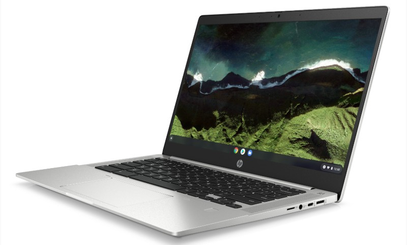

The parade of Chromebooks with 11th-gen Intel processors continues, with [Chrome Unboxed](https://chromeunboxed.com/the-enterprise-minded-11th-gen-hp-pro-c640-g2-chromebook-is-available-for-849/) reporting that HP is taking orders for the [previously announced HP Pro c640 G2 Chromebook](https://www.aboutchromebooks.com/news/11th-gen-intel-chips-power-newest-hp-pro-c640-g2-chromebooks/). This follow-up to last year's model gets newer CPU selections and lower pricing. I still think the prices are too high for what you're getting, but any cost savings is good. The downside is that when [I configured a basic Core i3 model](https://www.hp.com/us-en/shop/pdp/hp-chromebook-pro-c640-g2-customizable-355v0av-mb), the shipping date was out to March of 2022.

Let's talk about that particular configuration to give you an idea of the price point.

I selected the [Intel Core i3-1115G4](https://ark.intel.com/content/www/us/en/ark/products/208652/intel-core-i3-1115g4-processor-6m-cache-up-to-4-10-ghz.html), which is likely powerful enough for the majority of Chromebook users today. That CPU selection forces 8 GB of memory in the 2-in-1 Chromebook, which is fine by me: More RAM means more open tabs and applications at one time. This unit also comes with the backlit keyboard option and 64 GB of eMMC storage.

The base display option on the HP Pro c640 G2 Chromebook is a 14-inch 1366 x 768 resolution, non-touch panel.

Few will be happy with that, so I chose a 1920 x 1080 panel, although I skipped the touchscreen. There is a fingerprint sensor option but I decided to "save" $25 and skip it.

Now, if you had told me these specifications and asked me to estimate the price, I'd say around $600. What would you say?

Well, if you said $804.30, you'd be right.

No matter how much of a performance boost the 11th-gen Intel processors bring to this year's Chromebooks, that just seems like too much money for what you're getting. There aren't any exact like-for-like options from other brands, but you can find similar options out there priced at least $200 lower.

I understand that the HP Pro c640 G2 Chromebook is targeted more towards an enterprise audience. After all, the HP Chromebook x360 14c is really the consumer play.

Even so, there are more similarities than differences between these two models. And you can [customize the x360 with similar hardware for $539.99, with shipping only 10 days out.](https://www.hp.com/us-en/shop/pdp/hp-chromebook-x360-14ct-cc000-2e6x3av-1)

This price gets you a [slightly different 11th-gen Intel Core i3](https://ark.intel.com/content/www/us/en/ark/products/208652/intel-core-i3-1115g4-processor-6m-cache-up-to-4-10-ghz.html), the same 8 GB of memory, 128 GB of _**faster**_ SSD storage, and the 1920 x 1080 touch panel. You do lose the fingerprint sensor option, however.

Regardless, if the HP Pro c640 G2 Chromebook is the one you've been waiting for, you can get your order in now. You'll still be waiting a while to get it, so maybe... just maybe... that updated HP Chromebook x360 14c is worth considering instead.
