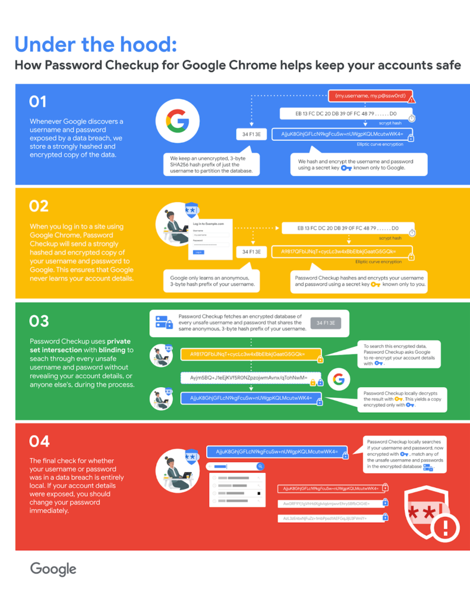

Google on Tuesday announced that Chrome and [Chrome OS 79 includes the Password Checkup feature, as expected](https://www.aboutchromebooks.com/news/google-launches-password-checkup-how-to-use-it-on-your-chromebook/). Previously, this feature was available as a Chrome extension, meaning that it was up to users to install the security feature, many of which likely had no idea it was available.

By moving Password Checkup directly into the platform, more users will be protected online thanks to notifications when an entered password is recognized against a database of stolen credentials.

The [Google Security Blog has a detailed technical writeup](https://security.googleblog.com/2019/12/better-password-protections-in-chrome.html) of how this all works behind the scenes and it's interesting reading.

But if you're a visual kind of person, this infographic also explains it nicely.

Essentially, when Google sees an entered online password in Chrome OS, it compares it to a hashed database of known cracked credentials. All of the credentials are encrypted with a private key that only Google has. If a match is found, a second secure credential check takes place locally on your Chromebook.

Google says the database has over 4 billion such breached username and password combinations. So how can it quickly search for your credentials in a massive data set?

A 3-byte SHA256 hash prefix is attached to your username "to reduce the scale of the data joined from 4 billion records down to 250 records, while still ensuring your username remains anonymous." Impressive.

Although version 79 of Chrome is expected out today for most devices, [Chrome OS 79 won't likely drop until next week according to the Chromium Dash Calendar](https://chromiumdash.appspot.com/schedule). Once it does, you'll have the Password Checkup feature installed on your Chromebook.
