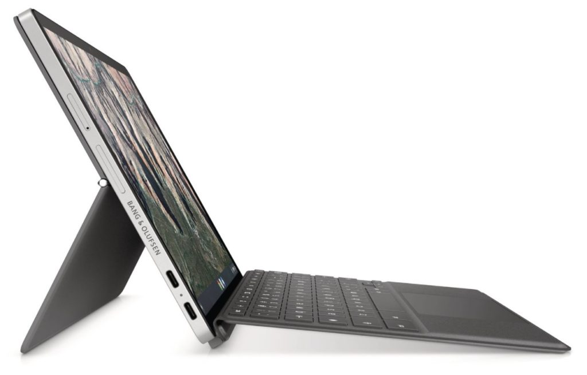

Did you miss out on [the $200 discount seen on the HP Chromebook x2 11 Chrome OS tablet earlier this month](http://X2)? You patience has been rewarded with an extra 10% of savings. The [recently launched, $599 HP Chromebook X2 11](https://www.aboutchromebooks.com/news/hp-chromebook-x2-11-detachable-lte-chrome-os-tablet-and-hp-chromebase-21-5-debut/) can be had for $220 off, making [your cost of this detachable Chrome OS tablet a more realistic $379 at Best Buy](https://www.bestbuy.com/site/hp-11-touch-screen-chromebook-qualcomm-snapdragon-8gb-memory-64gb-emmc-natural-silver-night-teal/6471019.p?skuId=6471019).

This isn’t an LTE model, which HP says is on the way, so you’ll have WiFi for connectivity. But you do get memory boost to 8 GB of memory, instead of just half that. The 11-inch touch display has a solid 2160 x 1440 resolution and supports the included rechargeable USI stylus. Unlike last year’s popular Chrome OS tablet, the Lenovo Chromebook Duet, the HP has a pair of USB Type-C ports. Even if they’re on the same side of the tablet, which isn’t ideal, it’s nice to have two.

Inside is the first generation Qualcomm Snapdragon 7c compute platform with an 8-core processor that’s good enough for entry-level performance and long battery life. A pair of cameras for video chatting and picture snapping are also along for the ride.

I still question the value of this HP Chromebook X2 11 configuration at its full price of $599. Unless you’re willing to give up performance for a smaller, more mobile Chrome OS workstation, you can get a superb Chromebook for that same cost. Or even less: The [Lenovo Chromebook 5i with new Pentium Gold should easily outperform this tablet](https://www.aboutchromebooks.com/news/lenovo-ideapad-5i-chromebook-review-a-potent-pentium-powered-laptop/) and costs around $440 when you can find it in stock.

At under $400 with the two most recent sales, however, the HP Chromebook X2 11 makes more sense for what it offers. Yes you’re still giving up some attributes of a “better equipped” Chromebook but the price difference makes it a little easier to make that trade off.

I’d be interested to hear from any readers that have bought the HP Chromebook X2 11, either on sale or at full price, to hear your thoughts on the value proposition.

