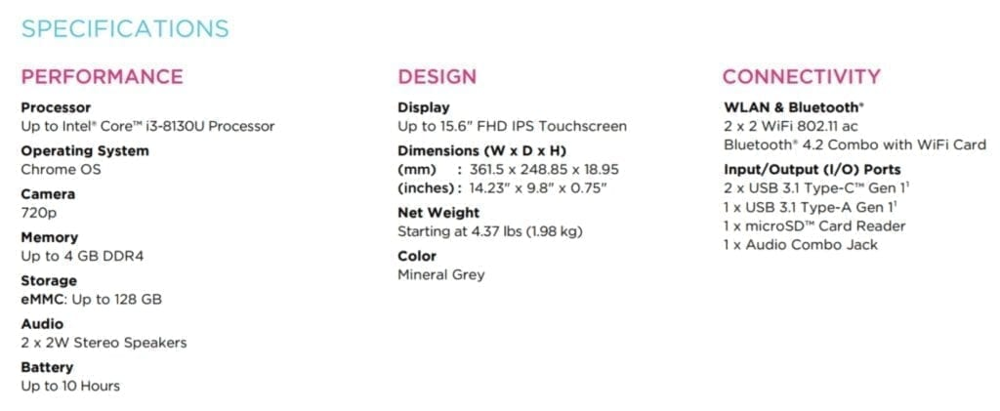
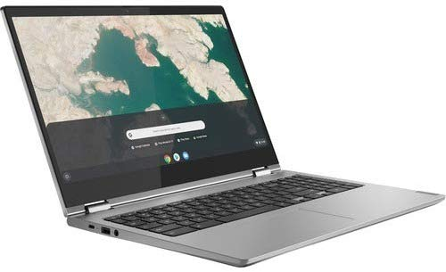

In late August, [Lenovo introduced three updated Chromebooks](https://www.aboutchromebooks.com/news/lenovo-chromebook-c340-s340-release-date-specs-pricing/) and said they'd be available in September, and in the case of the largest model, in October.

Unfortunately, the Lenovo Chromebook C340-11, C340-15 and S340-14 still aren't showing on Lenovo's website. Looks like it's Amazon to the rescue: You can [order the Lenovo Chromebook C340-15 today for $429.99](https://www.amazon.com/Lenovo-Chromebook-Processor-Graphics-81T90003US/dp/B07XH9876R/ref=pd_sbs_147_1/139-3877605-4995805?_encoding=UTF8&pd_rd_i=B07XH9876R&pd_rd_r=8d904042-c8aa-4e50-b23c-c216c4178c5a&pd_rd_w=CUNRS&pd_rd_wg=Mrqeb&pf_rd_p=d66372fe-68a6-48a3-90ec-41d7f64212be&pf_rd_r=B9TDCX1Z2P5579M8ST2J&psc=1&refRID=B9TDCX1Z2P5579M8ST2J) and have it arrive tomorrow.

Bear in mind that the Lenovo Chromebook C340-15 is the most expensive of the three new models, which are expected to be in the $250 to $290 range.

That's partially because the C340-15 is the largest, comes by default with a full HD, or 1080p display, and uses an Intel Pentium Gold 4417U CPU compared to an Intel Celeron N4000 processor.

Here's a full listing of the specs for the Lenovo Chromebook C340-15:

Lenovo Chromebook C340-15 specifications

Although there are some "up to...." specs above, Amazon is selling the base model with Pentium Gold processor, 4 GB of RAM, and 32 GB of storage. There aren't any upgrade options to boost the storage capacity or get the Intel Core i3-8130U processor yet.

I'm hoping to see one of these appear at my local Best Buy because I'd like to see the bang for buck when it comes to performance.

Why? Because you can get a [Dell Inspiron Chromebook 14 right now for $449 from Best Buy](https://www.bestbuy.com/site/dell-inspiron-2-in-1-14-touch-screen-chromebook-intel-core-i3-4gb-memory-128gb-emmc-flash-memory-urban-gray/6299820.p?skuId=6299820). You lose a diagonal inch on the 1080p display, get the same 4 GB of memory but gain the Core i3 and 128 GB of storage for $30 more.
