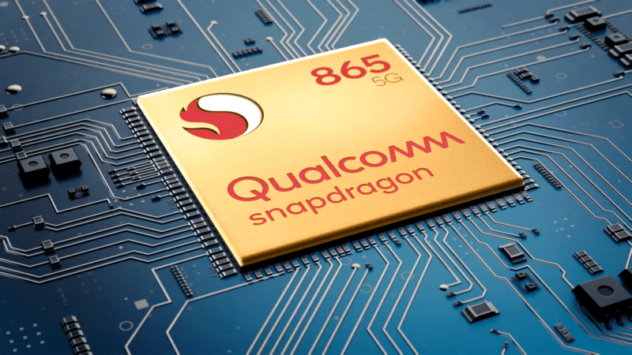
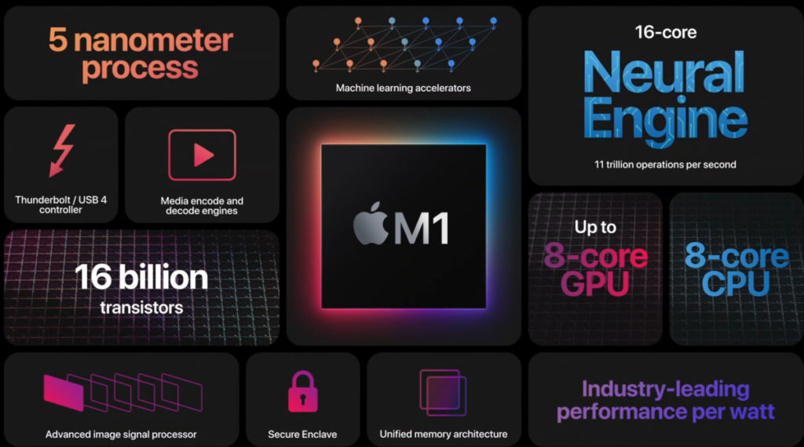
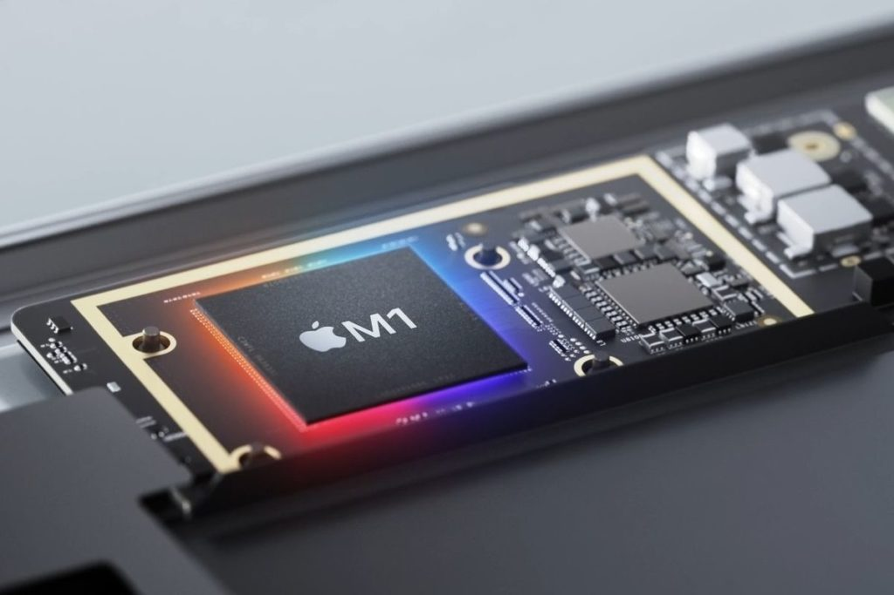

By now you've likely read the reports that [Google is planning to have its own chips for Chromebooks](https://asia.nikkei.com/Business/Tech/Semiconductors/Google-developing-own-CPUs-for-Chromebook-laptops), much like it will have in the upcoming Pixel 6 smartphone. I love this idea on the surface and even noted last year that [the Apple M1 silicon reviews](https://www.aboutchromebooks.com/news/all-the-great-apple-silicon-m1-device-reviews-make-me-wish-for-chromebooks-with-google-made-chips/) made me want Google chips in Chromebooks. Although I'm thrilled by the news, there are some very important things to keep in mind before the reported chips arrive in 2023.

## Clarification: Google won't be making the chips

Before we get into the meat of things, if you think Google chips in Chromebooks will be made by Google, you're wrong. Google will at best be designing (or even co-designing) the chip based on the standard ARM architecture. This is exactly what most other companies do.

For example, how many of these companies do you think make their own processors or GPUs? You can choose from Apple, Huawei, MediaTek, Nvidia, Qualcomm, and Samsung.

The answer? Only one, and it may not be the one you think.

It's Samsung, which alongside TMSC, fabricates chips for most of the industry. (TMSC is larger, by far.) All of the others? They **_design_** their chips, either with whatever standard architecture ARM provides or by tweaking that architecture if they have the higher-priced ARM license to do so.

While this point is subtle, it's actually very important.

## Chip fabricators cater to the larger players

Now that we know that Google will be a chip designer like most of its competitors and not a chip manufacturer, here's why it matters. Chip fabrication plants are super expensive to build. Like a billion dollars or more to build. And it takes a while to build those production lines. If that wasn't the case, we wouldn't be in a chip shortage situation right now. We'd just click a button and open up a new chip fabrication plant. Boom! Shortage problem solved!

Because of the economics and limited supply of these plants, chip makers like TMSC and Samsung have to be selective about the order of production for their various customers. Money is a big factor here and Apple is known for pre-paying to get its chips fabricated so it can generally guarantee its product line evolution. And by pre-paying, I mean even funding some of the fabrication facilities in advance so the production capabilities are ready when Apple needs them to be.

## How many chips will Google need?

So a company like Apple is going to get "dibs" on chip production in the early stages of newer CPU cycles. Everyone else? Well, that's going to depend largely on how many chips each company will need and what they're willing to pay.

Companies that sell the most devices need the most chips and it's more cost-effective for the silicon production line to crank out 10 million of the same processor as opposed to a few hundred thousand of another one. The companies that need a high quantity of chips are moved up in line. And if Google chips for Chromebooks have a custom design (and why bother if they don't?), then unless Google pays a huge premium or orders millions of the chip, it's likely going to be at the back of the production line.

I don't see Google ordering 10 million chips, maybe not even a million. I think it's a safe assumption that it will use the custom silicon in its own line of Chromebooks, at least initially. Although I haven't seen sales figures, I don't think a million Pixel Slates were sold.

Perhaps the Pixelbook Go did, but that may even be a stretch. Plus, that device has been around for nearly two years, giving it even more time to sell more units. Heck, there are reports that in its best-selling year, [Google Pixel phones only sold 9 million units](https://asia.nikkei.com/Business/Tech/Semiconductors/Google-developing-own-CPUs-for-Chromebook-laptops) in a smartphone market with more demand than for Chromebooks.

To top it all off, this doesn't even take into account the chip shortage issues that are likely to continue well into next year. That could further pressure chip makers to tell Google, "Yeah, we'll get to your chips when we get to your chips."

## What's the ROI of customization?

When Apple debuted the M1 processor, I had early thoughts on why Google chips in Chromebook[s would be a good idea](https://www.aboutchromebooks.com/news/apples-own-chips-inside-arm-powered-macs-show-why-google-needs-to-make-custom-silicon-for-chromebooks/):

> “Google has to rely on mostly off-the-shelf processors that are commodities. It’s hard to optimize fully in that case. And Apple’s advantage here isn’t just a single CPU architecture, but soon a unified application ecosystem, something that Google doesn’t have. Closing the loop then, **_a customized ARM architecture processor combined with Chrome OS fully optimized for that custom processor_** is clearly lacking right now in the Chromebook space.”

And I still believe in what I said. Now that this could become a reality, I'm thinking about what specific optimizations Google could create with its own CPU designs.

I'm not coming up completely short here but I am wondering what the actual value add will be and will it be worth the investment. Again, I'm pro-Google chips in Chromebooks but I'm trying to be real here in terms of tangible benefits.

Most of what Google could optimize for is with Linux, which is what Chrome OS is really built on, virtual machines for the Android and Linux app containers, and... a browser.

This is different for Apple, which has its own desktop applications and solid third-party support for apps. Think Photoshop and Final Cut Pro, for example. There's a reason these can export media on the M1 chip as fast, if not faster, than most current Intel chips. Apple's M1 has been optimized for that activity because it knows a huge number of its macOS users actually do those activities.

## Chrome OS isn't macOS

Chrome OS is a bit different. It doesn't have desktop applications that can take advantage of optimized silicon.

Now, this might change in the future as part of the custom CPU or GPU plan. Perhaps some high-profile app makers are convinced by Google to port over Linux versions of their software that can take advantage of Google chips in Chromebooks. And I could see native games on Chromebooks become comparable to their Windows or macOS counterparts with a chip that's optimized for gaming.

Multiple Chrome tabs, a PWA, Google Play Music Android app, and Linux humming along.

Outside of that, and maybe some nebulous AI / ML activities, I'm not sure what in the Chrome OS architecture would most benefit from an optimized chip just yet. And that means such silicon might only provide an incremental benefit to a subset of devices, Google-branded Chromebooks, for a large amount of effort and money.

I'm sure you all have thoughts on this news too, so chime in with a comment below!
