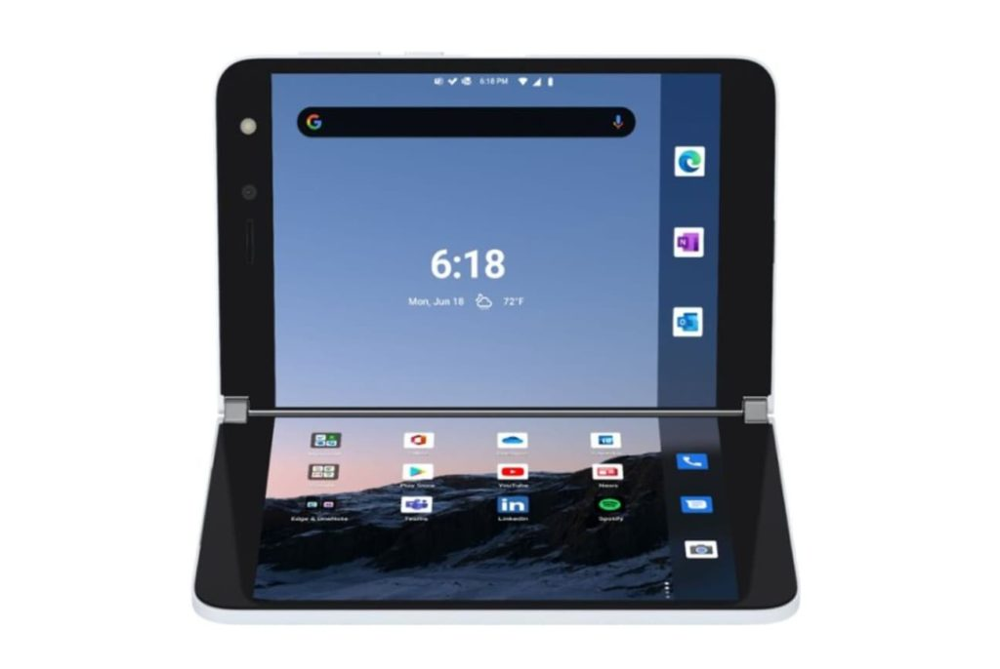

I've long been intrigued by different mobile device form factors and the foldable phone is starting to really hit its stride this year. Sure, we saw the Galaxy Fold arrive last year, but it wasn't quite what I wanted and the second generation Fold looks better, as expected. But after watching the Microsoft Surface Duo press event earlier this month, combined with work on [Google's in-progress Phone Hub for Chromebooks](https://9to5google.com/2020/08/15/chrome-os-android-phone-hub/), I'm seriously thinking of buying a Surface Duo.

Here's the press event video, in case you didn't see it. Pay particular attention to Microsoft's own Your Phone experience with Windows, starting around the 25 minute mark:

https://youtu.be/R1CNwBzYqRs

Obviously, the Microsoft Your Phone app for Android works with Windows PCs, not Chromebooks. However, my hope is that Phone Hub for Chromebooks ends up providing a similar experience.

**_I don't know that this is what Google is envisioning for the Phone Hub, of course._**

After all, running Android apps on a Chromebooks is a native feature now, with no Android phone needed. Imagine if that changes though. It would fundamentally offer a different and perhaps simpler way to run Android apps on a Chromebook to some extent. You wouldn't need to install Android apps on your Chromebook and you therefore you wouldn't be confused if an app on your Chromebook is a web app, PWA or Android title.

And the "plumbing" is already there in more than one way. Android apps already have a container to run in on Chromebooks. And Chromebooks already have the capabilities for emulation and/or virtual machines as evidenced by Linux and the [Android emulator for Android Studio on supported Chromebooks](https://www.aboutchromebooks.com/news/some-chromebooks-now-support-the-android-emulator-for-developers/). Tweaking the front end by using a connected Android phone wouldn't require starting from scratch.

Essentially, I'd like to see Google do for Android and Chromebooks what Microsoft is doing with the Android-powered Surface Duo and Windows. Maybe that's in the cards and maybe not. Time will tell.

Since this is all an unknown, I haven't yet pre-ordered a Surface Duo. Well, that and the $1,399 price tag are holding me back, although I can clean out my device closet and get up to a $700 trade-in credit towards the purchase. That helps quite a bit.

My other concern is how Microsoft-centric the Surface Duo is, for obvious reasons. Although I use some of the Microsoft Android apps, my main daily experiences are in Google's apps. Although Duo is an Android device and all Google apps are pre-installed, I want to make sure I can "de-Microsoft" some things, such as the Launcher.

Does anyone else see this Android experience from phone to Chromebook as a practical possibility or is this something you don't want to see happen? I'm also curious if any current Android and Chromebook users are thinking about purchasing a Surface Duo.
