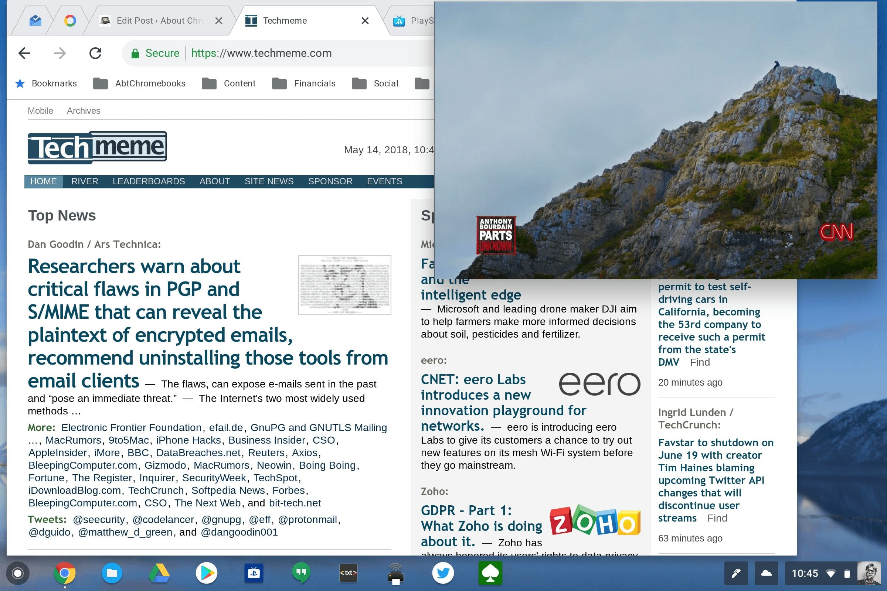

Last month, I reported on [an experimental picture-in-picture (PiP) feature that I used on my Chromebook](https://www.aboutchromebooks.com/how-to/how-to-enable-picture-in-picture-on-a-chromebook/). At the time, I had to use a Chrome flag setting to enable it. On Tuesday, I spotted code that will [enable the PiP API by default](https://chromium-review.googlesource.com/c/chromium/src/+/1090728) with [Chrome version 69](https://www.chromestatus.com/feature/5729206566649856), and not just for Chromebooks. It will also be available in the Chrome browser for Windows, Mac and Linux. And eventually, Chrome for Android support will follow.

So why is this moving from testing to availability? According to [related documentation](https://groups.google.com/a/chromium.org/forum/#!msg/blink-dev/ibVPbqBQapU/rUZIrPPLAQAJ):

> The Origin Trial was dropped. We mostly wanted to help web developers setup their websites and get feedback for a next version of the API. We now have gathered strong interest from external partners.

When I used an iPad Pro 12.9 as my daily driver, I used the native PiP feature all the time. It was super useful when I was working on the tablet and wanted to watch YouTube or television content; we stream all of our TV from PlayStation Vue.

Testing it on my Pixelbook was just as useful as I was able to catch some PGA golf while researching and writing posts. A few weeks ago, the feature stopped working for me, so I suspect once "Origin Testing" was complete, it may have been disabled in a Chrome OS update.

Regardless, making this feature enabled by default is a smart move. Because there were several Chrome flags to enable and an extension to install, most folks wouldn't have bothered to set it up. I don't know if the final implementation will still require an extension -- I'm betting not -- but by making it easier to just use, as a native, default feature, more people will actually benefit from it.

Note that schools or businesses that use managed Chromebooks or the Chrome browser can disable this feature if they want: There will be [a policy available in the Admin Console to allow or disable it](https://chromium.googlesource.com/chromium/src/+/2e9a253df86bf18beaa55b5062fbf37884493bbf/third_party/blink/renderer/modules/picture_in_picture/html_video_element_picture_in_picture.cc#84).
