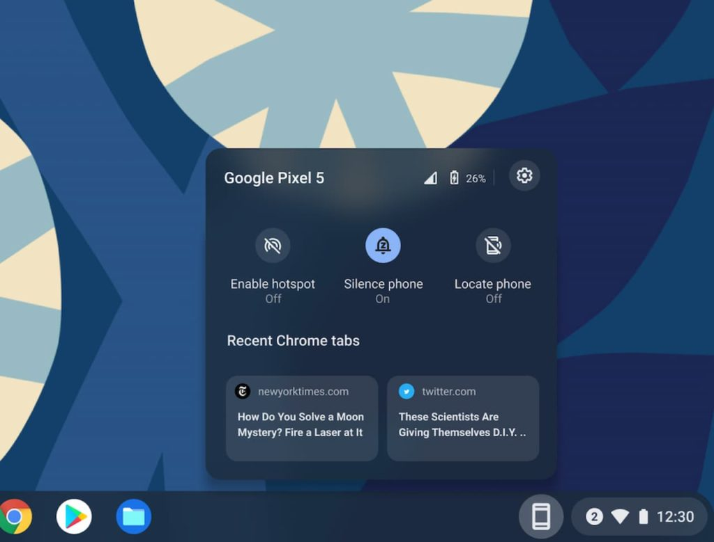

Later today, Google is streaming its Pixel 6 launch event online. You can [catch it live right here](https://pixelevent.withgoogle.com/) if you're interested. Of course, we'll hear about the new Tensor chip powering the Pixel 6, new cameras and photo features, as well as many other Android 12 goodies. My hope though? Google shows off a feature to run Android apps on a Chromebook from the phone.

That might sound silly. After all, you can already run Android apps on a Chromebook out of the box. Enable the Google Play Store and off you go.

But more than a year ago, when considering a Microsoft Surface Duo, I saw that [using phone apps on a computer that didn't have the mobile software installed looked pretty handy](https://www.aboutchromebooks.com/news/phone-hub-chromebooks-surface-duo-vs-your-phone/). And I suggested that Google would be keen to improve the Chrome OS Phone Hub to be similar.

Why? Rather than cluttering up Chrome OS with all of a phone's Android apps on a Chromebook, it's just as effective to "stream" those apps on a laptop without installing them. This helps with local storage constraints and reduces some of the confusion between "Is this a Chrome app, a PWA, or an Android app?" when using a Chromebook.

Earlier this week, [XDA Developers shed little more light](https://www.xda-developers.com/chromeos-launching-phone-apps-on-chromebook/) on how Android apps on a Chromebook could be accessed from the phone, even when not installed on Chromebook:

> Presumably, when you receive a notification on your phone, and it’s forwarded to your Chromebook, you will be able to click on it to open the said app in a window for a brief period.

I'm not sure what "brief period" means but I assume that you'll have enough time to interact with the Android apps on your Chromebook and then close the mobile application. The key thing here is that the Android app won't have to be installed on the Chromebook. As long as it's on your Android phone, the Chrome OS Phone Hub will shoot it over in the context of whatever the notification suggests. There's no need to stop using your Chromebook, pick up your phone, take action, put the phone down, and revert back to your Chromebook.

My instinct tells me that if Google does launch this feature, it will be exclusive to its own line of handsets. That would mean the Pixel 6 launch is a perfect time to show off this "better together" feature with Chromebooks. Even if the feature isn't ready for prime time, Google could easily demonstrate it, however briefly.

Don't have or want a Pixel? I doubt that's going to be a problem if you still want Android apps on a Chromebook, using your phone. Google typically makes certain features exclusive to the Pixel lineup at launch but eventually trickles them down into Android proper. By keeping such features exclusive for a short while, Google can push potential buyers to its new Pixel 6 phones, which is a smart strategy.

How about it: Is this a feature you would use on your Chromebook, whether it's Pixel exclusive or not?
