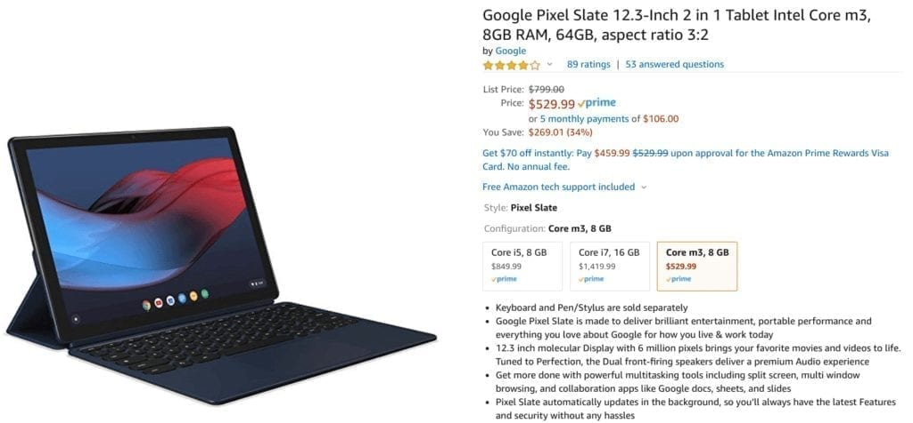

In my [Pixelbook Go review](https://www.aboutchromebooks.com/news/pixelbook-go-review-a-premium-price-validated-by-a-premium-device/), I noted that Google's new clamshell Chromebook essentially has the same internals as last year's Pixel Slate. So you lose the 2-in-1 use cases as well as digital pen support. If those are important to you, the [Core m3 Pixel Slate can be had for just $529.99 on Amazon](https://www.amazon.com/Google-Pixel-12-3-Inch-Tablet-aspect/dp/B07JWCHWRM/).

Here's a rundown of the Pixel Slate specs, which is normally priced at $799:

- [Intel Core m3 8100Y](https://ark.intel.com/content/www/us/en/ark/products/185282/intel-core-m3-8100y-processor-4m-cache-up-to-3-40-ghz.html) dual-core CPU with 1.1 GHz clock speed, 3.4GHz turbo speed
- 8 GB of LPDDR3 memory
- 64 GB of eMMC storage
- A 12.3 inch IPS touchscreen display with 3000 x 2000 resolution and 3:2 aspect ratio
- Intel UHD Graphics 615 with that shares memory with the system
- 802.11ac Wi-Fi (2×2 MIMO) and Bluetooth 4.2
- A pair of USB Type-C ports for data, charging and 4K video output, dual microphone and stereo speakers
- Integrated fingerprint sensor in the power button
- 8MP 1080p front wide-angle camera, 8MP, 1080p rear camera
- 48 WHr battery with run time up to 12 hours, fast charge for a 2 hour run time in 15 minutes

I'm not suggesting the Slate is better than the Go; you have to determine if a clamshell or detachable Chrome OS device is better for your needs.

On the plus side with the Pixel Slate, you do get the previously mentioned 2-in-1 flexibility and optional pen support, plus a higher resolution display and fingerprint scanner.

<iframe style="width:120px;height:240px;" marginwidth="0" align="right" marginheight="0" scrolling="no" frameborder="0" src="//ws-na.amazon-adsystem.com/widgets/q?ServiceVersion=20070822&amp;OneJS=1&amp;Operation=GetAdHtml&amp;MarketPlace=US&amp;source=ss&amp;ref=as_ss_li_til&amp;ad_type=product_link&amp;tracking_id=aboutchromebo-20&amp;language=en_US&amp;marketplace=amazon&amp;region=US&amp;placement=B07J6TC92W&amp;asins=B07J6TC92W&amp;linkId=68b8c6ddcdae39ca83d3d86255c73594&amp;show_border=true&amp;link_opens_in_new_window=true"></iframe>

Of course, with the Pixelbook Go, you get a larger display, a lighter overall package with the obviously included/attached keyboard. However, the Brydge G-Type Wireless Keyboard for Pixel Slate is also discounted currently on Amazon. At the sale price of $79.99, you can add it to your Pixel Slate and still spend less than you would on the Pixelbook Go.

In terms of performance and the target audience, I'd say the Pixel Slate with Core m3 and 8 GB of memory is enough for all but heavy power users and/or developers. You'll be fine with a dozen open tabs, a few Android apps running simultaneously and occasional Linux use if that's your thing.

I'd consider this a solid mid-range device with some high-end features such as a high-resolution touchscreen and excellent speakers.

If you're interested in the Pixel Slate but put off by the early reviews, don't sweat it. There are still areas for improvement but all of the initial issues have been resolved through Chrome OS updates over the past year: Overview mode and task switching are vastly better (as shown below) and the overall experience is much smoother.

<iframe width="560" height="315" src="https://www.youtube.com/embed/4f6j0l9V5_o" frameborder="0" allow="accelerometer; autoplay; encrypted-media; gyroscope; picture-in-picture" allowfullscreen></iframe>
