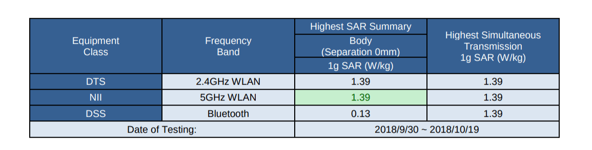

If you were hoping for one last Pixel Slate surprise -- and that surprise being an integrated LTE radio -- you'll be disappointed: There won't be an LTE model available, at least not at launch. This information comes from the [Pixel Slate FCC certification](https://apps.fcc.gov/oetcf/eas/reports/ViewExhibitReport.cfm?mode=Exhibits&RequestTimeout=500&calledFromFrame=N&application_id=c7vRlQ%2FI%2FtcAID71gyVZjw%3D%3D&fcc_id=HFSC1A) that [Chrome Unboxed found on Friday](https://chromeunboxed.com/news/pixel-slate-chromebook-tablet-fcc-filing-arriving-soon).

I was hoping we might get the chance to add an LTE module when choosing one of the [five Pixel Slate configurations you might be considering based on your usage and requirements](https://www.aboutchromebooks.com/opinion/which-google-pixel-slate-to-buy-guide/).

Part of my thought was the pricing for every model wasn't an exact price, but instead said: "From \[insert price here\]". Why say "From" if the price is simply the price? Oh well, maybe we'll see an LTE option added in the future like [Samsung did with the Chromebook Plus v2.](https://www.aboutchromebooks.com/news/samsung-chromebook-plus-v2-lte-release-date-specs-599-price-verizon/) And of course, you can use the [Instant Tethering feature of Chrome OS](https://www.aboutchromebooks.com/news/better-together-bringing-instant-tethering-voice-calls-and-easy-unlock-to-chromebooks/) with an Android phone for the Pixel Slate.

As you can see, for now, the FCC has only accepted test results with dual-band Wi-Fi and Bluetooth frequencies.So does this tell us anything about the potential release date for Google's Pixel Slate?

Not in any detail, of course, but the device can't be sold in the U.S. until it receives FCC certification. We're obviously a step closer to availability and/or pre-ordering. The only information we have -- and it's certainly not confirmation of anything -- is the Best Buy product listing that showed a November 22 release. That date was quickly taken down by Best Buy once I reported it, but I did capture a screenshot at the time.

Assuming that date is correct, we could see pre-orders start within the next two weeks or so; if you signed up to be notified by Google when that happens, keep an eye on your Inbox for confirmation.
