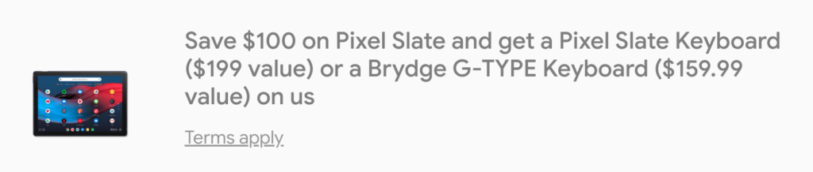

While the Pixel Slate isn't for everyone, those who are interested in the Made By Google Chrome OS tablet will want to check this deal. All this week, the [Google Store is selling all three Pixel Slate models at $100 of the normal price](https://store.google.com/product/pixel_slate). The icing on the cake is your choice of a free Pixel Slate Keyboard or a [Brydge G-Type Keyboard](https://www.aboutchromebooks.com/news/brydge-wallaby-goanna-keyboards-for-chrome-os-pixelbook-nocturne-tablets/), making the savings up to $300.

That means the base, Intel Core m3 model with 8 GB of memory and 64 GB of storage with the included keyboard costs $699. For $200 more you can upgrade to the Core i5 model with a keyboard and double your storage, while the high-end Core i7 Slate and keyboard at $1,499 brings you to 16 GB of RAM and 256 GB of storage.

Should you buy it and which should you get?

Obviously, that up to your use case and budget. Frankly, if you plan to use the Pixel Slate as a full-time Chromebook -- meaning barely or not at all as a tablet -- you're probably better off with a 2-in-1 device.

You can spend less and get better-performing hardware with any of the Chromebooks with an Intel U-Series processor, for example. [The Acer Chromebook Spin 13 (reviewed here)](https://www.aboutchromebooks.com/reviews/acer-chromebook-spin-13-review-vs-pixelbook/), Dell Inspiron Chromebook 14, HP Chromebook x360 14 and Lenovo Yoga Chromebook C630 all come to mind in that regard.

However, if you plan to split up your Chrome OS activities between laptop and tablet use, the Pixel Slate might fit your needs better. I wouldn't worry about the fact that [Google is out of the hardware business for tablets](https://www.aboutchromebooks.com/news/made-by-google-exit-tablet-business-pixel-slate-chrome-os-chromebooks/). I've already seen efforts to improve the Chrome OS tablet experience arrive since that announcement and there are plenty of others in the works.

Put another way: If I was concerned, I wouldn't still be using the Core i5 Pixel Slate I purchased myself as a daily driver for browsing, Android apps and [Java code for my CompSci classes](https://www.aboutchromebooks.com/news/how-to-code-on-a-chromebook-crostini-pixel-slate/).

Implementing a linked list stack in Java on the Pixel Slate - yay!

One thought on the Android apps though. If you're thinking "Hey the Pixel Slate would make for a great Android tablet", I'd pause on the purchase.

Yes, the Pixel Slate does run Android apps. But you can get a very capable pure Android tablet for far less money. In most cases, I'd say you're better off doing that since the main draw of the Pixel Slate is really Chrome OS and the full desktop browser experience.

Having said all that, if the Pixel Slate could meet your needs, this discount and free keyboard is a stellar deal. Keep in mind that this pricing promo ends on July 27 or "while supplies last and subject to availability." It's also only for U.S. residents, unfortunately.

For basic browsing, Android apps and maybe a little Linux, the Core m3 model should suffice. Just keep in mind that the base configuration has 64 GB of storage only. If you want more storage, the bump up to the Core i5 gets you a bit more performance as well as 128 GB of eMMC capacity. I personally wouldn't recommend the Core i7 model even at the discounted price. For heavy-duty coders, it [doesn't suffice as a recommended option to use Android Studio](https://www.aboutchromebooks.com/news/android-studio-chrome-os-chromebook-recommendation-google-io-2019/), for example, due to the Y-Series chipset.

If you're on the fence and have specific use case questions about the Pixel Slate, drop 'em in the comments. I'm happy to share my experiences with the device and I'm sure other Pixel Slate owners will as well.
