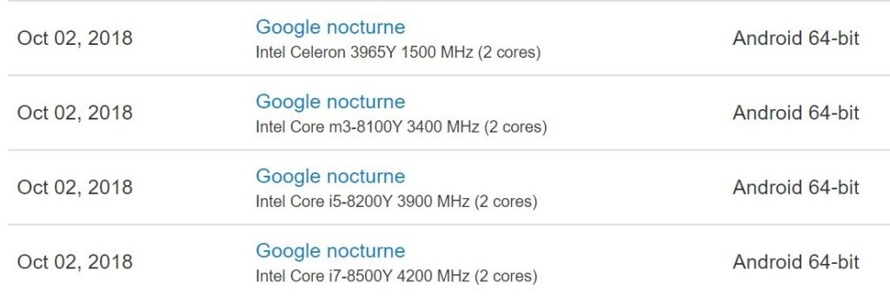

Earlier this week, the Pixel Slate appeared under its Nocturne codename on Geekbench, a benchmarking tool that displays test results on its site. That showed [Google's tablet to be running an Intel Core i7-8500Y processor](https://www.aboutchromebooks.com/news/google-pixel-slate-nocturne-specifications-android-9/), which was to be expected. Today I see four different ones on the same Geekbench site: The original Core i7 configuration as well as a Core i5, Core m3 and Celeron.

Also in the Geekbench results are the memory capacity used for the tested devices. So far, all of the Core i7 tests appear with 16GB of RAM. That makes sense, given the current Pixelbook tops out with a Core i7 and the same amount of memory.

The Core i5-8200Y device, as well as the Core m-8100Y and even the Celeron 3965Y, were all tested with 8GB of RAM on board. However, I wouldn't be surprised if at _least_ the Celeron -- and maybe the m3 -- model was also available with 4GB of RAM to bring down prices.

In fact, that's what all of this leads to: A range of Chrome OS tablets at multiple price points. I won't hazard any guesses right now based on this new information, mainly because I have one more key aspect about the Pixel Slate that I'm trying to ascertain: More to follow if and when I find it.

I'll admit it's possible that these tests were faked in some way. But I think that highly unlikely: A few of my sources suggested we'll see a range of configurations for this [Chrome OS tablet with detachable keyboard options](https://www.aboutchromebooks.com/news/interchangeable-chrome-tablet-keyboard-bases-google-assistant-key/). We're also nearing the launch time, with less than a week to go [before the October 9 Google event](https://www.aboutchromebooks.com/news/pixelbook-2-atlas-nocturne-madebygoogle-event-october-9/). This is _precisely_ when I'd expect to see such tests appear.
