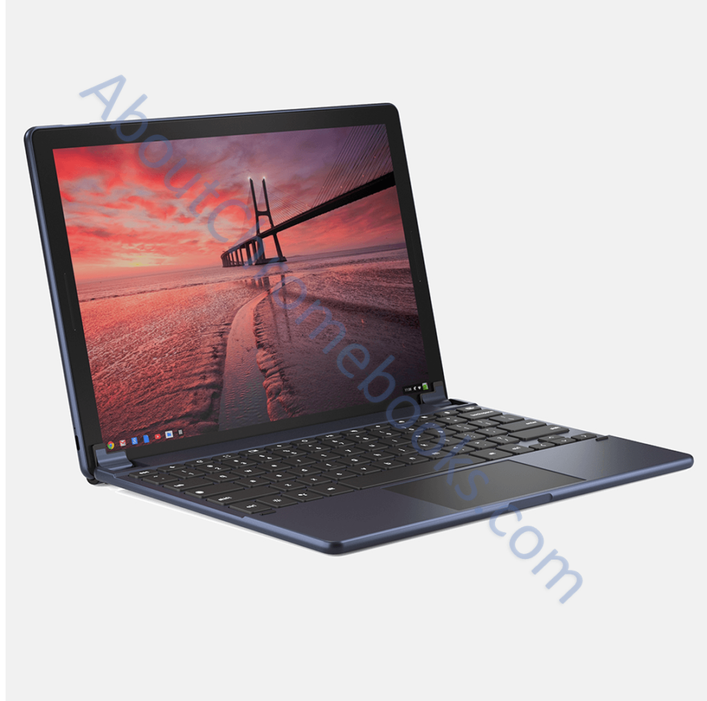

'Twas the night before Christmas -- or maybe the #MadeByGoogle event -- when what's likely the last Pixel Slate leak appeared.

Accomplished leaker Evan Blass dipped deep into his bag of tricks with this image of the Pixel Slate in its thin folding keyboard:

https://twitter.com/evleaks/status/1049423746442907648

The keyboard stand holds up the Pixel Slate a little differently from the iPad Pro Smart Keyboard: It appears to create a similar wedge but also rides further up the back of the tablet. My hope is that adds some stability for touching the display in this configuration. Perhaps there are magnets midway up the tablet to hold the stand section. I'm not yet sure, but I'll find out tomorrow at the New York City event.

By the way: This is the first image where you can clearly see a front camera on the Pixel Slate. I doubt anyone thought the tablet _wouldn't_ have one, but in case there was someone, they can sleep easy tonight.

At this point, we know the [likely hardware configurations](https://www.aboutchromebooks.com/news/pixel-slate-nocturne-intel-configurations-celeron-m3-i5-i7/), what [third-party keyboard options](https://www.aboutchromebooks.com/news/brydge-wallaby-goanna-keyboards-for-chrome-os-pixelbook-nocturne-tablets/) will be available, [the likely screen resolution](https://www.aboutchromebooks.com/news/nocturne-chrome-tablet-screen-resolution-specs-pixelbook-3000x2000/) -- although I'm wondering if the Celeron model will have a lower res display -- and just about everything else but the price of the Pixel Slate.

One last thought before I hit the sack early for my pre-dawn commute from Pennsylvania: The more I look at the keyboard, tablet and launcher icons, the more I think the Pixel Slate will be similar in size to Microsoft's Surface Pro, which is 12.3-inches diagonally. I may be off by a tenth or two, but that's my guess.
