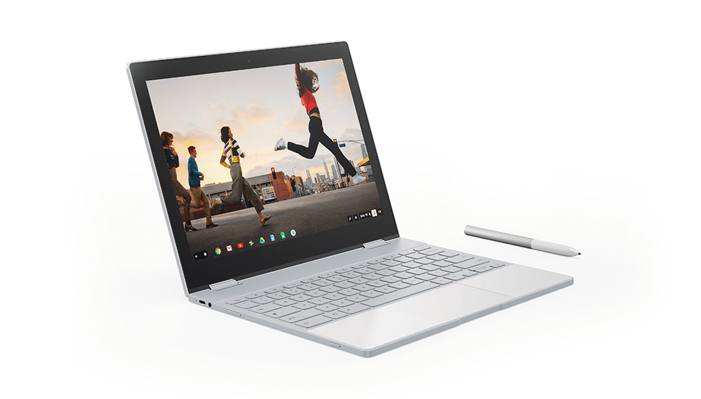

I read this [intriguing post at 9to5 Google](https://9to5google.com/2018/09/29/google-pixel-slate-nocturne-windows-10/) over the weekend, suggesting that the Nocturne tablet-- which is reportedly going to be called the Pixel Slate -- may have the dual boot functionality thanks to Campfire:

> A commit from July we found seems to indicate that the second Chromebook Windows 10 is being tested on is ‘Nocturne‘, the device in Chromium that we’re fairly confident is the to-be-announced Google Pixel Slate.

and

> This commit does not necessarily mean the Google Pixel Slate will launch with dual-boot capability. It does, however, mean that if and when Windows 10 support is officially announced for certain Chromebooks (this is still more-or-less a secret project), the Google Pixel Slate is likely among them.

I'm not too sure about that, although, in fairness, 9to5 Google indicates that it's likely the dual boot feature will originally be available on the Pixelbook, which I agree with. The idea is that due to a code commit back in July, Nocturne could gain the feature in the future.

That's a possibility, of course. So could many _other_ high-end Chrome devices though, such as the [Lenovo Chromebook Yoga 14](https://www.aboutchromebooks.com/news/4k-lenovo-yoga-chromebook-c630-specs-price-release-date-599/), [Acer Chromebook and Chromebook Spin 13](https://www.aboutchromebooks.com/news/new-acer-chromebook-spin-13-chromebook-13-launching-at-acer-next-event/) or the [Dell Inspiron 14](https://www.aboutchromebooks.com/news/dell-insipiron-14-chromebook-price-release-date-availability/), which could be the other "certain Chromebooks" mentioned. I wouldn't be surprised at all by that.

Here's the thing: That Nocturne commit from July is the only one I could find, after a few hours of digging, that relates to Windows. It seems like someone was testing the feature by kicking the tires or the idea was to try the function on a Chrome OS tablet. All other code for this project is in a build called "eve-campfire", meaning that Project Campfire is being developed for Eve, which is the code name of the current Pixelbook.

There's another telling aspect here as well. Recently, Google [updated the boot screen keyboard commands](https://chromium-review.googlesource.com/c/chromiumos/platform/ec/+/1122148) and [menu options for dual booting](https://www.aboutchromebooks.com/news/project-campfire-alt-os-dual-boot-windows-10-chromebooks-linux/). From what I can see so far, all of those commands require the keyboard. That's different from getting into boot menus on other Chrome OS tablets which have specific power and volume button commands to reset, recover or get into Developer Mode.

Yes, [Nocture will work with Chrome OS keyboards](https://www.aboutchromebooks.com/news/interchangeable-chrome-tablet-keyboard-bases-google-assistant-key/), but so does the HP Chromebook X2 -- with one keyboard, that is -- for example, yet it has the power and volume button commands. That's likely because Google can't guarantee the X2, or any detachable tablet, really, _will be attached to a keyboard at boot time_.

Again, dual booting could come to Chrome tablets and Chromebooks in the future. I'm all for it if that happens. I think, however, we'd see far more evidence in the code commits by now to even consider it happening in the near future. And it's likely easier and quicker for Google to bring the feature to other Chromebooks before it does the same to Chrome tablets.
