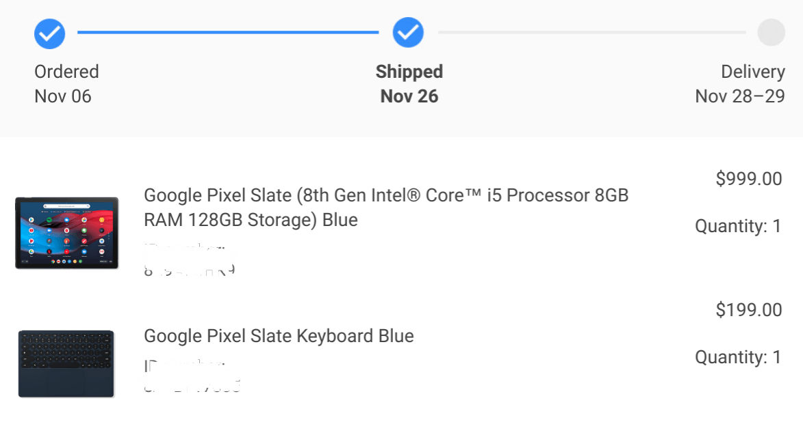

Looks like [Best Buy was right last month](https://www.aboutchromebooks.com/news/google-pixel-slate-release-date-november-22-best-buy/): The retailer will have the [Google Pixel Slate on release day, which is November 22](https://www.bestbuy.com/site/searchpage.jsp?st=pixel+slate&_dyncharset=UTF-8&id=pcat17071&type=page&sc=Global&cp=1&nrp=&sp=&qp=&list=n&af=true&iht=y&usc=All+Categories&ks=960&keys=keys). Even better is that [orders through the Google Store are now open](https://store.google.com/product/pixel_slate) as well. I had signed up for the waitlist, but oddly, didn't get a notification. However, I'm not surprised the Pixel Slate can be ordered directly now since the [device passed its FCC certification last week](https://www.aboutchromebooks.com/news/pixel-slate-fcc-certification-november-release-date-lte-wifi-bluetooth/).

And yes, I already ordered mine.

Of course, I did get a little hands-on time with the Pixel Slate and Pixel Slate Keyboard, which I think is very well designed.

\[embed\]https://youtu.be/MqRuNDGV9lA\[/embed\]

So I pretty much knew that I wanted this. But what if you're thinking of ordering one?

First, you should [ask yourself these two questions](https://www.aboutchromebooks.com/opinion/google-pixel-slate-vs-chromebook-should-i-buy-chromeos-tablet/) to make sure this is the right device and form factor for your needs. Assuming it is, which of the five models should you purchase? Again, it depends on your needs, not mine. So [here's a buyers guide of sorts to help you choose the Pixel Slate that will work for you](https://www.aboutchromebooks.com/opinion/which-google-pixel-slate-to-buy-guide/).

Remember, a Chrome OS tablet isn't the best form factor for everyone. If you're happy with a clamshell Chromebook or a 2-in-1, stick with what works.
