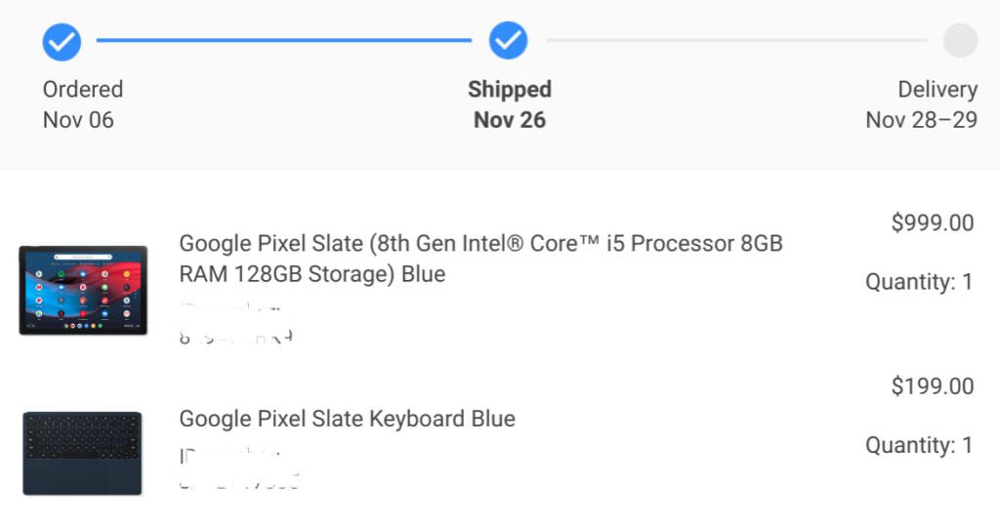

After a false start where we [expected the Pixel Slate to appear on November 22](https://www.aboutchromebooks.com/news/google-pixel-slate-release-date-november-22-best-buy/), it appears that pre-orders for the #MadeByGoogle Chrome OS tablet have begun to ship. Well, at least mine has; I assume other people who pre-ordered as soon as they could back on November 6 are getting the same or similar emails.

I don't have tracking information just yet, but based on the above image from the email I got from the Google Store, my Core i5 model and Pixel Slate Keyboard are on the way with delivery expected later this week.

I would assume that Best Buy will update its Pixel Slate availability within the next few days as well. That means there should be demo devices in stores for those who were on the fence. And if you're one of those people, I recommend [answering these two questions](https://www.aboutchromebooks.com/opinion/google-pixel-slate-vs-chromebook-should-i-buy-chromeos-tablet/) to help you get on one side of the fence or the other.

You may find out that your use case doesn't lend itself well to a tablet. In that case, don't pay the premium for the extra mobility of a thin slate when you can get an as powerful -- if not more powerful -- 2-in-1 Chromebook like the [Acer Chromebook Spin 13, which is $200 off today](https://www.aboutchromebooks.com/news/cyber-monday-chromebook-deals-include-new-acer-chromebook-spin-13-for-699/).

I asked myself those same two questions before I pre-ordered. I prefer a tablet for content consumption and a "leanback" type mode over a 2-in-1 device personally. And I spend roughly half the time now with Pixelbook laptop in those situations.

So the Pixel Slate is better suited to my needs; it might or might not be for yours. And that's OK: You should always buy the device that best meets your own personal requirements and use cases. If the Pixel Slate does meet your needs and you're not sure which of the five models would best suit you, I put together a [Pixel Slate buyers guide with recommendations based on expected usage scenarios](https://www.aboutchromebooks.com/opinion/which-google-pixel-slate-to-buy-guide/).
