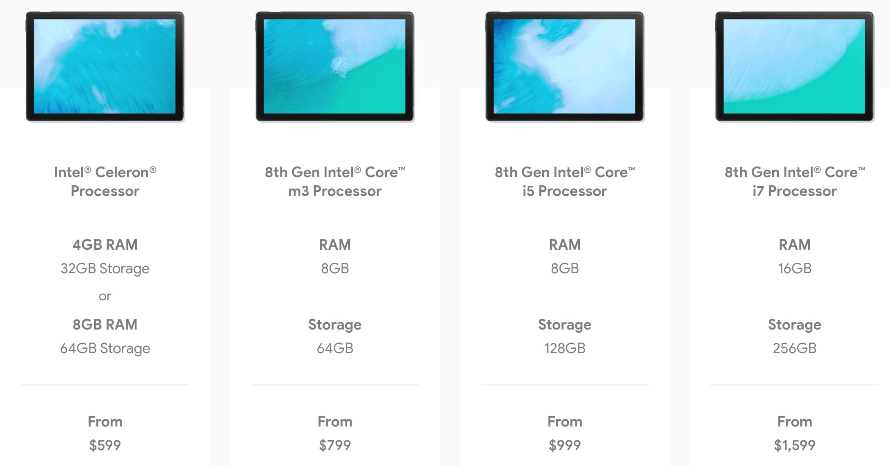
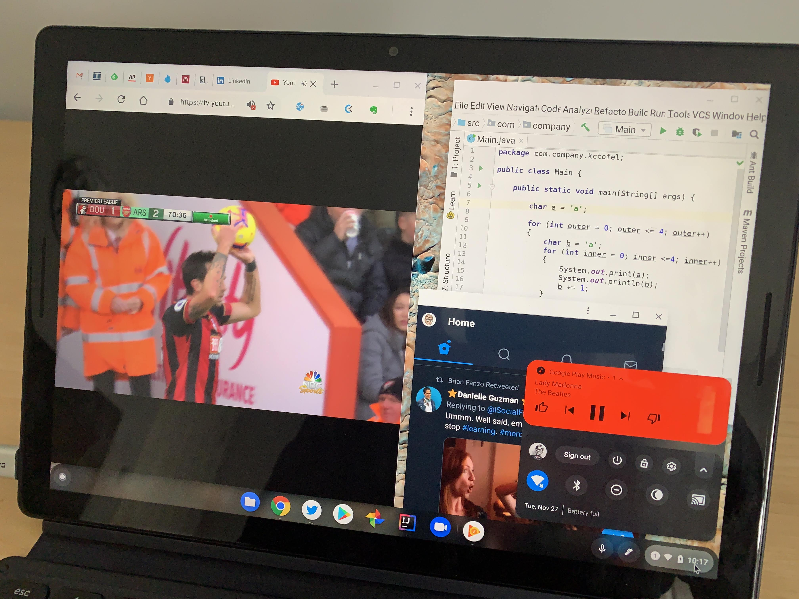

When discussing a [video of the Pixel Slate performance between the $799 and $999 models](https://www.aboutchromebooks.com/news/pixel-slate-core-m3-vs-i5-performance-video/), I noted that the [Chromium team opened up a bug report for the terrible animation lag on the $599 model](https://bugs.chromium.org/p/chromium/issues/detail?id=917605&q=slate&colspec=ID%20Pri%20M%20Stars%20ReleaseBlock%20Component%20Status%20Owner%20Summary%20OS%20Modified). It turns out that the team was aware of this even before the Pixel Slate started shipping. [We know that thanks to Chrome Unboxed](https://chromeunboxed.com/news/chromebook-tablet-mode-lag-jank-fix/), who spotted a similar but different bug report that's [been in the works since November 8 and specifically mentions the entry-level Celeron model](https://bugs.chromium.org/p/chromium/issues/detail?id=903486&q=jank%20overview&colspec=ID%20Pri%20M%20Stars%20ReleaseBlock%20Component%20Status%20Owner%20Summary%20OS%20Modified).

At least part of the issue has to do with the rounded corner software implementation on the user interface:

> A lot of animation jank seems to be coming from the use of Mask Layers to create rounded corners. This combined with background blur adds a lot of additional steps in the paint/rendering pipeline. The performance (fps increase) and memory improvement (tiles don't get discarded and we actually see the content) is quite significant on Nocturne Celeron when rounded corners are removed.

I assumed that the issue wasn't hardware related, or at least could be improved through software optimization. That may sound odd since the chips inside the various Pixel Slate models range from the lowly Intel Celeron to a Core i7 processor. However, the integrated GPU is actually the same for every model: It's the [Intel HD Graphics 615](https://www.intel.com/content/www/us/en/support/products/96554/graphics-drivers/graphics-for-7th-generation-intel-processors/intel-hd-graphics-615.html).

There is one key difference in the base-level Pixel Slate with Celeron that may also have a negative impact: That's the only configuration with 4GB of memory. And that memory on all of the Slate models is shared with the Intel HD Graphics 615, so when you start out with half the memory on the $599 Pixel Slate, you're already in the hole. [One trace of overview mode showed 1.5GB of memory in use](https://bugs.chromium.org/p/chromium/issues/detail?id=905388#c6), for example. This is why in my [Pixel Slate buyers guide](https://www.aboutchromebooks.com/opinion/which-google-pixel-slate-to-buy-guide/), I suggested that anyone interested in the Celeron-powered Pixel Slate spend the extra $100 to get 8GB of RAM; that cost also doubles the local storage.

To be clear: All models of the Pixel Slate need optimization when it comes to the overview mode animations. It's less of an issue if you have a keyboard attached to the Slate because as a workaround of sorts, you can use the alt + tab key combo to maneuver through open apps and/or you can see multiple apps on the screen at one time.

\[caption id="attachment\_2302" align="aligncenter" width="4032"\] Multiple Chrome tabs, a PWA, Google Play Music Android app and Linux humming along.\[/caption\]

When using the Pixel Slate without a keyboard, you're in Chrome OS tablet mode where the _only_ way to switch apps is to use overview mode and deal with laggy animation. Plus you can only see two apps at most on the screen at a single time.

The bug report found by Chrome Unboxed indicates a target Stable release of Chrome OS 73, which isn't due to land in March. Perhaps folks with the $599 Celeron will see early improvements in the Dev or Beta channels, which should become available for version 73 in the coming weeks. Note too that this same animation code is used for any 2-in-1 Chromebook or Chrome OS tablet, so they'll benefit from any fixes or software tweaks as well.
