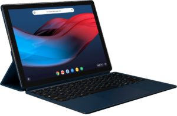

With the announcement of the [Pixel Slate in five different configurations](https://store.google.com/us/product/pixel_slate_specs), some folks interested in the newest #MadeByGoogle Chrome device are wondering which to order. Take this question on Twitter, for example:

https://twitter.com/mszero/status/1051861435012272128

My response to Peggy and anyone else in the same situation is: If you have or are thinking of buying the original Samsung Chromebook Plus with an ARM processor, _every_ Pixel Slate option should perform better. That's because even the base [Pixel Slate at $599 has an Intel Celeron 3965Y processor](https://www.aboutchromebooks.com/news/pixel-slate-nocturne-intel-configurations-celeron-m3-i5-i7/), which is more capable and newer (read: faster and more power efficient) as the OP1 chip inside the Samsung Chromebook Plus.

But what if you currently have the [Samsung Chromebook Plus v2](https://www.aboutchromebooks.com/news/samsung-chromebook-plus-v2-release-date-price/)? That actually has the same Celeron chip as the base Pixel Slate, so performance would be very comparable at that point. Beyond that, every step up in CPU -- the m3, i5 or i7 options -- should boost Pixel Slate performance accordingly.

From a cost perspective, buying a Samsung Chromebook Plus v2 is $100 less expensive than the comparable Pixel Slate at $599 for the same performance. Most people will have to factor in the [Pixel Slate Keyboard](https://www.aboutchromebooks.com/news/first-look-video-google-pixel-slate-keyboard/) though, which adds another $200 to the final bill.

With the Pixel Slate, you're essentially paying a premium for the form factor of a tablet and need to decide if that's worth it to you when choosing between the two devices. That's essentially the same decision on whether to spend $599 -- an extra $100 -- for the [Samsung Chromebook Plus v2 with integrated LTE radio](https://www.aboutchromebooks.com/news/samsung-chromebook-plus-v2-lte-release-date-specs-599-price-verizon/). You'll pay a premium for the freedom of mobile broadband.

Since I currently use my Pixelbook in tablet or "tent" mode at least 50 percent of the time -- the device is my main entertainment machine -- I'm willing to pay the premium for the Pixel Slate. I like the idea of having a keyboard-less device for downtime and the ability to pop a keyboard in place when it's time to get work done.
