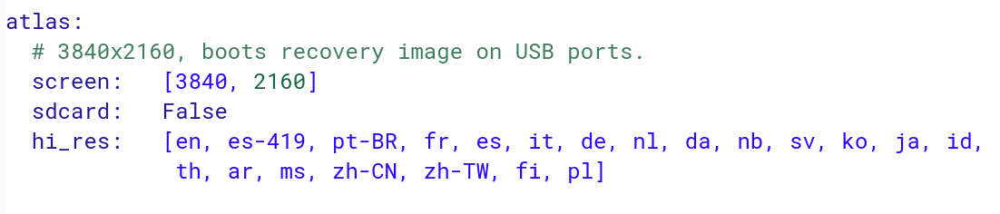

I've known Evan Blass for a dozen years, when we worked together at Engadget, and if there's one thing I know about him, he has impeccable industry sources. His latest tip, tweeted early this morning, suggests that [a new Pixelbook, with smaller bezels, will be available by year end](https://twitter.com/evleaks/status/1020891902378487808?s=19). Knowning Evan, I'd bet a paycheck that he's right about the Pixelbook 2.

https://twitter.com/evleaks/status/1020891902378487808?s=19

This makes sense to me, even though Google has typically launched a high-end Chromebook every _other_ year since the Chromebook Pixel in 2013 and the current Pixelbook arrived in late 2017. With a number of detachable Chromebooks in the works, plus the HP Chromebook X2 already on the market (shown above [and marked down to $519.99 right now](https://www.aboutchromebooks.com/news/hp-chromebook-x2-sale-price-reduction-80-dollar-savings/)), a flagship detachable is logical to showcase Chrome OS tablets with removable keyboards.

But is it [Atlas](https://www.aboutchromebooks.com/news/more-evidence-suggests-atlas-is-a-4k-detachable-chromebook-tablet/), [Cheza](https://www.aboutchromebooks.com/news/cheza-lte-chromebook-detachable-snapdragon-845/) or some other device entirely? Any device that would arrive by the end of the year already has to be in the works, so I don't think this is a mystery device that we haven't yet seen in the Chromium code commits. For the Pixelbook 2 (or Pixelbook 2018, if you prefer) my money is on Atlas, therefore, for two key reasons.

First, Google's own Chromebooks have always been high-end, flagship products. The point of them is to show hardware partners what a premium Chrome OS experience can be like. And although we don't know much about Atlas, we do know one thing that will make this device stand out: [Atlas is expected to have a 4K display panel](https://www.aboutchromebooks.com/news/chromium-code-suggests-4k-chromebook-code-named-atlas-in-the-works/), which no other Chromebook has.

Second, and this is key to me, Atlas will not likely have an SD card slot based on the "False" value shown for the Atlas board:

Note that the Pixelbook doesn't have an SD card slot either, likely because the base model comes with 128 GB of local storage and you can buy a model with even more capacity.

Clearly, I'm speculating here but doing so with the information we currently know about Atlas. Cheza would likely be a step down in terms of performance, given that it will run on the Qualcomm Snapdragon 845 processor.

Don't get me wrong, I think Cheza will be a fine performer but it won't likely beat out an updated Pixelbook, especially if Google uses Intel's eighth-generation processors in the Pixelbook 2, which is the other big upgrade I expect.
