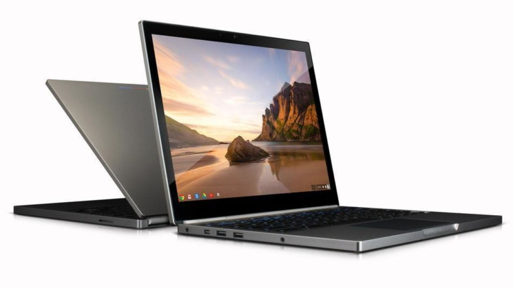
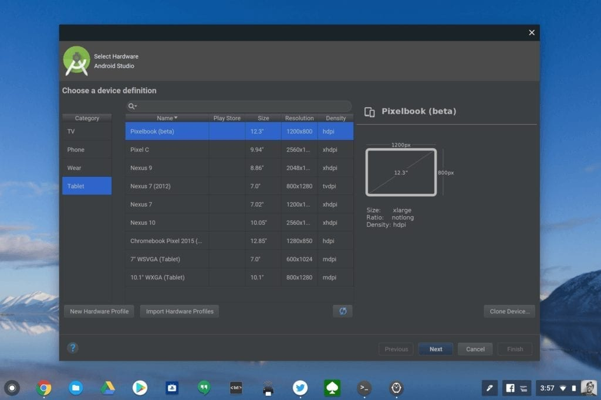
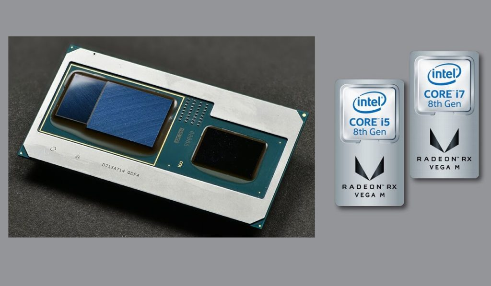

This is very odd. I was browsing through recent Geekbench benchmark scores online and noticed results from several Google Pixelbooks. That's not the odd part, it's actually quite normal.

What threw me is that these benchmarks show the tested Pixelbooks were running _updated eighth-generation processors with the U-Series_, not Y-Series, Intel chips found in the current Pixelbook.

It's possible that the [Pixelbook refresh](https://www.aboutchromebooks.com/news/did-google-leak-this-image-of-the-pixelbook-2-with-smaller-bezels/), which I expect in October, is very much the same externally as the current model but with smaller display bezels. That's essentially what happened with the 2015 Chromebook Pixel, which aside from a slightly different color, looked nearly identical to the 2013 version it replaced.

If that's the case - and it's admittedly a _big_ if - we could be looking at early chip specifications for the Pixelbook 2. And I'm thinking we are, but I'll explain why in a bit. First, let me share the chips, amount of RAM and benchmarks that appeared in the past few weeks.

- [April 29](https://browser.geekbench.com/v4/cpu/12952789): Intel Core i7-8705G, 16 GB of RAM, 4293 single-core score, 14653 multi-core score
- [May 8:](https://browser.geekbench.com/v4/cpu/13053837) [Intel Core i7-8550U](https://ark.intel.com/content/www/us/en/ark/products/122589/intel-core-i7-8550u-processor-8m-cache-up-to-4-00-ghz.html), 16 GB of RAM, 5155 single-core score, 10955 multi-core score
- [May 8](https://browser.geekbench.com/v4/cpu/13053838): [Intel Core i5-8250U](https://ark.intel.com/content/www/us/en/ark/products/124967/intel-core-i5-8250u-processor-6m-cache-up-to-3-40-ghz.html), 8 GB of RAM, 4158 single-core score, 10871 multi-core score

If you're not familiar with these chip designations, the current Pixelbook model uses seventh-generation, not eighth-gen, chips. The first digit of the chip number tells you which generation chip this is, hence a Core i5-8250U is a newer processor than the Core i5-7Y57 found in today's Pixelbook.

Also important is the U because it represents the Intel U-Series processor. [Google recently recommended a Core i5 (or higher) U-Series Chromebook for developing Android apps in Android Studio for Chrome OS](https://www.aboutchromebooks.com/news/android-studio-chrome-os-chromebook-recommendation-google-io-2019/). The current Pixelbook uses a lower-powered Y-Series chip so it isn't recommended. Nor is the Pixel Slate for the same reason.

And that's exactly why I'm thinking the Pixelbook 2 could well be an internal refresh with the same, or very similar, external components. After all, isn't it odd that Google wants Android developers to build Android apps on Chromebooks and its own current product line isn't recommended?

To be clear, a Pixelbook 2 with just a chipset upgrade may have to be thicker than the current device, so that would be an external change of some kind. Why? Because unlike the Y-Series chips, the U-Series processors can run under a full load for a longer period time, which generates more heat. Therefore, they need to have some type of fan or other cooling system involved.

You can see this already on the [Acer Chromebook Spin 13](https://www.aboutchromebooks.com/reviews/acer-chromebook-spin-13-review-vs-pixelbook/), [Dell Inspiron Chromebook 14](https://www.aboutchromebooks.com/news/dell-insipiron-14-chromebook-price-release-date-availability/), and [Lenovo Yoga Chromebook C630](https://www.aboutchromebooks.com/news/lenovo-yoga-chromebook-c630-price-availability-4k/): All of them run on Intel's eighth-generation U-Series processors and all of them have a fan.

You'll note that I didn't yet mention the April 29 benchmark showing an [Intel Core i7-8705G](https://ark.intel.com/content/www/us/en/ark/products/130411/intel-core-i7-8705g-processor-with-radeon-rx-vega-m-gl-graphics-8m-cache-up-to-4-10-ghz.html) processor.

That one is throwing me a bit because it's a G-Series chip with Radeon RX Vega M GL discrete graphics in lieu of Intel's integrated GPU. That would be a beast of a Chromebook, but it generates 3x times more heat than the U-Series CPUs, so I don't know if it was a one-off test or Google has plans to build the beast.

Note that there's one more thing that has me scratching my head. The board name for all of these tested Pixelbooks is "eve" on Geekbench.

Eve is the board name in the current Pixelbook and if Google were upgrading processors, the internal board would require changes. In that case, the board would have a new name. To wit, the 2013 Chromebook Pixel board name was Link, while the updated 2015 Chromebook Pixel used the Samus board.

That suggests either that these benchmarks do _not_ accurately reflect the Pixelbook 2 _or_ that Google is holding back on the name and simply re-using Eve in its place for these types of public data points.

Obviously, I can't say for sure because I simply don't know. After all, we've been thinking that [Atlas is the board for the next Pixelbook](https://www.aboutchromebooks.com/news/atlas-chromebook-pixelbook-2-nvme-ssd/), so maybe this information provides more questions than answers.
