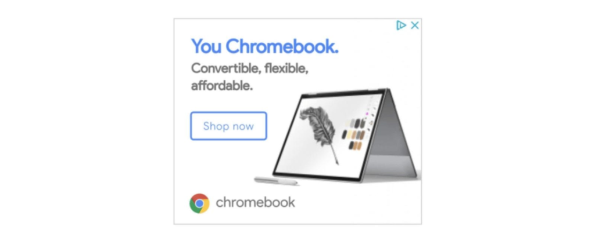
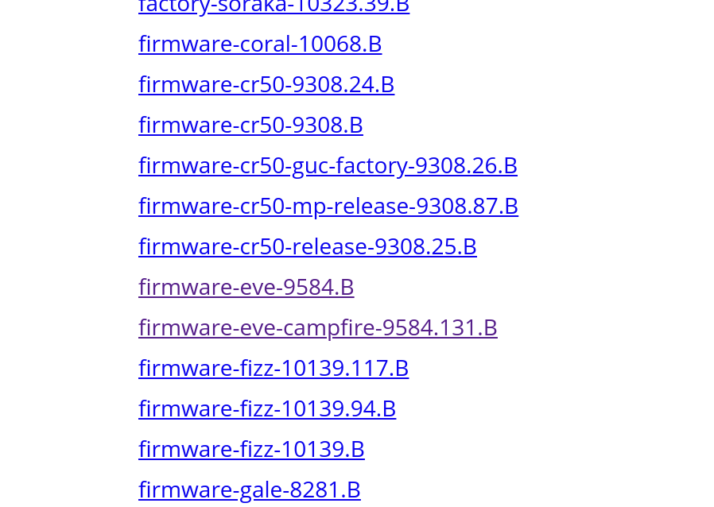

At least [one of the #MadeByGoogle launch event details](https://www.aboutchromebooks.com/news/pixelbook-2-atlas-nocturne-madebygoogle-event-october-9/) is becoming clear: The Pixelbook 2 appears to be similar looking to the current model, but with smaller bezels. [Chrome Unboxed found some early running advertisements for the upgraded device](https://chromeunboxed.com/news/pixelbook-2-leaked-image-online-ad) that should launch on October 9.

This looks legit to me and it's also in line with what Evan Blass, the best device leaker in the business said in July: [The next Pixelbook would have smaller bezels](https://www.aboutchromebooks.com/news/pixelbook-2-atlas-detachable-4k-chromebook-availability-2018/). At the time, I thought this device would be Atlas. But that doesn't make sense now. Nor does it look like this is Nocturne either. Why? Both of those devices have code references to being a detachable and this ad doesn't support that based on the hinges. Nor do these ads that [a Chrome Unboxed reader saw on Facebook](https://chromeunboxed.com/news/pixelbook-2-images-facebook-nearly-bezel-less-display):

So, if the Pixelbook 2 isn't built on the [Atlas](https://www.aboutchromebooks.com/news/atlas-chromebook-pixelbook-2-nvme-ssd/) or [Nocturne](https://www.aboutchromebooks.com/tag/nocturne/) boards, what is it?

I'm thinking it's a variant of Eve, which is the current Pixelbook board. In fact, there's an Eve-Campfire board build so my guess is that's the Pixelbook 2. Campfire, if you recall, is the build that will add the Alt-OS option at boot so that you can run Windows 10.

Another thought that rules at least Atlas out of the running for the Pixelbook 2 board: The ad suggests the new Pixelbook will be affordable. Atlas supports a 4K display so that would only increase the bill of materials, i.e.; all things being equal, it would be more expensive.

So assuming that train of thought is correct, I expect the Pixelbook 2 to be a general refresh of the current model: Smaller bezels with a slightly larger display -- say 13-inch -- and eighth-generation Intel Core processors.

Assuming that's true, I still anticipate another #MadeByGoogle Chrome OS device to be shown on October 9. I've been thinking it's Atlas but based on more code work done for [Nocturne](https://www.aboutchromebooks.com/tag/nocturne/) of late, I'm now thinking it's the latter. Either way, it doesn't matter much because both are detachables and that's the direction Google has been moving Chrome OS for much of this year. To not show off a Google-branded detachable next month doesn't make sense to me.

As we get closer to the October 9 event, I'm sure more will become clear but at this point, I'm thinking a minor Pixelbook refresh -- likely with lower starting costs -- and a more expensive detachable option.
