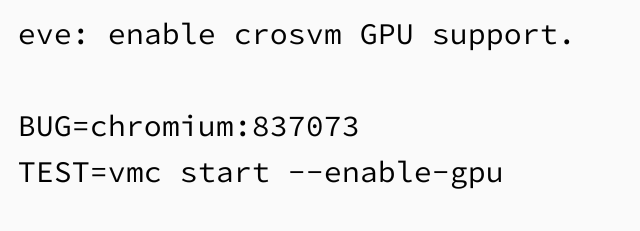
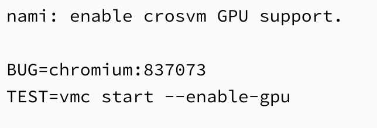

I've been following the [bug report that tracks progress on adding GPU acceleration for the Linux container in Chrome OS](https://bugs.chromium.org/p/chromium/issues/detail?id=837073#c47) and there's good news today. The first two Chrome OS boards should now, or very soon, be able to try [GPU hardware acceleration with the new startup parameter](https://www.aboutchromebooks.com/news/gpu-acceleration-chromebook-linux-project-crostini/) found last month. The bug report says the --enable-gpu argument was added to the Eve and Nami boards:

There's only one Eve and that's the Pixelbook. Nami is used on a number of newer devices, including:

- Dell Inspiron 14
- Lenovo Yoga Chromebook C630
- Acer Chromebook 13
- Acer Chromebook Spin 13
- HP X360 Chromebook 14

<iframe style="width: 120px; height: 240px;" src="//ws-na.amazon-adsystem.com/widgets/q?ServiceVersion=20070822&amp;OneJS=1&amp;Operation=GetAdHtml&amp;MarketPlace=US&amp;source=ac&amp;ref=qf_sp_asin_til&amp;ad_type=product_link&amp;tracking_id=aboutchromebo-20&amp;marketplace=amazon&amp;region=US&amp;placement=B07GD4CMDH&amp;asins=B07GD4CMDH&amp;linkId=9984f98f86dddf5957b180b9a4a83fb6&amp;show_border=true&amp;link_opens_in_new_window=true&amp;price_color=333333&amp;title_color=0066c0&amp;bg_color=ffffff" frameborder="0" marginwidth="0" marginheight="0" scrolling="no" align="right"></iframe>

I don't have a Pixelbook for testing right now, otherwise, I'd pop it into Developer Mode and jump on the Canary channel. However, I _**do**_ still have a loaner [Acer Chromebook Spin 13](https://www.aboutchromebooks.com/reviews/acer-chromebook-spin-13-review-vs-pixelbook/), so I'll give it a go later today and see if the newly added code from early this morning is there in the Canary Channel; if it is, I'll circle back with observations on how well it does or doesn't work for the Android emulator in Android Studio and possibly a game or two using Steam.

This bodes well for all Chrome OS devices that support Crostini though. There really hasn't been a timeline for when the Chromium team would deliver on this important missing feature. I did suggest that it would arrive [before or at the same time as Google officially supporting Android Studio in Crostini](https://www.aboutchromebooks.com/news/project-crostini-linux-chromebooks-gpu-acceleration-date/), mainly because developers would want the Android emulator to be functional for development. Google said that official support is coming in "early 2019", so this code change is lining up nicely with that timeframe.
