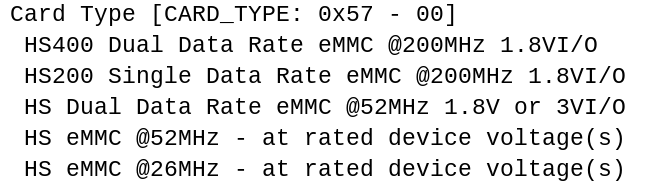
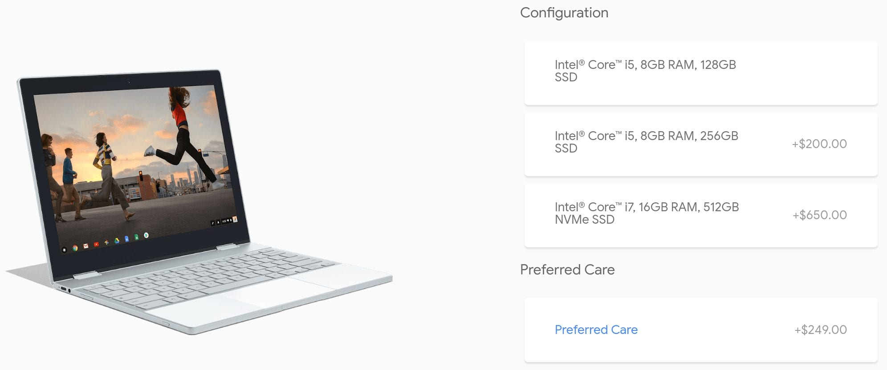
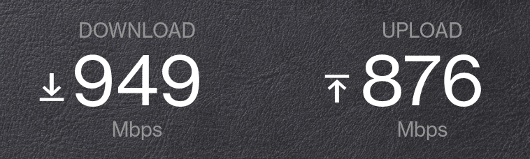

In the comment thread of last week's post on the [new Acer Chromebook 13 and Chromebook Spin 13 availability](https://www.aboutchromebooks.com/news/acer-chromebook-13-spin-13-price-release-date-september-650-and-750/), there was a lengthy discussion on types of storage for Chromebooks. [The thread is worth the read](https://www.aboutchromebooks.com/news/acer-chromebook-13-spin-13-price-release-date-september-650-and-750/#comments) as we confirmed with Google that the Pixelbook uses two different types of storage types -- eMMC or SSD -- depending on the model.

After that conversation, I received the following email question about this from George, who wrote:

> "I was recently surprised to learn the internal storage in the Core i5 128GB and 256GB versions of the Google Pixelbook is of the eMMC variety and not (as implied in Google's marketing) of the mSATA/M.2 SSD variety. I suspect a significant percentage of Pixelbook owners and potential buyers are not aware that the base and mid-tier Pixelbooks come with eMMC and not the better performing mSATA/M.2 SSD storage implied in Google's marketing."

George is correct: Per an email conversation I had with Google, the Core i5 versions of the Pixelbook use slower eMMC (embedded MultiMediaCard) storage while the Core i7 model uses much faster NVMe SSD.

I'm not surprised by the confirmation for two reasons: Before chatting with Google, I checked the storage information in my own Core i5 Pixelbook by navigating to c_hrome://system_ and viewing the storage\_info data, which clearly references eMMC a number of times:

I also reviewed the iFixit process for swapping out the compact motherboard on a Pixelbook: I didn't see an SSD drive attached to the board.

George is also likely right that many Pixelbook Core i5 owners don't know this: The tech specs for the Pixelbook indicate that the Core i5 models come with an SSD, or Solid State Disk drive.

Is that a bit misleading? Sure, I won't argue that. From a consumer point of view, I can see why one might think Google should change the SSD listing to show eMMC.

I can also see why Google simply lists the storage as SSD as well as I think many consumers don't know what eMMC and they're more likely to be familiar with the term SSD. Many Pixelbook reviews ([PC World](https://www.pcworld.com/article/3234765/computers/google-pixelbook-review.html), [Wired](https://www.wired.co.uk/article/google-pixelbook-review), [TechRadar](https://www.techradar.com/reviews/google-pixelbook) and others) **did** make the distinction in their write-ups, noting that the model they used has eMMC storage.

Even so, George's point is spot on. But Google isn't the only hardware vendor to use SSD when actually describing eMMC storage. [This inexpensive Acer laptop officially lists the storage as SSD](https://www.acer.com/ac/en/GB/content/model/NX.SHGEK.001), but it's not based on reviews and [support questions](https://community.acer.com/en/discussion/447682/replace-the-aspire-one-cloudbook-a01-431-emmc-with-an-ssd): It's eMMC as well. That's one of several such examples I found.

For what it's worth, I can say that the eMMC in the Pixelbook does at least support the newest eMMC 5.1 standard which can provide read/write speeds up to 400 Mbps, which approaches the performance of some SSD drives. And more importantly, it doesn't matter to that my Pixelbook may have slower read/write speeds because it uses eMMC storage. I felt the same when using an [HP Chromebook X2, which also uses eMMC storage](https://support.hp.com/us-en/document/c06071109?jumpid=reg_r1002_usen_c-001_title_r0005), although HP clearly states that on the product page.

Why? Because it doesn't negatively impact me. What I mean is: I don't transfer large files around on the device. And I'm betting most other Pixelbook owners don't either, or if they do, it's generally a very small percentage of the time they use the device.

Instead, the biggest potential for a data bottleneck on the Pixelbook -- or any other Chromebook, for that matter -- is the connection speed. If you're constantly connected to a very slow Wi-Fi or mobile broadband network, that will have a much larger negative impact on the experience. This is the main reason I have a 1 Gbps fiber line to my home, although I won't lie: I also got that connection speed for streaming 4K video in the house.

Again, I can't argue that the Pixelbook storage tech specs are technically wrong. And if you're upset that you paid for a high-end laptop and think part of that cost as for an SSD drive, I totally get that. At the end of the day though, what's the actual effect of the difference?

Do I hope that the [Pixelbook 2](https://www.aboutchromebooks.com/news/pixelbook-2-atlas-detachable-4k-chromebook-availability-2018/) uses faster storage technology? Sure, we all want more speed, everywhere we can get it. If it doesn't though, that won't stop me from seriously considering the purchase.
