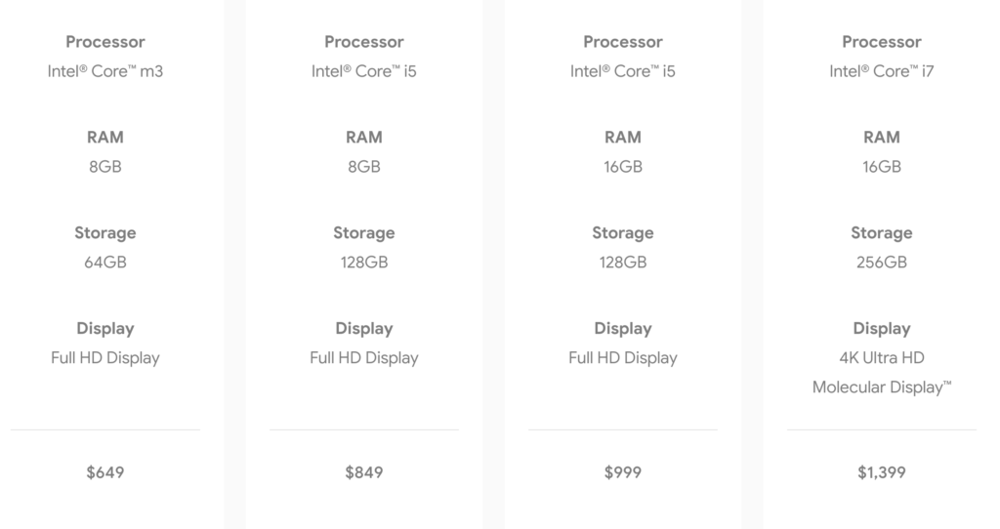
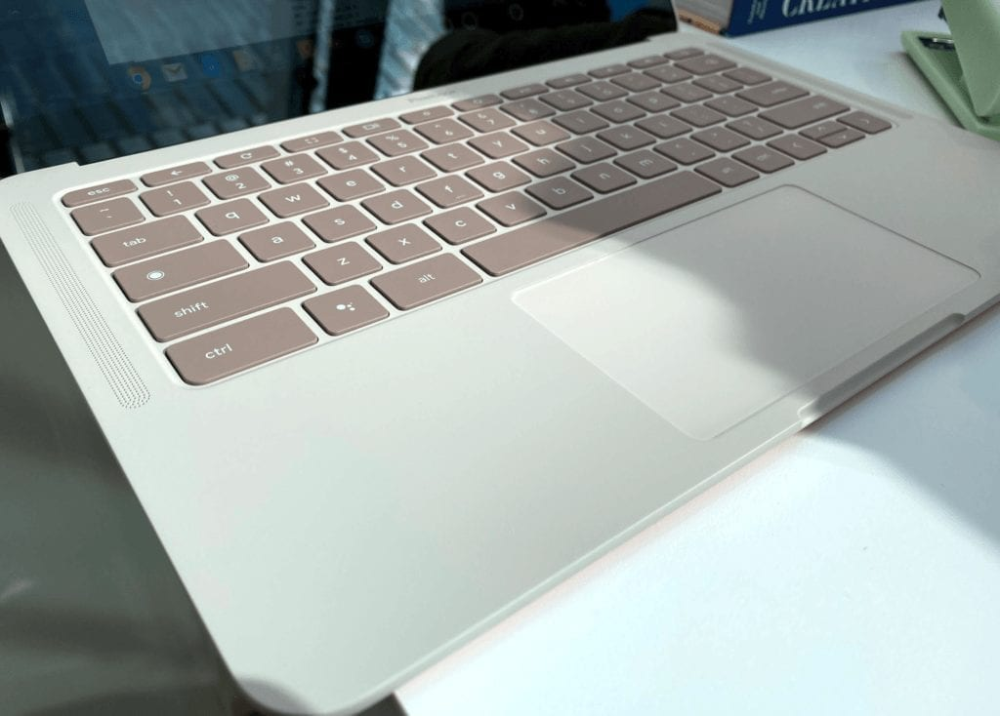

About the only thing we didn't know about the Pixelbook Go was the pricing, and now we have it. Launched today in New York City, [Pixelbook Go starts at $649](https://www.blog.google/products/pixelbook/pixelbook-go/) with pre-orders open in the U.S. and Canada, with UK ordering in January.

So the good news is the pricing. Typically the entry point for a Pixelbook is around the $1,000 range. But the typical Pixelbook is the highest of the high-end Chrome OS experience. Pixelbook Go isn't that, signaling a change in strategy for Google.

At $649 you get an Intel Core m3 with 8 GB of memory and 64 GB of eMMC storage. for $200 more you're getting a faster Core i5 and doubling your storage. This year there is a Core i5 option with 16 GB of memory, but that will set you back $999. And that 4K option with a Core i7, 16 GB of RAM and 256 GB of storage? $1,399. [Full specs are here](https://store.google.com/product/pixelbook_go_specs), although they'll likely look familiar.

The company says this lightweight Chromebook with up to 12 hours of battery life is for "people on the go." I'd say that's everyone. And I'd add it's for "people on the go that don't mind older processors. Indeed, the Pixelbook go uses the same 8th-generation Intel Core Y-Series chips as last year's Pixel Slate.

I'd go so far to say that Pixelbook Go is essentially a Pixel Slate in clamshell form. The thin chassis has the same rounded corders as the Slate, for example. The Pixel Slate Keyboard had "hush keys" for quiet typing, which the new Pixelbook go has too, although, they're not circular.

The stereo speakers on the Pixel Slate are among the best I've heard and yup, the Pixelbook Go seems to have them as well.

So you're paying less for the Go than for a Slate and getting a keyboard with it. But you're also giving up a 2-in-1 form factor as well as pen support, if those are important to you.

I'm sure some folks are disappointed that the Pixelbook Go doesn't have higher performing U-Series chips. As someone who bought a [U-Series Chromebook with 16 GB of memory](https://www.aboutchromebooks.com/news/acer-chromebook-spin-13-with-16-gb-ram-should-you-buy-one/), I get it. But the Go isn't for these folks. It's a Pixelbook for the masses at this price. There are plenty of higher performing Chromebooks on the market for the developer and power user crowd.

This is exactly why I said a few months back, it [may not make sense to wait for this year's Pixelbook](https://www.aboutchromebooks.com/news/atlas-pixelbook-processors-acer-chromebook-13-lenovo-yoga-c630-hp-360/) if you're in the "high performance" crowd. There are a ton of people _not_ in that crowd, however. The base model Pixelbook Go could meet their needs nicely, assuming Chrome OS works for them. Then again, there are [plenty of mid-range Chromebooks out there for $500 or less](https://www.aboutchromebooks.com/news/dell-inspiron-chromebook-14-399-sale-best-buy-discount/). No, they may not be as thin and light, but Pixelbook Go might be a tough sell.

I'll have more to share after some hands on time and/or getting a review unit in the future.
