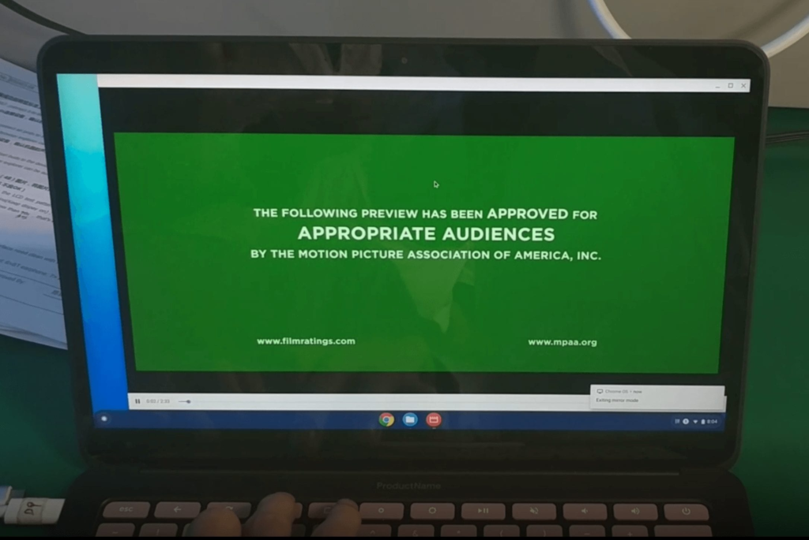
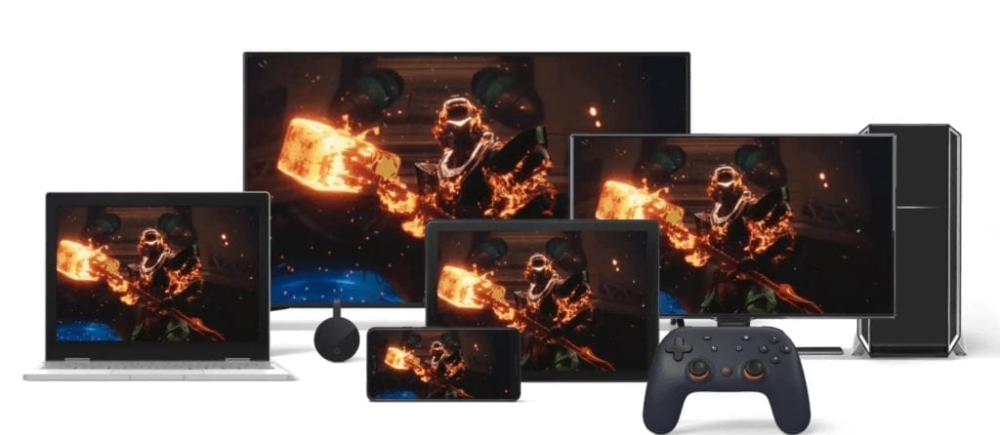

After [18 months of tracking Atlas](https://www.aboutchromebooks.com/tag/atlas/), the baseboard expected inside the Pixelbook Go, we'll finally get to hear all about this new Chromebook tomorrow in New York City. I'll be at the event and will share full thoughts afterward.

But having seen [leaked images and benchmarks](https://9to5google.com/2019/10/10/exclusive-this-is-google-pixelbook-go-gallery/), I've still been stymied by a few questions about the Pixelbook Go. Namely, [who is is for](https://www.aboutchromebooks.com/news/pixelbook-go-leaks-specifications-pricing-atlas/) and why this device may indicate a different strategy for Google's Chromebook hardware.

I shared some of those thoughts a few weeks ago but want to resurface one in particular aroud the target audience since unlike prior Made by Google Chromebooks the Pixelbook Go doesn't appear to have cutting edge internals:

> .....who is Google targeting?
> 
>   
> Certainly not developers who need more horsepower. Consumers, who want the “best-of-the-best” in Chrome OS hardware? You can get that now and likely for less. Enterprise users? Sure, there could be some interest there but again, there are plenty of excellent options in this space already.

At the time, I didn't realize there was a missing target audience. Luckily, Jason Falter reminded me on Twitter with this thought:

https://twitter.com/JasonFalter/status/1182701778489479169?s=20

I'm starting to think Jason is spot on for several reasons.

First and foremost, it's worth noting that Google Stadia will work on just about every Chromebook, even low end ones. That's because the processing all takes place on Google's Stadia infrastructure. You only need a screen and internet connection to have Stadia games streamed to your device. I'm not suggesting that Stadia is in any way exclusive to the Pixelbook Go because we all know that's **_not_** the case.

However, there are certain aspects of the Pixelbook Go that could make for what Google will suggest are "optimal" for online gaming as Jason suggests.

The 3:2 display aspect ratio of the current Pixelbook is ideal for productivity but not for gaming. A 16:9 ratio on the Pixelbook Go is better suited for that purpose.

A 4K display panel -- expected to be an option on the Pixelbook Go -- isn't really beneficial for day to day browsing, but it's ideal for Stadia's $10 monthly plan, which will be the first launch next month.

The textured base of the Pixelbook Go certainly doesn't scream "enterprise device". When gaming with the device on your lap though, that base will keep the Pixelbook Go in one place so as not to impact a fast-paced gaming experience on Stadia.

I also find it odd that with internal components in the Pixelbook Go expectd to be similar (if not mostly identical) to those in last year's Pixel Slate, why Google waited until now to debut this Chromebook. It could have done that a year ago. Then again, a year ago, Stadia was just a rumor; [Google didn't announce its game streaming platform until May of this year](https://www.aboutchromebooks.com/news/google-stadia-turns-every-chromebook-into-a-pc-gaming-rig/). Holding up the Pixelbook Go until one month before the launch of Stadia is rather interesting from that perspective.

From a marketing viewpoint then, pushing the Pixelbook Go as the ideal Stadia device makes sense to me. You don't need a processor better than ones that are in the Pixel Slate, which are expected in the Pixelbook Go, for Stadia and you still [have enough power to do just about everything you could want](https://www.aboutchromebooks.com/news/how-to-code-on-a-chromebook-crostini-pixel-slate/) from a traditional Chromebook.

Implementing a linked list stack in Java on the Pixel Slate - yay!

I'll take a leap here only because the "Go" name had me scratching my head as soon as I heard it. Although computing on the go could be part of the branding, I'm wondering if Go actually stands for "Gaming online". That's arguable of course but it's an interesting coincidence.

I'm even wondering, assuming there is a big Stadia tie-up with this laptop, if Google sweetens the Pixelboook Go by including a Stadia controller and several months of the Stadia Pro service with a Pixelbook Go purchase. That could help offset any prices deemed as too high compared to competing high-end Chromebooks.

I guess we'll find out for sure tomorrow!
