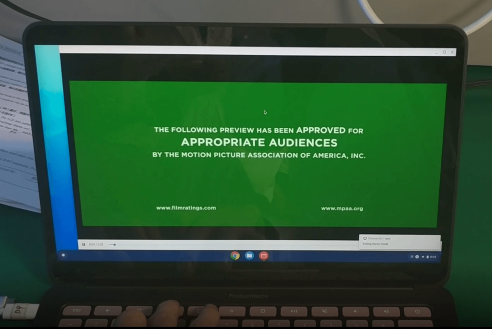

Kudos to 9to5 Google, who on Monday reported [exclusive details of the next Pixelbook, which apparently will be dubbed the Pixelbook Go](https://9to5google.com/2019/09/23/exclusive-google-pixelbook-go/). You should definitely read 9to5's reporting which also has a video of the expected device, [built on the board code-named Atlas](https://www.aboutchromebooks.com/tag/atlas/), as myself and others have previously reported.

Here's a quick rundown of the Pixelbook Go details, as reported:

- 13.3-inch touch screen with 16:9 aspect ration and resolution options of 1080p or 4K.
- A clamshell, not 2-in-1, form-factor so no tablet mode and no digital pen support; a step back from the current Pixelbook and Pixel Slate devices.
- Intel Core m3, i5, and i7 processor options, although no details on which generation CPU from Intel inside.
- Either 8 GB or 16 GB of memory.
- Storage options of 64, 128 and 256 GB, very likely to be eMMC-based.
- Dual side speakers similar to the Pixel Slate, which I believe to be the best speakers currently available on any Chromebook.
- A 2 MP front-facing webcam, which [lines up with the Sony IMX208 sensor support I noted last August](https://www.aboutchromebooks.com/news/4k-atlas-chromebook-detachable-imx208-1080p-front-camera/).
- Two USB Type-C ports
- The standard Wi-Fi and Bluetooth connections you'd expect. No mention of LTE support.
- Expected pricing similar to the Pixel Slate, i.e.; $799 to start, $999 for a mid-level configuration and $400 to $500 more for the top option.

The reported Pixelbook Go video and images show the [same Chromebook I shared back in May of this year](https://www.aboutchromebooks.com/news/google-atlas-chromebook-first-look-video/): A device with rounded corners, wide-aspect ratio display, and black chassis. 9to5 Google says there will be a "not-Pink" color choice as well.

So assuming all of this information is true - and I have no additional data to suggest that it isn't - some immediate thoughts come to mind.

First is the name Pixelbook Go

My first thought was that "Go" referred to mobility and connectivity, with the Chromebook including an LTE option. But there's no mention of LTE, nor have I found any Chromium code to support such an option. Instead, we know from an FCC filing back in July that the Pixelbook Go should use the [Intel Wireless-AC 9260 chip](https://www.intel.com/content/www/us/en/products/wireless/wireless-products/dual-band-wireless-ac-9260.html), which supports 160 MHz channels of 802.11ac Wi-Fi for up to 1.73 Gbps transfer speeds and Bluetooth 5.

So Go may just be a branding exercise to target knowledge workers that don't sit at a desk all day. Instead, they move around the office with Wi-Fi throughout. Perhaps the device is lighter to assist with that? If so, the device chassis would be plastic instead of the metal found in the current Pixelbook, and I don't think that will be the case. Go doesn't yet make sense to me although I'm sure Google will explain it on October 15.

Next is the processor choices

After the [Pixel Slate Celeron debacle](https://www.aboutchromebooks.com/news/google-pixel-slate-celeron-unavailable-permanently-discontinued/), a Core m3, i5, or i7 CPU makes complete sense. But there are key questions remaining: Will these be older 8th-generation CPUs at a time when new laptops are arriving with either 9th- or 10th-generation Intel chips? And will Google use the same Y-Series processors found in both the Pixelbook and Pixel Slate or will they put more powerful U-Series chips under the hood, which would raise costs?

Back in July, [Geekbench test scores appeared online for a "Google Atlas" device using the same Intel Core i5-8200Y and Intel Core i7-8500Y processors as the Pixel Slate](https://www.aboutchromebooks.com/news/atlas-pixelbook-2-cpu-specs-android-studio-support/). Those don't indicate with total certainty that these are the chips that the Pixelbook Go will use and I actually hope it doesn't.

For one thing, the Pixelbook Go wouldn't likely be considered [a recommended device for Android Studio development due to the Y-series processors](https://www.aboutchromebooks.com/news/android-studio-chrome-os-chromebook-recommendation-google-io-2019/).

My Acer Chromebook Spin 13 with 16 GB of RAM

And frankly, given expected pricing, the Pixelbook Go with these chips would cost more than other currently available Chromebooks that have more powerful processors such as the [Acer Chromebook Spin 13 I recently bought](https://www.aboutchromebooks.com/news/acer-chromebook-spin-13-with-16-gb-ram-should-you-buy-one/). Given the limited information we have so far, this is why [I didn't wait for the next Pixelbook](https://www.aboutchromebooks.com/news/atlas-pixelbook-processors-acer-chromebook-13-lenovo-yoga-c630-hp-360/).

Who is the Pixelbook Go for?

Traditionally, Google's own Chromebooks have showcased the best-of-the-best Chrome OS experience. The 3:2 display aspect ratio for web work, the highest amounts of memory and storage available, and high-resolution touchscreens.

Again, I'm assuming the reported hardware description is accurate here, and if it is, the Pixelbook Go isn't any of the above things. That's because the high-end Chromebook landscape has changed over the past 12 or so months.

Lenovo Yoga Chromebook C630

There are very high-end, powerful options available in the aforementioned Acer Chromebook Spin 13, the Dell Inspiron Chromebook 14 and Lenovo's Yoga Chromebook C630, which was the first Chromebook to offer a 4K display.

All of these options, which have been available since last year, have U-Series processors, above-average to very good displays, and a reasonable choice of memory and storage options. Oh, and they cost between $599 and $999 before any sale discounts, which happen frequently.

If the Pixelbook Go has lesser processor power and higher pricing, who is Google targeting?

Certainly not developers who need more horsepower. Consumers, who want the "best-of-the-best" in Chrome OS hardware? You can get that now and likely for less. Enterprise users? Sure, there could be some interest there but again, there are plenty of excellent options in this space already.

Let's hope for some surprises on October 15

It's worth reiterating that all of my thoughts are based on what's been reported about the Pixelbook Go. And yes, there are some open questions still in terms of hardware details.

That's why I'm crossing my fingers that when the Pixelbook Go debuts on October 15, some of the open questions are answered with improved hardware expectations. If not, I'd hope for lower pricing than both the Pixelbook and Pixel Slate as that could spur sales for those who still want a Made By Google Chromebook, don't mind a clamshell device and could be swayed away from the currently available options offered by Acer, Dell, and Lenovo.

If all of the reported Pixelbook Go information is accurate, is it something you would be interested in buying?
