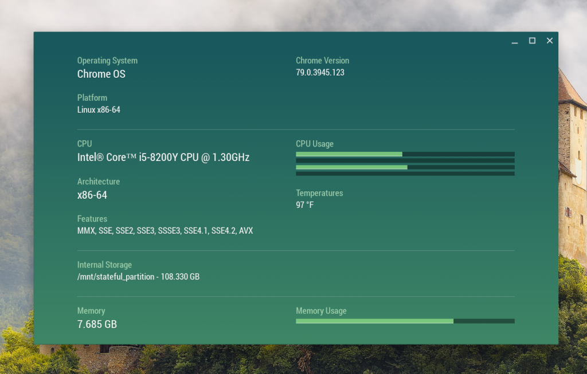
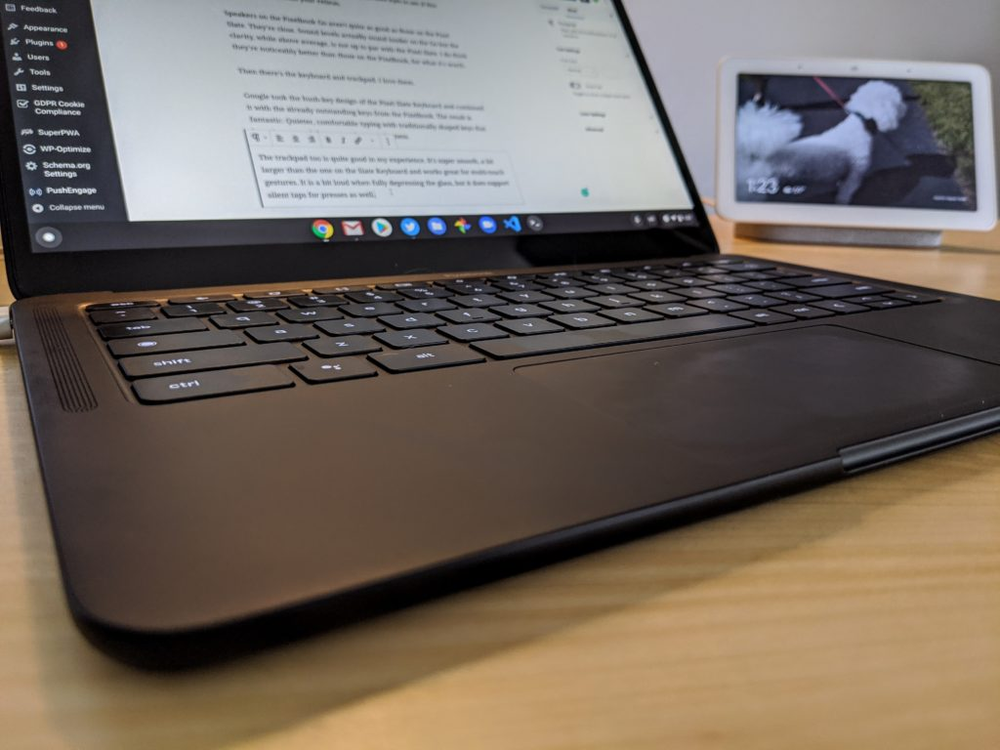
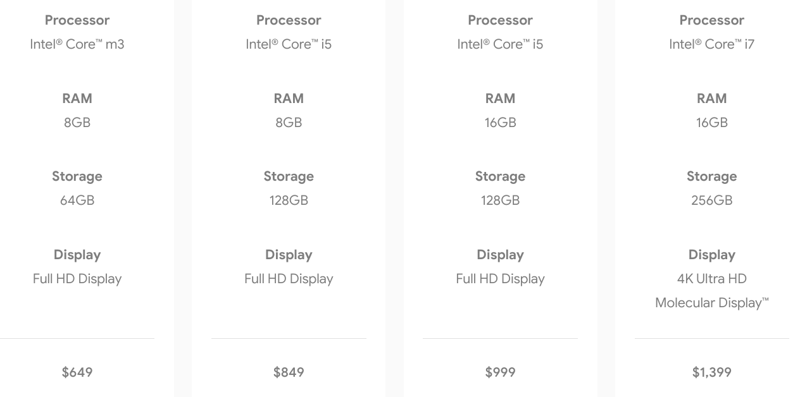

It's been four months to the day since I first [reviewed the $849 configuration of the Pixelbook Go](https://www.aboutchromebooks.com/news/pixelbook-go-review-a-premium-price-validated-by-a-premium-device/). It's not my daily driver but I have been using it a few days a week throughout the month of February.

Does it still stand up to what I first thought? Is it still a good choice for specific types of customers? Here's what I think.

# Pixelbook Go performance will keep most everyone happy

Overall, there's still not much to dislike about the Pixelbook Go. It has continued to meet nearly all of my needs and would probably meet yours as well unless you're a developer.

To effectively [code quickly on a Chromebook using Linux](https://www.aboutchromebooks.com/news/can-you-learn-to-code-in-a-college-computer-science-program-with-a-chromebook/), you really want a higher processor series than what Google has used inside the Pixelbook Go, which is the Intel Y-series processors. While I can certainly code on the Go, compile and build times for my code is noticeably slower than on my [Acer Chromebook Spin 13 with its Intel U-series chip](https://www.aboutchromebooks.com/news/acer-chromebook-spin-13-with-16-gb-ram-should-you-buy-one/).

But most Chromebook buyers aren't developers. Instead, they use a Chromebook for browsing and web apps, along with some Android titles as well.

If you're in this category, I can't see you lacking for power with the Pixelbook Go. The 8th-generation processor inside, paired with 8 GB of memory has more than enough oomph for a few dozen open tabs and Android apps, gaming or otherwise.

Pixelbook Go memory usage with 10 open tabs

# Great display but compomised aspect ratio

I can't rave enough about the 13.3-inch 1920 x 1080 IPS display panel Google used for the Pixelbook Go. It has above average brightness, great viewing angles and superb color reproduction. Whether I'm getting work done or watching online HD video content, I never think "this display panel could be a tad better."

However, this **_is_** a 16:9 aspect ratio display. And it feels awkward if you bounce around from different machines with other aspect ratios.

My Acer Chromebook Spin 13, for example, has a 3:2 aspect ratio like the original Google Pixelbook and it's better suited for productivity; particularly in split screen mode.

Acer Chromebook Spin 13 with 3:2 aspect ratio

The Pixelbook Go? Not so much. But I might feel differently if this was my only Chromebook because the switch between display ratios wouldn't be there. Right now it feels jarring to me. That's why I've opted to use an external monitor when doing some light coding with the Go.

Having said that, 16:9 is actually perfectly suited for my online content viewing and for Stadia gaming. It's a natural fit for those activities. My take: Think long and hard about the percentage of your productivity and your consumption / fun-time usage.

If it's 50-50 (or more) like mine is, I'd rather sacrifice the natural widescreen video content ratio of 16:9 and get something other than a Pixelbook Go. If you've never used a 3:2 laptop and/or don't think you're missing anything, or you're comfortable on a widescreen display to begin with, you'll be happy with the Pixelbook Go.

# Build quality is still the reason for the premium Pixelbook Go price

When the Pixelbook Go launched with a $649 base price for the Core m3 processor, 8 GB of RAM and 64 GB of internal storage, many balked at the price. And I can see why if you're comparing apples to apples internal hardware between the Pixelbook Go against similarly configured Chromebooks from Acer, Asus, Dell and others that can be found in the $400 to $500 range.

If you're going to make that comparison, basing your Chromebook purchase solely on a device's capabilities for the price, consider one of those less expensive options. If you want what I think is the best built and lightest devices with this mid-range configuration, consider the Pixelbook Go.

Pixelbook Go

This Chromebook is a joy to carry around at just 2.3 pounds and has one of the best (if not the best) input experiences with the hush-key keyboard and trackpad.

As I noted the display is great and the speakers are also better than most Chromebooks have to offer. Battery life is also fantastic in this thin and light clamshell: I'm averaging 10 hours of usage a day on a single charge and the quick charge feature makes it easy to add more juice in a hurry if you need to. I can count on one hand the times I really found myself in that situation though.

The only reasons I'd consider a similar lower cost Chromebooks was if I didn't want a 16:9 aspect ratio or I had to have a 2-in-1 Chromebook; remember, this is a clamshell.

# Pixelbook Go pricing and model thoughts

<iframe style="width:120px;height:240px;" align="right" marginwidth="0" marginheight="0" scrolling="no" frameborder="0" src="//ws-na.amazon-adsystem.com/widgets/q?ServiceVersion=20070822&amp;OneJS=1&amp;Operation=GetAdHtml&amp;MarketPlace=US&amp;source=ss&amp;ref=as_ss_li_til&amp;ad_type=product_link&amp;tracking_id=aboutchromebo-20&amp;language=en_US&amp;marketplace=amazon&amp;region=US&amp;placement=B07YMGQYP6&amp;asins=B07YMGQYP6&amp;linkId=68c8c269257fa4ec5a283d90abb4db6d&amp;show_border=true&amp;link_opens_in_new_window=true"></iframe>

Although I'm using the $849 Pixelbook Go, I have had a chance to try the $649 configuration. It has the same build quality, screen, speakers, keyboard and touchpad. The difference is on the inside: You get a Core m3, still with 8 GB of memory, and 64 GB of storage.

I'd honestly recommend that model to most Chromebook users because I really didn't see a performance difference in most cases. The key here is to consider if the storage limtation will work for you.

As long as I've used Chromebooks, I've relied more on Google Drive storage for documents, work and code. So I can make do with 64 GB. But once you start adding large Android games, downloading offline music or movies and such, you could run into issues. Still, with effective storage management, saving $200 to get the Pixelbook Go base model gets you the quality and experience of the next-higher priced version.

Pixelbook Go pricing

I'd still like to see the occasional Pixelbook Go sale to help people's budgets and frankly, I think a non-touchscreen model priced $50 less than the current Pixelbook Go configurations would do wonders for this product.

And although I love the build quality of the Pixelbook Go, I don't see much value of the $999 and $1,399 models for most people. Not even developers. You can spend the same or less money as the $999 configuration and get a much higher performing device.

And [$1,399 filled to the gills with memory, storage and a 4K display](https://www.aboutchromebooks.com/news/should-you-buy-core-i7-4k-pixelbook-go/)? Again, for around $1,000, you can find similar devices minus the 4K screen. And lets face it: If you're spending $1,399 for the Pixelbook Go, you're still getting a Y-series processor, even if it is a Core i7.

# Final thoughts on the Pixelbook Go

The Pixelbook Go may not be the Pixelbook 2 that some wanted. I get that. However, **_what the Pixelbook Go isn't doesn't take away from what it is_**. This is a Pixelbook experience for the masses, at a lower price than the original.

Were some compromises made? Of course.

But any average Chromebook user would likely be very happy with the Pixelbook Go -- even the base model -- provided they don't want a 2-in-1 device, are fine with a widescreen display and they're not routinely programming apps on a daily basis.
