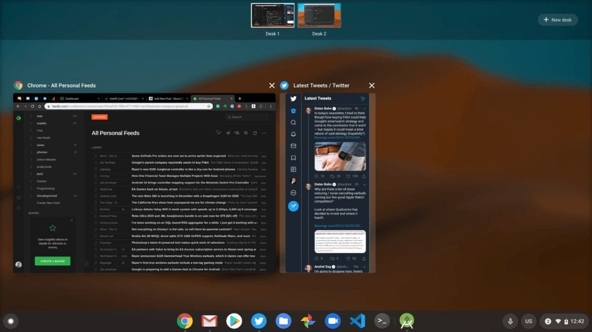

Before I share thoughts after using the Pixelbook Go for more than 80 hours, I want to explain why this review didn't appear alongside [the many others last week](https://www.techmeme.com/191025/p6#a191025p6), when the embargo lifted.

Simply put: It wasn't ready. I don't write reviews to an artificial deadline, at least not unless I feel they're actually complete and provide maximum value to readers. I wanted to make sure I fully tested the device in as many ways as possible, which I now have done.

So let's get started with the Pixelbook Go!

Specs and benchmarks (only because people want to see them)

So I'm sure by now, nearly every potential Pixelbook Go buyer knows all the hardware specifications and configurations; most are similar, if not identical to the Google Pixel Slate.

Still, this is necessary info to set the stage, so here's what's inside and out of the Pixelbook Go, which is a clamshell laptop. Note that my review unit, like every other one that I know of, is the $849 configuration. I'll discuss the $649 model later though, I promise.

<table class="wp-block-table"><tbody><tr><td>CPU</td><td>Dual-core, four-thread Intel Core i5-8200Y (fanless) at 1.3 GHz, 3.9GHz in boost mode</td></tr><tr><td>GPU</td><td>Intel UHD Graphics 615</td></tr><tr><td>Display</td><td>13.3-inch glossy 1920 x 1080 LCD touchscreen, 16:9 aspect ratio, 72% NTSC</td></tr><tr><td>Memory</td><td>8 GB, LPDDR3-1866</td></tr><tr><td>Storage</td><td>128 GB, eMMC 5.1</td></tr><tr><td>Connectivity</td><td>802.11ac Wi-Fi 2x2 MIMO, Bluetooth 4.2</td></tr><tr><td>Ports</td><td>Two USB Type-C ports, 3.5mm headphone jack</td></tr><tr><td>Audio</td><td>Dual speakers, 2 microphones for echo cancellation</td></tr><tr><td>Webcam</td><td>2 megapixel, ƒ/2.0 aperture, 1080p 60fps video</td></tr><tr><td>Keyboard</td><td>Backlit, island hush-keys, 19mm pitch, dedicated Google Assistant key</td></tr><tr><td>Trackpad</td><td>Etched glass, multi-gesture support</td></tr><tr><td>Battery</td><td>47 WHr with claimed 12-hour run-time, quick-charge of 2 added hours in 20 minutes</td></tr></tbody></table>

I'm not a fan of benchmarks, but I know others are.

To me, benchmarks are only a general indication of performance comparisons but everyday use is more important to me. I ran industry-standard tests on the Pixelbook Go in Guest Mode.

Here’s how they compared to the original Pixelbook as well as last year's Pixel Slate and Acer Chromebook Spin 13 as I use both of those devices.

_\***Note**: I have seen many Pixelbooks score into the low-to-mid-30,000 range on Octane tests. I don’t know why my results are much lower, although it may be due to running Chrome OS 71 Dev Channel at the time. This appears to be an outlier._

I wasn't surprised at all by these test results, most of which have a small margin of error on the plus or minus side. The original Pixelbook uses a 7th-generation Y-series processor while the Pixelbook Go uses a comparable 8th-gen chip. Hence, the first column should have the lowest scores.

As I noted, the [Pixelbook Go uses the same internal hardware for the most part as last year's Pixel Slate](https://www.aboutchromebooks.com/news/pixelbook-go-launch-pricing-specifications-pixel-slate-laptop/). And as you'd expect, benchmarks between the two are similar.

I included the [Acer Chromebook Spin 13](https://store.acer.com/en-us/chromebook-spin-13-cp713-1wn-53nf) for two reasons: First, it's in the same MSRP range as the other three options. And second, it illustrates the rough benefit of having Intel's U-series chip in a Chromebook: It can run under a heavier processor load for longer, although it does require a fan.

What's it like to use the Pixelbook Go?

I found the Chrome OS experience on the Pixelbook Go is little different than on my Pixel Slate. Well, after [the Pixel Slate got a handful of software updates to improve the experience](https://www.aboutchromebooks.com/news/chrome-os-75-pixel-slate-tablet-mode-animations-buttery-smooth-overview-lag/). That is to say: It's really good.

With 8GB of memory paired to the Intel Core i5 chip, Pixelbook Go is a browsing and web app champ. When I'm working on a Chromebook, I generally don't have more than a dozen open tabs.

I pushed that limit to nearly two dozen and the Go handled them like a champ: No slowdowns, no page refreshes, no lagging cursor, nothing.

Moving back to my normal workflow, I ran three Android apps (Spotify, Microsoft Word, and Snapseed) alongside my typical up to 12 tabs, as well as the Twitter PWA. Again, no issues here although the Android apps I used weren't massive games. If you're going to play on Android with the Go, or any other Chromebook, I'd say, close everything else for the best experience.

Lastly, I kept my tabs open, closed Word and Snapseed, and then fired up a few Integrated Development Environments to do some light coding within Linux. First, I used Microsoft Visual Code to test some Flutter code for a few hours. I then closed Visual Code and worked on some small Java apps for my Computer Science class in Android Studio, which is more resource-intensive.

In both cases, I was able to get my work done but it took longer to build and run my code than it does on my Acer Chromebook Spin 13. I expected that due to the lower performing Y-series processor in the Pixelbook Go, not to mention that [my Acer has 16GB of memory](https://www.aboutchromebooks.com/news/acer-chromebook-spin-13-with-16-gb-ram-should-you-buy-one/). That's a better device for full-time development, but I only mention that for the developers out there.

Most people considering the Pixelbook Go aren't likely to be in that crowd. And those who want to use Linux with the Go for traditional desktop apps will be just fine with this device.

By the way, the Pixelbook Go handled [Virtual Desktops](https://www.aboutchromebooks.com/news/virtual-desks-chrome-os-76-release-chromebooks/) just fine in all scenarios and I saw no performance issues when connecting my 1440p 60fps monitor either.

Using Virtual Desks to switch between Android Studio in Linux and general browsing activities

The Pixelbook Go is also great for watching 1080p videos on YouTube and traditional programming on YouTube TV, no problem, particularly because of the internal hardware and the 16:9 1080p display which has good color saturation and brightness except in an outdoor setting where it falls a bit short.

1080p video on an external display while working

And while finishing this review, I was watching Samsungs SDC 2019 Livestream at 1080p on the external monitor; only 20 dropped frames in the first 10,000 or so.

From an overall performance standpoint then, the Pixelbook Go in the $849 configuration is more than enough Chromebook for just about anybody, with the exception of people highly dependent on running intensive Linux apps for hours at a time.

One additional item as it pertains to battery life. I'm not getting the claimed 12 hours of battery life on this Pixelbook Go, likely because battery life is highly dependent on a number of variables, such as your usage activities and brightness settings.

However, with brightness set to around 60 percent, I averaged around 9 hours of continuous run-time on a charge. That's still excellent but the real hidden gem here is the quick-charge capabilities. I can verify that yes, with a 20-minute plug-in, you'll get around two more hours of run-time. I don't know of another Chromebook that supports this outstanding feature today.

What about the $649 Pixelbook Go?

Although I haven't used the base Pixelbook Go model, I have used several Chromebooks with the same Core m3 processor inside of the least expensive Pixelbook Go. To be honest, there's _not_ that much of a difference between this Core m3 and the Core i5 inside the $849 option on paper:

<table class="wp-block-table"><tbody><tr><td>CPU</td><td>Core m3 8100Y</td><td>Core i5 8200Y</td></tr><tr><td>Clock speed</td><td>1.1 GHz</td><td>1.3 GHz</td></tr><tr><td>Turbo speed</td><td>3.4 GHz</td><td>3.9 GHz</td></tr><tr><td>Cores</td><td>2</td><td>2</td></tr><tr><td>Threads</td><td>4</td><td>4</td></tr><tr><td>GPU</td><td>Intel UHD Graphics 615</td><td>Intel UHD Graphics 615</td></tr></tbody></table>

Based on my experience, the $649 Pixelbook Go (which also has 8 GB of memory) shouldn't show a noticeable performance drop from the $849 model, except in the most demanding of situations. I'd say most people will be better served with the base model of the Pixelbook Go and I'll have more to say on pricing in a bit.

Premium hardware adds to the experience

I wanted to get the performance and user experience out of the way before discussing the hardware, mainly because I think this is one of those devices that you can't evaluate from a website or photos. You **_have_** to get the Pixelbook Go in your hand before understanding the package that you're getting.

The build quality is as least as good as it was on the original Pixelbook, which is pretty much the standard for a Made By Google Chromebook. There's no plastic here; everything is housed in a magnesium alloy chassis with a matte finish, which greatly reduces fingerprints and feels good in the hand.

Got ribs?

And at 2.3 pounds, you'll want to carry this around in the hand. I can't say that the ribbed bottom of the Pixelbook Go adds any grippiness, but I have small hands. You may find otherwise. In either case, it's not a detriment, only a potential positive.

I do love opening the Pixelbook Go with a single finger. It's a little touch but I appreciate the design thought.

Indeed, when you use the Go, it's the design attention that really jumps out and sets this Chromebook apart from competing devices that are in the same price range or lower. This is **_not_** a budget Chromebook in any way, shape or form. It's a less expensive Pixelbook, something that I didn't understand until spending hours using it.

Glossy screen but otherwise a superb package

The display with smaller bezels than in prior models is crisp with a quality panel. It does appear a bit warmer than most of my other Chromebooks though; something you'll want to see with your own eyes to see if this yellow-ish hue offends your retinas.

As far as the aspect ratio, it's well suited for my content consumption needs, but I struggle a bit when being productive. To be clear, 16:9 is good for splitting the screen with two tabs or productivity apps side-by-side. I think most folks will be fine and it will great for any Stadia gaming as well. When I code, however, I personally prefer the 3:2 aspect ratio on Google's prior Chromebooks.

Speakers on the Pixelbook Go aren't quite as good as those on the Pixel Slate. They're close. Sound levels actually sound louder on the Go but the clarity, while above average, is not up to par with the Pixel Slate. I do think they're noticeably better than those on the Pixelbook, for what it's worth.

Then there's the keyboard and trackpad. I love them.

Google took the hush-key design of the Pixel Slate Keyboard and combined it with the already outstanding keys from the Pixelbook. The result is fantastic: Quieter, comfortable typing with traditionally shaped keys that have just enough bounce and responsiveness.

The trackpad too is quite good in my experience. It's super smooth, a bit larger than the one on the Slate Keyboard and works great for multi-touch gestures. It is a bit loud when fully depressing the glass, but it does support silent taps for presses as well. Both the trackpad and keyboard picked up my skin oils within a day, but hey, maybe you have drier skin!

Let's talk about the elephant in the Chromebook: pricing

If you're the kind of person that simply looks at specs and pricing on paper, I can understand why you'd feel the Pixelbook Go is too expensive. After all, you can find other Chromebooks with the same or similar specs at lower prices, whether looking at MSRP or sale pricing.

For example, the Asus Chromebook Flip C425 which is also a clamshell touchscreen device, has an MSRP of $499.99 and can be [had on Amazon today for a rock-bottom $379.99](https://www.amazon.com/Chromebook-Clamshell-NanoEdge-Processor-C425TA-DH384/dp/B07VT254P6/ref=asc_df_B07VT254P6/). Inside is the same Core m3 and 8 GB of memory but half the storage of the Pixelbook Go. You can expand that storage with a memory card on the Asus; something that's not possible on the Go.

The 14-inch 1080p panel on the Asus is limited to a 45% NTSC color gamut if that matters to you and weighs 0.6 pounds more than the Go at 2.9 pounds. I've found Asus keyboards and trackpads to be adequate, but not in the same class as any made by Google.

So yes, there's a valid complaint about the Pixelbook Go pricing when the $649 base model is priced $260 more than the discounted sale price of an Asus Chromebook Flip C425 as an example. The question is: Do you want premium build materials, input methods, and a lighter device without sacrificing any battery life and the quick-charge feature?

Asus Chromebook C425

That's your call and to be fair, if I were on a limited budget, I'd go the "specs and price" route for this Asus model on sale. If I had the money for the Pixelbook Go though I wouldn't think twice about picking one up over a less expensive non-Google branded Chromebook.

Additionally, there's no way I'd consider a low-end Chromebook - say sub-350 - to be a Pixelbook Go competitor. You'll get lesser performing internals for sure, a hit-or-miss display panel, a bulkier and/or mediocre design and less battery life.

There's the other side of the coin to look at too: What about similarly priced or more expensive high-end Chromebooks? I can tackle that one too since I spent $819 on that 16 GB Acer Chromebook Spin 13 I mentioned.

In that case, I gave up a thin and light Chromebook option to get more performance. In addition to the gobs of RAM, I also gained a higher tiered Intel Core i5-8250U processor, which as I noted earlier, improves overall performance.

You really need a U-Series for coding on a Chromebook

I did that because I _**needed**_ the heavy-duty hardware for programming. The configuration is overkill for all but developers in my opinion. And that $819 price was reduced because of the refurbished status; the MSRP of that model is $1,059, which is much more than a comparably Pixelbook Go.

My point is: Buy hardware you need that can handle the tasks you do. The Pixelbook Go can meet most Chrome OS user's needs but it's up to you if the premium qualities are worth the price difference. If I wasn't coding as much as I do, I'd strongly consider the Go because after using it, I appreciate those premium qualities.

I would say that having a touchscreen hasn't added much value to my Pixelbook Go experience. I saved that for the pricing thoughts mainly because Google could have saved some costs by skipping the touch feature, making for a more competitively priced device.

In fact, I'd recommend that Google consider non-touchscreen options for the Pixelbook Go, particularly if they could also reduce the price of that configuration by $50. That would put the base model at a more palpable $599.

People pay Microsoft Surface and Apple Mac premiums, so why not Google?

One more point on the pricing argument after reading dozens of complaints about it: This is what Microsoft and Apple do as well.

What I mean by that is that you were to look at a Microsoft Surface Laptop or an Apple MacBook Air, the specs on paper don't look like they justify the costs either.

That $1,099 MacBook Air a slightly better 8th Gen Core i5-8210Y processor, for example, although it does have a higher resolution screen compared to the Pixelbook Go.

Want a light 2-in-1 with pen support? The $899 Surface Pro 7 comes with a newer 10-generation Intel Core i5 processor, which is a nice performance bump, the same 8 GB of memory and 128 GB of storage as the Pixelbook Go. Don't forget though: It doesn't come with a keyboard; that's another $160 for the full premium Surface experience.

Don't get me wrong, these are both great devices. Indeed, I bought a Surface Pro last year and it was great. I don't have an Air but we do have a MacBook in the house. It's also superb.

They're both good not just because of the internal hardware though, which can be as I said overpriced as compared to less expensive devices with similar specs. They're also good because of the design, look, and feel that both companies put into them. And people are willing to pay a premium for those attributes.

It's not any different with the Pixelbook Go. Think of it as Microsoft's Surface or Apple's MacBook line: You'll pay more but there's a good reason to do so if you choose to. You'll feel like you're getting your money's worth, even if you could get more features or performance for less with another brand.

Who should buy a Pixelbook Go?

<iframe style="width:120px;height:240px;" marginwidth="0" align="right" marginheight="0" scrolling="no" frameborder="0" src="//ws-na.amazon-adsystem.com/widgets/q?ServiceVersion=20070822&amp;OneJS=1&amp;Operation=GetAdHtml&amp;MarketPlace=US&amp;source=ss&amp;ref=as_ss_li_til&amp;ad_type=product_link&amp;tracking_id=aboutchromebo-20&amp;language=en_US&amp;marketplace=amazon&amp;region=US&amp;placement=B07YMGQYP6&amp;asins=B07YMGQYP6&amp;linkId=e48e3c2f455a635d91f21d3e1ea71af3&amp;show_border=true&amp;link_opens_in_new_window=true"></iframe>

Obviously, if Chrome OS isn't your thing, the Pixelbook Go is a pass.

And developers? I’d stay away, even from the higher-end models; you’re going to much happier with a U-Series processor inside of your Chromebook, even if you’re sacrificing some weight, design or other attributes.

Everyone else?

I alluded to it before: _This is the Pixelbook model for the masses._

I say that because you get the premium quality materials, design, and keyboard with better performance than the **_original_** $999 Pixelbook at a substantially lower price.

Google has effectively reduced the cost of entry for a mid- to high-end Chromebook while cutting the size and weight, and adding battery life. If those attributes don't matter to you or you have a limited budget, you've got less expensive options, of course.

I'll continue using the Pixelbook Go as my primary device for the next few weeks. If you have any specific questions or want anything within reason tested - no, I'm not going into Developer Mode or dual-booting! - drop a comment and I'll try to address as many as I can.
