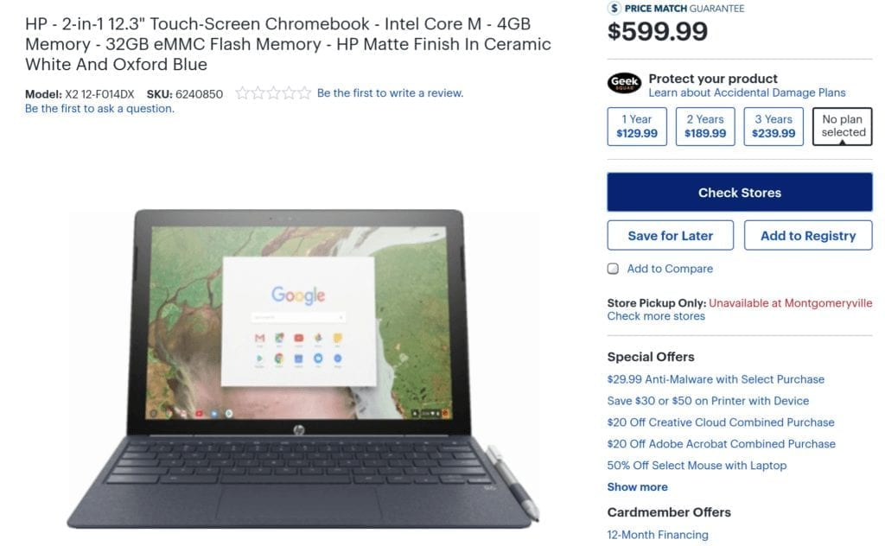
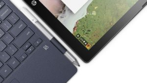
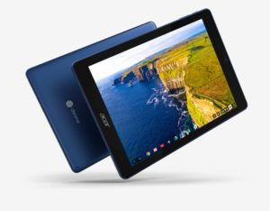

I received this email question from Nancy and it's a good one, considering the current and upcoming Chromebook landscape:

> "I've been thinking about buying a Pixelbook but should I wait or would you still purchase the Pixel Book even after these new detachables come out? Do you see a new improved Pixelbook in the next 6 months?"

I just happen to have been thinking about this very situation although in my case, I already have a Pixelbook. I bought a used one in mint condition a few months ago for $819. Right now you can find the [base Pixelbook on sale for $899 at Amazon](https://amzn.to/2Irw6Ui) (_affiliate link_). So I've been wondering about selling the Pixelbook and replacing it with a detachable like the [HP Chromebook X2](https://www.aboutchromebooks.com/news/hp-chromebook-x2-detachable-chrome-tablet-appears-on-best-buys-site/), which is expected to go on sale next month and [can be pre-ordered now](https://www.aboutchromebooks.com/news/hp-chromebook-x2-detachable-chrome-tablet-appears-on-best-buys-site/).

 

But enough about me. Let's tackle Nancy's question. And before I do, let me add a disclosure of sorts: In the 15 years I've been covering technology, I've always lived by this rule: I don't tell people what to buy or answer "what's the best \[insert device here\]?" question. That's because we all have different computing requirements and use cases.

Having said that, here are my thoughts.

## Fold-over tablet vs. a true tablet

The Pixelbook is currently among the cream of the crop when it comes to Chromebook options. You'll pay at least $900 for the privilege of having a high-resolution touchscreen paired with a range of high-performing processors, lots of memory and an abundance of storage. Plus, if you're adventurous, you can test out [Linux app containers](https://www.aboutchromebooks.com/news/first-look-running-full-linux-apps-on-a-chromebook-with-project-crostini/) and other goodies that Google is working on.

While the Pixelbook display can fold back behind the keyboard for a tablet form factor, it's not the best tablet experience. For that, you'd want a true detachable screen with all of the computing and power components in the display like the [HP Chromebook X2](https://press.ext.hp.com/us/en/press-releases/2018/chromebook-x2.html). I say "like" the X2 because there is evidence of additional upcoming detachable Chromebooks, such as the [Nocturne](https://www.aboutchromebooks.com/news/nocturne-to-be-a-chrome-os-detachable-with-high-res-display-and-fingerprint-reader/) and [Atlas](https://www.aboutchromebooks.com/news/more-evidence-suggests-atlas-is-a-4k-detachable-chromebook-tablet/) devices being worked on.

So right off the bat, if you really want a true 2-in-1 device that can be both a solid laptop and a tablet, it may make sense to skip the Pixelbook. Both have touchscreens and run Android apps, but a detachable will likely provide the better tablet experience.

## How much power do you need?

Another question to ask yourself is if you need the power of the Pixelbook. I fully expect HP to offer Chromebook X2 configurations that rival those of the Pixelbook but unlike Google's current Chromebook, you can nab an [HP Chromebook X2 with Intel Core m3 processor, 4 GB of memory and 32 GB of storage for $599](https://www.aboutchromebooks.com/news/hp-chromebook-x2-detachable-chrome-tablet-appears-on-best-buys-site/).

Sure it won't perform as well as the base Pixelbook but it also costs $300 to $400 less. And for some, this configuration is more than capable; again, it depends on your needs and expectations. I also expect some HP Chromebook X2 configurations with sub-Pixelbook performance but better than the base X2 model in the $650 to $750 range, so those might be options to consider as well.

## The next Pixelbook?

As far as a "new improved Pixelbook in the next 6 months", that's a tougher question to answer. Keep in mind that Google release its own high-end Chromebooks in the fall of 2013, 2015 and again (with the Pixelbook) in 2017. So it appears to be on a two-year cycle.

However, a detachable Pixelbook would be a new form factor so Google could break that cycle this year. I'm thinking that we do see a new Chromebook from Google this fall: Likely the Atlas detachable with 4K display. But that's just a guess; I have no solid information on that.

Overall then, I'd say the answer to Nancy's question actually is a question itself: How important is a true Chrome OS tablet? If not very, then the current Pixelbook is the way I'd go. If you think you'll spend at least half of the time using a new device as a tablet, then the HP Chromebook X2 is worth the look. Maybe even head to Best Buy on or after June 7 when it should be in stock and get a hands on with the device.

## My current plan

For me, I want a true Chrome OS tablet. I've been suggesting that Google make one since I did the Chrome Show podcast back in 2013. Of course, without Android app support back then, it didn't make sense. Now it does, obviously, since Google's hardware partners such as [Acer](https://www.aboutchromebooks.com/news/looks-like-the-acer-chromebook-tab-10-release-date-is-june-or-later/) and HP have announced these devices.

For the moment though, I'm not going to rush out and swap my Pixelbook for a tablet just yet. I think I'll wait for the fall and see if Google does out its own Chrome OS detachable device because I'd rather have a Google Chromebook: That's where most of the newest experimental features have been appearing lately and I like to live on the edge.

Chime in on the comments with your own perspective to this question. And if, like Nancy, you've got a Chromebook question, don't hesitate to shoot me an email at [kevin@aboutchromebooks.com](mailto:kevin@aboutchromebooks.com).
