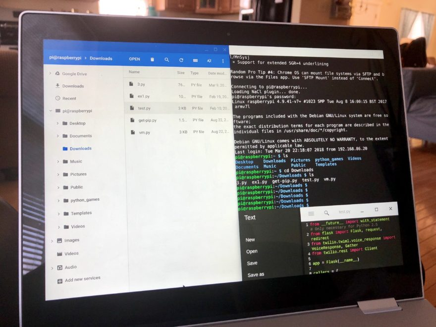
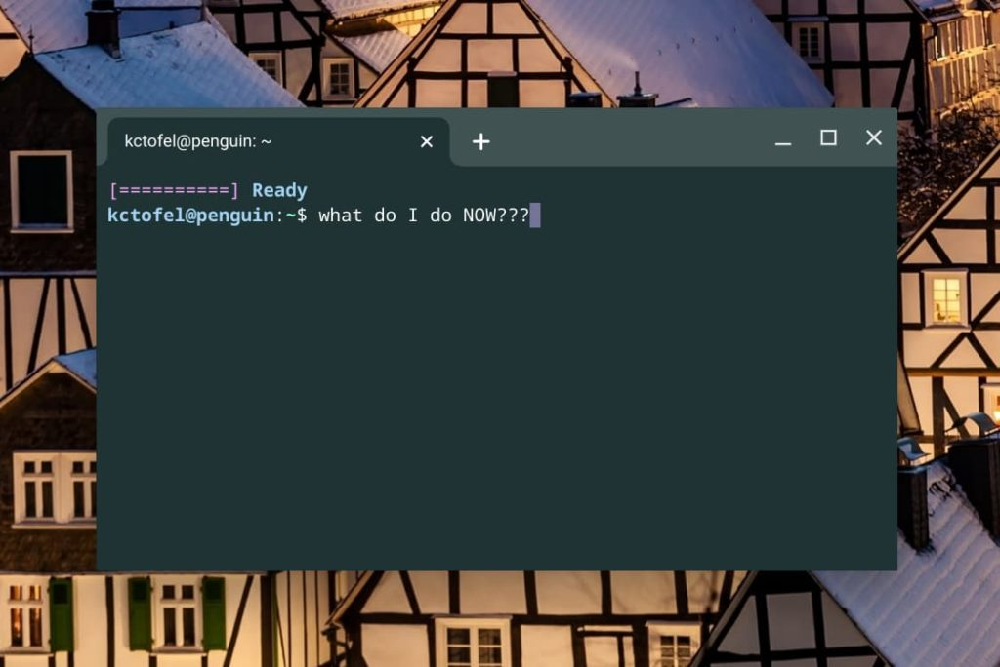

Well, I'm about six weeks out from starting my first semester for [my Masters in Computer Science](https://www.aboutchromebooks.com/news/linux-on-chromebooks-just-might-get-me-through-a-masters-in-computer-science/). So today I started cleaning up the Linux instance on my Chromebook. My intention is to do [what I did for undergrad CS coursework](https://www.aboutchromebooks.com/news/can-you-learn-to-code-in-a-college-computer-science-program-with-a-chromebook/) and use a Chromebook for most, if not all, of my work. That got me wondering how many of you use Linux on your Chromebook.

I would think that out of **_all_** possible Chromebook users, the number using Linux is relatively low. To be honest, all Chromebook users **are** using it since Chrome OS runs on Linux. But that's a technicality. ;)

Readers here tend to be more apt to try new things with Chrome OS. And many are happy to extend the value of their Chromebook with optional features such as Android and Linux. Frankly, there's no way I could get through my coding exercises without this option.

## Linux on Chromebooks doesn't have to be scary

Of course, I wouldn't say that Linux is the perfect solution for every Chromebook owner. And there are still some improvements that could be made.

Even so, I think just a mention of the word "Linux" scares people from trying it on their Chromebook. And I get that.

Most people have grown up in a world with Windows or macOS where much of the operating system is abstracted away. The same could be said of Chrome OS, for that matter.

However, Google has taken steps to make Linux on Chromebooks a little less scary.

The [secondary operating system essentially self-installs](https://support.google.com/chromebook/answer/9145439?hl=en), for example. There's no need to look for, manually download, and then install Linux. You just go into your Chrome OS settings, look for the Advanced options, choose the Developer menu, and answer a few questions. Less than a minute later, depending on your Chromebook hardware and your internet connection, you've got Linux installed.

I think it's what happens **_after_** that point that people get stuck due to the command line interface and lack of a GUI, or graphical user interface. Again, I get it.

## Why not more guidance from Chrome OS?

And while Google is really targeting Linux on Chromebooks for developers and "power users", it would be nice to offer up a small tutorial to get others started after the Linux installation.

Seriously, if you didn't know that you can download many Linux apps from the web and [install them through the Chrome OS Files app](https://www.aboutchromebooks.com/news/how-to-install-debian-linux-packages-in-project-crostini-chrome-os-files-app/), Google isn't doing much to inform you.

In any case, I put this small poll together to see how many of you are using Linux, how often, and if you used to use Linux but no longer do on your Chromebook.

Of course, comments below are welcome if you want to share your experiences. I'm betting there are people who don't know what you could use Linux for, so maybe collectively we can help explain [this underappreciated option](https://www.aboutchromebooks.com/news/linux-on-chromebooks-underappreciated-versatility-as-an-app-solution/).

https://poll.fm/10876998
