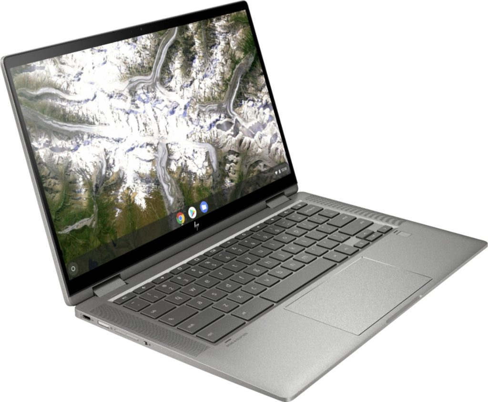
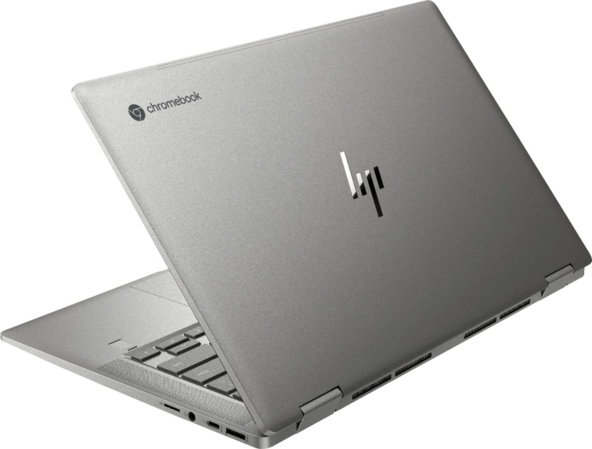

Following up on the [budget-friendly, $219 HP Chromebook 11a](https://www.aboutchromebooks.com/news/the-new-budget-hp-chromebook-11a-launches-at-219-already-on-sale-for-169/), HP announced this week what it calls the "company's most premium consumer Chromebook" to date.

The HP Chromebook x360 14c includes a fingerprint scanner, webcam privacy switch, 88% screen-to-body ratio and a range of chip & memory configurations from Intel Pentium Gold to Intel Core i5 processor and up to 8 GB of memory. The base model is priced at $499 while I've already seen [a Core i3 version specific to Best Buy costing $629](https://www.bestbuy.com/site/hp-2-in-1-14-touch-screen-chromebook-intel-core-i3-8gb-memory-64gb-emmc-flash-memory-mineral-silver/6407695.p?loc=HP_6407695_PR&ref=186&skuId=6407695).

I'm not a fan of different Chromebook models, or SKUs, from a hardware company and retailers. Often times, that leads to consumer confusion about what they're actually buying. Case in point: The Best Buy version of the Lenovo Chromebook Yoga C630 appeared identical to the one you could purchase from Lenovo, yet it [didn't have a backlit keyboard like the latter](https://www.aboutchromebooks.com/news/best-buy-sale-lenovo-yoga-chromebook-c630-discount/).

Regardless, more Chromebook choices are good news in general. And HP appears to be targeting mainstream Chromebook users that want a premium built and looking device; if you want performance, however, you're going to pay for it.

I say that because of the hardware used for the $499 model of the HP Chromebook x360 14a. It comes with a dual-core [Intel Pentium Gold 6405U](https://ark.intel.com/content/www/us/en/ark/products/197888/intel-pentium-gold-6405u-processor-2m-cache-2-40-ghz.html) processor, 4 GB of memory and 64 GB of local storage.

Best Buy is advertising this convertible Chromebook with a 10th-generation dual-core [Intel Core i3-10110U](https://ark.intel.com/content/www/us/en/ark/products/196451/intel-core-i3-10110u-processor-4m-cache-up-to-4-10-ghz.html) processor, 8 GB of memory and the same 64 GB of eMMC storage. That model is showing at a price of $629.

Both models share the same 14-inch IPS 1920x1080 touch panel with a mediocre 250 nits of brightness and 45% NTSC support. They also both have WiFi 6 and Bluetooth 5 support, and a trio of USB ports: 2 SuperSpeed Type-C and one SuperSpeed Type-A. Backlit keyboards are standard on both models but only the $499 model has a memory card slot.

HP's data sheet for the Core i3 configuration at Best Buy suggests there's no memory card slot on that model, however Best Buy says there **_is_** one and even shows an image where you can plainly see it. If you plan to get that model, I'd make sure the slot is there before pulling the trigger.

I really like the capacity of the 60.9WHr battery in these Chromebooks, the USB-C charger and HP's Quick Charge feature which gets you from zero to half-charged in 45 minutes. HP says that battery should get you up to 13.5 hours of browsing time; I'd guess that real-world usage should easily deliver 10+ hours.

Aside from the integrated fingerprint sensor and webcam privacy shutter, this convertible supports any USI stylus. It doesn't come with one, so you'll have to search around and buy that separately.

Here are the two datasheets for you to compare between the two:

[HP-Chromebook-x360-14c-ca0053dx-BBY-SKU](https://www.aboutchromebooks.com/wp-content/uploads/2020/06/HP-Chromebook-x360-14c-ca0053dx-BBY-SKU.pdf)[Download](https://www.aboutchromebooks.com/wp-content/uploads/2020/06/HP-Chromebook-x360-14c-ca0053dx-BBY-SKU.pdf)

[HP-Chromebook-x360-14c-ca0065nr-HHO-not-final](https://www.aboutchromebooks.com/wp-content/uploads/2020/06/HP-Chromebook-x360-14c-ca0065nr-HHO-not-final.pdf)[Download](https://www.aboutchromebooks.com/wp-content/uploads/2020/06/HP-Chromebook-x360-14c-ca0065nr-HHO-not-final.pdf)

As nice as the updated HP Chromebook X360 14c looks, a Pentium-powered Chromebook with 4 GB of memory costing $499 might be a tough sell. Even the Core i3 with double the RAM at Best Buy seems priced a little high to me as well, but I suspect it will run regular sales between $50 and $100 off the standard price.

Note that HP says the Chromebook X360 14c can be had in "up to a Core i5 processor" model with 128 GB of local storage. Perhaps that model, and its price, will be on HP's site in a custom configuration option. We'll see.
