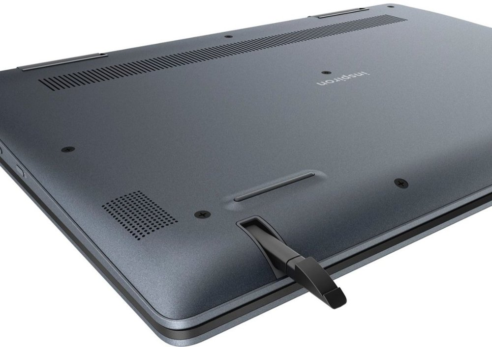

Best Buy is discounting a few Chromebooks for today's U.S. holiday and two of them stand out as really good deals. Both have the same Intel Core i3-8130U processor inside and a 14-inch IPS touchscreen with 1920 x 1080 resolution. And both have an MSRP in the $549 to $550 range but are on sale for $200 less.

HP Chromebook x360 14 g1

The two devices are extremely similar: One is the [HP Chromebook X360-14 at $399](https://www.bestbuy.com/site/hp-2-in-1-14-touch-screen-chromebook-intel-core-i3-8gb-memory-64gb-emmc-flash-memory-white-gold/6365772.p?skuId=6365772) while the other is the [Dell Inspiron Chromebook 14 for $349](https://www.bestbuy.com/site/dell-inspiron-2-in-1-14-touch-screen-chromebook-intel-core-i3-4gb-memory-128gb-emmc-flash-memory-urban-gray/6299820.p?skuId=6299820). They're quite capable 2-in-1 Chromebooks for typical browsing as well as Android and Linux use.

Dell Inspiron Chromebook 14

So which one should you consider buying if you're in the market?

The key factor in my opinion is in two specific specifications. I'll highlight them below, showing where these Chromebooks are the same -- which is in most of the specs -- and where they're different:

The main differences that caught my eyes are the combination of memory and storage, as well as the Dell having one more USB port and an integrated stylus.

Dell Inspiron Chromebook 14 stylus

If you can live without a stylus and that extra USB jack, I'd say the HP has the advantage even though it costs $50 more. That advantage is in the memory department since it has double the RAM over the 4 GB provided by the Dell.

But that's just me.

You can happily use a Chromebook with 4 GB of memory as long as you realize the limitations that come with it: You won't be able to have as many browser tabs open as on a Chromebook with more RAM, for example. And with the Dell you get the added USB port, the stylus and double the local storage.

It's a tough decision but either one of these will suit the needs of most Chromebook users and at this price, both are a great deal.
