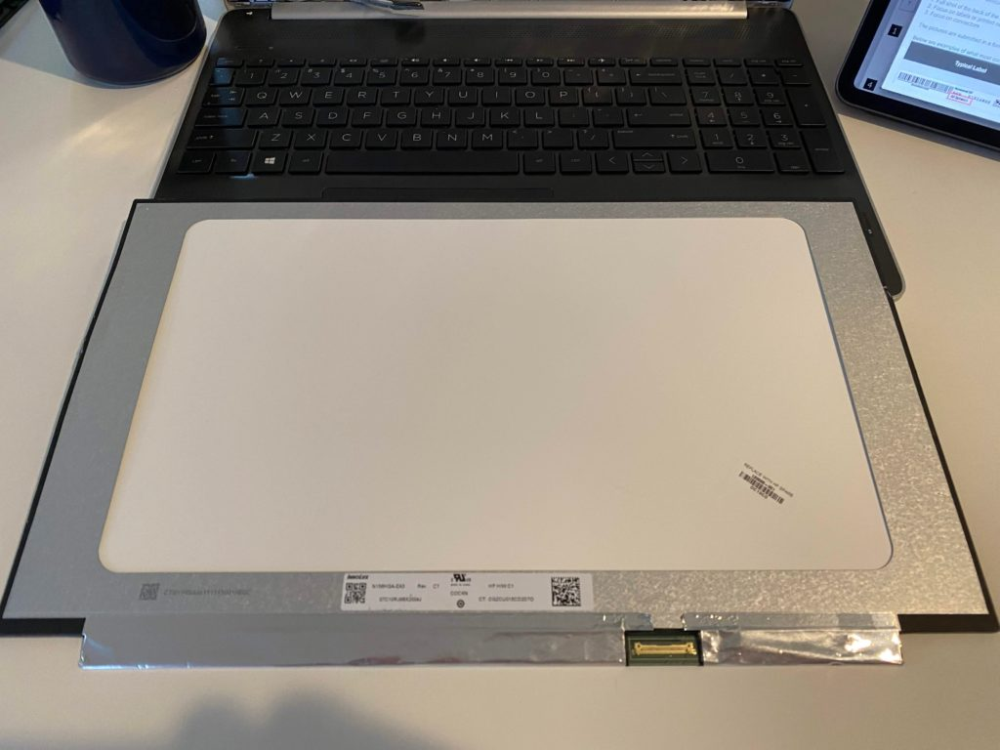

I've heard from a number of readers over the years that they don't like the lack of repairability from Chromebooks. It's a fair point; if something breaks you either have to hope you can get manufacturer support or the issue is something you can fix yourself with aftermarket parts.

I just went through an interesting experience replacing the display on a relatively new HP laptop that I purchased on sale during the holidays. It actually wasn't broken or defective, however. There just wasn't an option to purchase the device with anything but a crappy TN panel. So I wondered if I could replace it with a higher quality IPS display.

It turns out I could. Even better, it was simple to do, didn't cost me that much and, more importantly, I found out that this can also be done with Chromebook screens.

First a quick note about TN and IPS panels. This image below gives you an idea of the difference. It's from [LaptopScreen.com](https://www.laptopscreen.com/), which is who I worked with for my display replacement. They're not a sponsor and I have no affiliate relationship with them. I just had a good experience as a paying customer.

Credit: LaptopScreen.com

If you've ever bought a low-end Chromebook and the colors change as you view the screen from different angles, you're likely looking at a low-cost TN panel. That's what came with my HP laptop: A 15.6-inch 1920 x 1080 TN panel.

Working with the customer support folks at LaptopScreen.com, they pointed me to an IPS replacement panel in the same size and resolution. Additionally, it had the same 30-pin connector as my laptop; there are typically either 30- or 40-pin connectors used these days.

The cost? $54. I chose a glossy panel since I work indoors most of the time. I could have bought a matte IPS panel for an additional $4.

Once my replacement screen arrived, I carefully removed the plastic bezel around the display. This is pretty standard as the first step on a laptop or Chromebook. There are plastic clips all around the bezel, so you have to be careful. But once you get one of them undone -- I used a thin plastic card to get started -- they all generally come off easy.

Look Ma, no bezel!

Once I removed the bezel and put it aside, I had to heat up the back of my laptop with a heat gun because as I found out in the HP Maintenance manual for my laptop, the display is attached to the laptop with double-sided tape. This is not typical, however. On most laptops and Chromebooks, there are four small screws, one in each corner that holds the display to the device.

With the tape heated up enough to loosen up the adhesive, I was able to pull the screen out. It was attached to the laptop chassis by the display cable, which is simple to unplug. Just be careful when doing this.

Display cable port on the screen

With that step completed, my old TN panel was completely unattached to the laptop.

With the new display panel, reassembly is done by reversing the steps. And this part goes fast. You re-attach the display panel cable, place the display in the laptop cover, replace the screws (I used double-sided tape but again, this is not typical) and carefully re-attach the bezel.

I don't have pictures of the old TN panel on this particular laptop, but here's the end result with the IPS screen. You can see that that viewing angles are excellent and there's no off-center color shift:

Again, while I used a traditional laptop to demonstrate this, everything I've outlined applies to Chromebooks as well. I searched for and found dozens of support Chromebook models supported by LaptopScreen.com. You'll also find customer videos showing the same process I used.

In my case, a little bit of time and $54 was well worth the investment. You can use this approach to replace a cracked or defective Chromebook display and, depending on the model, you may even find screen upgrade options that weren't made available from the manufacturer when you bought your Chromebook!

Keep in mind that if you do take the plunge, you're doing so at your own risk. No blaming me if something goes wrong. ;)
