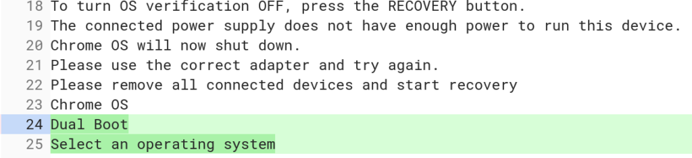
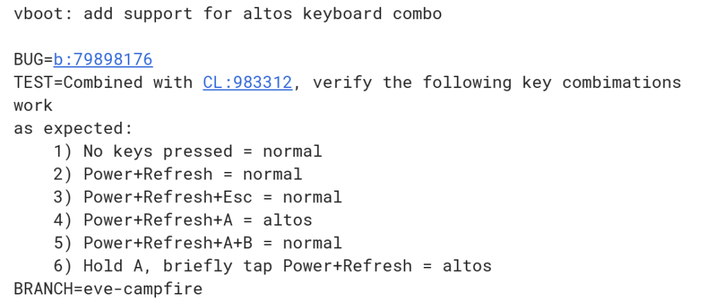
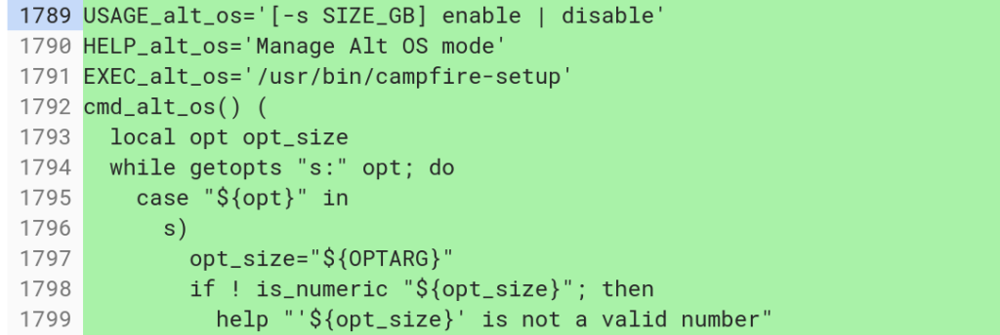
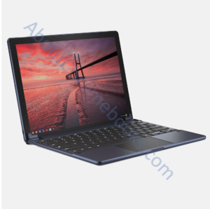

Google's Project Campfire, often referred to as Alt-OS, is undergoing some changes as we get closer to release. If you're not familiar with Campfire, it essentially allows some Chromebooks -- there are memory and storage requirements -- [to run Windows 10](https://www.xda-developers.com/chromebooks-chrome-os-windows-10-dual-boot-apple-boot-camp-campfire/). However, as Campfire progresses, I've learned it's not just for Windows 10, nor will the end user choose to boot into Alt-OS.

Instead, the Chromium team is [changing over to "Dual Boot" as the end user option instead of Alt-OS](https://chromium-review.googlesource.com/c/chromiumos/platform/bmpblk/+/1236014/2), which makes more sense because the term is more descriptive and meaningful. Here are the new code strings that will appear when booting up a supported Chromebook for the Dual Boot function:

Note that line 25 doesn't say "Select Windows 10" but instead is more generic.

That's because I'm hearing Campfire won't just support Microsoft's operating system, but others as well. Specifically, I'd expect that you'll be able to boot into the Linux distro of your choosing, whether it be Debian / Ubuntu, Arch Linux, Fedora, and others. Who knows, maybe some enterprising folks will figure out how to ["hackint0sh" a Chromebook to unofficially run macOS](https://hackintosh.com/).

There are also some icon mockups for the Campfire screens so that it will be easy to select which OS to boot into. Note that since these are mocks, they could change prior to Campfire's implementation.

This is clearly to choose Chrome OS:   

And this is the button for choosing Alt-OS, I mean Dual Boot:  

There are also two versions of a clear icon button -- square with rounded corners -- one for when the button has focused (read: when hovering over or pressing) and one without focus. Since they're clear, I'm thinking icons or [text descriptions for any installed alternative operating systems](https://chromium-review.googlesource.com/c/chromiumos/platform/bmpblk/+/1224350) may appear inside these buttons.

And although this code uses the old, or internal Alt-OS, naming convention it shows system flags to [enable or disable Dual Boot mode](https://chromium-review.googlesource.com/c/chromiumos/platform/vboot_reference/+/1009444/9/firmware/2lib/include/2nvstorage.h):

Lastly, there's code being tested for a [new keyboard combo to start up a Chromebook directly into Dual Boot](https://chromium-review.googlesource.com/c/chromiumos/platform/depthcharge/+/1126806) mode, although it's again referenced by the Alt-OS name:

Essentially, A + Power + Refresh will get you to the Dual Boot screen to choose your OS. This differs from booting into Developer Mode, which is typically the Refresh + Power + ESC keys.

This keyboard combo appears to assume that you've already set up Dual Boot mode however. To do that, it looks like you'll have to first open up a crosh terminal (CTRL + ALT + T) and [run through the setup process](https://chromium-review.googlesource.com/c/chromiumos/platform2/+/1170675/5/crosh/crosh).

All in all, I'm excited by Project Campfire. Yes, you can already run Linux packages within Chrome OS via Project Crostini, but there are use cases where someone might want all of their Chromebook resources dedicated to fully running a Linux distro via Campfire instead of using some of the CPU and memory in a Linux container.

And of course, some folks want or need Windows 10 software for their job or for certain home uses. I don't think the ability to run Windows on a Chromebook is a bad thing. In fact, the need for particular Windows features or apps is a primary reason people might shy away from a Chromebook.

Project Campfire could sway those potential Chromebook buyers to make the switch because the Chromebook has gone from having the least apps -- and now operating system choices --  to the nearly the most, if not the most, in under a decade.

Keep in mind that Campfire is likely to appear first on the Google Pixelbook, although I expect it to be supported on any new Google Chromebooks, [such as the Nocturne tablet](https://www.aboutchromebooks.com/news/first-look-chrome-os-pixelbook-tablet-nocturne-madebygoogle/) expected to launch next month.

It _might_ come to older devices but I don't have high hopes there: Many older Chromebooks won't have the disk space needed. Going forward though? Devices in 2019 and beyond with at least 64GB of local storage and 4GB of memory are potential candidates for the Dual Boot functionality.
